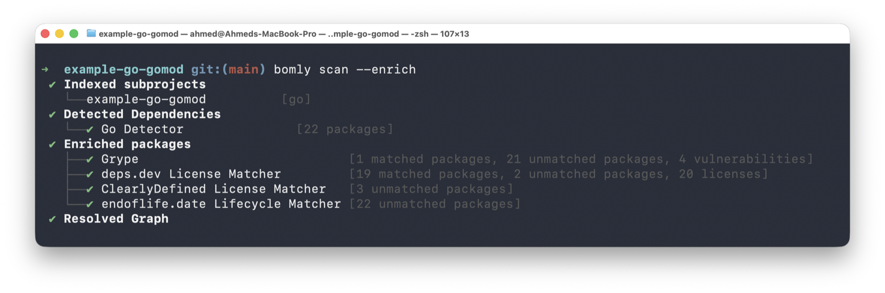
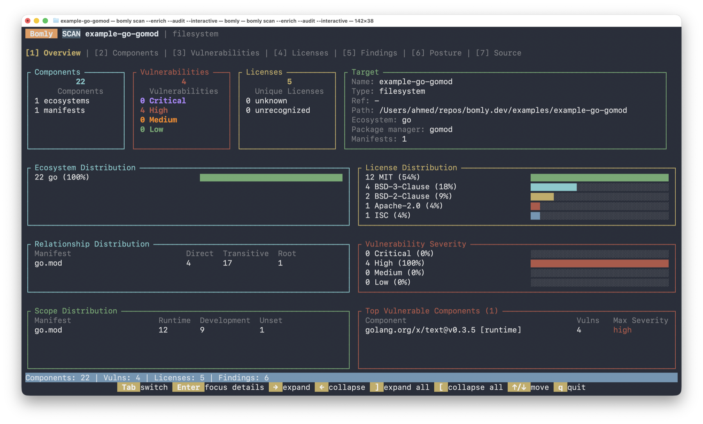
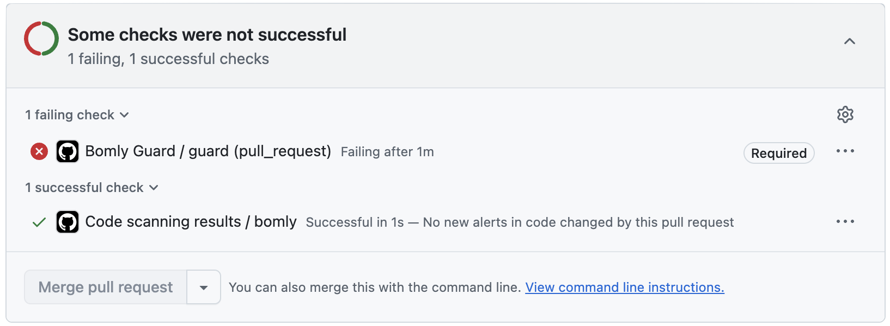

<p align="center">
  
</p>

<p align="center">
  <strong>Analyze Your Software DNA.</strong>
</p>

<p align="center">
  <a href="https://github.com/bomly-dev/bomly-cli/actions/workflows/ci.yml"></a>
  <a href="https://scorecard.dev/viewer/?uri=github.com/bomly-dev/bomly-cli"></a>
  <a href="https://github.com/bomly-dev/bomly-cli/releases/latest"></a>
  <a href="LICENSE"></a>
  <a href="https://pkg.go.dev/github.com/bomly-dev/bomly-cli"></a>
  <a href="https://goreportcard.com/report/github.com/bomly-dev/bomly-cli"></a>
</p>

Bomly is a free, open-source CLI for dependency intelligence. It scans source trees, SBOMs, Git refs, and container images; explains why dependencies are present; enriches packages with vulnerability and license data when you ask for it; evaluates policy; and writes automation-friendly output for CI.

One binary. No service to host. No telemetry. No outbound matcher calls unless you opt in with `--enrich`.

## Install Bomly

```bash
# macOS / Linuxbrew
brew install --cask bomly-dev/tap/bomly

# Linux / macOS install script
curl -fsSL https://bomly.dev/install.sh | sh

# Windows
winget install Bomly.BomlyCLI
```

Prebuilt archives and Linux packages are published from [GitHub Releases](https://github.com/bomly-dev/bomly-cli/releases). Releases include `bomly` (full binary with builtin Syft and Grype) and `bomly-lite` (smaller binary that shells out to external `syft` and `grype`).

Verify the install:

```bash
bomly version
```

For Linux packages, Scoop, Go install, checksums, pinned versions, upgrades, and uninstall instructions, see [Installation](docs/INSTALLATION.md).

## Start With a Scan

```bash
# Scan the current project
bomly scan

# Scan a specific directory
bomly scan --path ./services/api

# Scan a container image
bomly scan --container ghcr.io/example/app:latest

# Scan a remote Git ref
bomly scan --url https://github.com/owner/repo --ref v1.2.3

# Read an existing SPDX or CycloneDX SBOM
bomly scan --sbom --path ./sbom.cdx.json
```

Bomly reads manifests, lockfiles, package-manager output, container layers, or existing SBOMs and turns them into one dependency graph. Native detectors cover Go, npm, pnpm, Yarn, Maven, Gradle, Python, Composer, Bundler, GitHub Actions, SBOM ingest, and more. Syft fills the long tail, including container images. See the [Support Matrix](docs/SUPPORT_MATRIX.md) and [Scan Targets](docs/SCAN_TARGETS.md).

<p align="center">
  
</p>

## What Bomly Can Answer

| Question | Command |
| --- | --- |
| What do we depend on? | `bomly scan` |
| What changed in this PR or branch? | `bomly diff --base main --head HEAD` |
| Why is this package here? | `bomly explain lodash` |
| Which findings matter to policy? | `bomly scan --enrich --audit --fail-on high` |
| Can CI fail on high-severity findings? | `bomly scan --enrich --audit --fail-on high --format sarif` |
| Can I triage reachable findings first? | `bomly scan --enrich --audit --analyze --fail-on high --fail-on reachable` |

For more recipes, see [Getting Started](docs/GETTING_STARTED.md) and [Use Cases](docs/USE_CASES.md).

## Explore Interactively

Open the terminal UI when you want to inspect a graph by hand:

```bash
bomly scan --interactive
```

Use it to fuzzy-find packages, inspect versions and scopes, pivot through findings, and see how a dependency entered the graph without writing a report to disk. See [Interactive TUI](docs/TUI.md).

<p align="center">
  
</p>

## Enrich and Audit

By default, Bomly does not call vulnerability, license, lifecycle, or scorecard services. Add `--enrich` when you want external package intelligence:

```bash
# Fetch vulnerability and license data
bomly scan --enrich

# Evaluate policy against enriched package data
bomly scan --enrich --audit --fail-on high

# Add experimental reachability analysis
bomly scan --enrich --audit --analyze --fail-on high --fail-on reachable
```

Built-in enrichment uses public services such as OSV, CISA KEV, deps.dev, and OpenSSF Scorecard. `--audit` evaluates the vulnerability and license data already present on packages; use `--enrich --audit` when you want to fetch and evaluate in one run.

Reachability is experimental. It is useful for triage, but "unreachable" is not a guarantee of safety. Read [Reachability](docs/REACHABILITY.md) before using `--fail-on reachable` as a CI gate.

## Explain and Diff

Use `explain` when a transitive package shows up and you need the path:

```bash
bomly explain requests
bomly explain lodash --path ./web
```

Use `diff` when you need to review dependency changes across Git refs or SBOMs:

```bash
# Compare Git refs
bomly diff --base main --head HEAD

# Compare two SBOM files
bomly diff --sbom --base ./old.spdx.json --head ./new.spdx.json
```

See [Getting Started](docs/GETTING_STARTED.md) for the first-run walkthrough and [Use Cases](docs/USE_CASES.md) for PR review, upgrade review, and incident triage recipes.

## Generate Output for CI

Bomly can write human-readable text, JSON, SARIF, SPDX 2.3, and CycloneDX 1.6:

```bash
# Structured JSON for automation
bomly scan --json

# SARIF for security tabs and code-scanning integrations
bomly scan --enrich --audit --fail-on high --format sarif

# Write SBOMs while still showing the normal report
bomly scan -o spdx=sbom.spdx.json -o cyclonedx=sbom.cdx.json

# Emit one SBOM to stdout
bomly scan --format cyclonedx
```

Exit codes are stable for scripts: `0` for clean results, `2` for policy violations, and separate values for usage, runtime, and no-supported-project failures. See [Output Formats](docs/OUTPUT_FORMATS.md), [SBOM Formats](docs/SBOM.md), and [Exit Codes](docs/EXIT_CODES.md).

To gate pull requests, use the [Bomly Guard action](https://github.com/bomly-dev/bomly-guard) or call the CLI directly from your workflow. See [Bomly Guard](docs/BOMLY_GUARD.md) and [CI Integration](docs/CI_INTEGRATION.md).

<p align="center">
  
</p>

## Use Bomly With AI Agents

Bomly can run as an MCP server so AI agents can call the same `scan`, `explain`, and `diff` capabilities you use on the command line:

```bash
bomly mcp serve
```

Add Bomly to an MCP-aware agent such as Claude Code, Cursor, VS Code, or a custom tool, and the agent receives structured JSON it can summarize or reason over. See [Getting Started](docs/GETTING_STARTED.md) for setup recipes.

## Configure and Extend

Bomly reads configuration from global config, project config, `BOMLY_*` environment variables, and CLI flags, with later sources taking precedence:

1. `~/.bomly/config.yaml`
2. `<project>/.bomly/config.yaml`
3. `BOMLY_*` environment variables
4. CLI flags

Use `--config <path>` to add an explicit config file. See the generated [Config Reference](docs/CONFIG_REFERENCE.md).

Managed plugins let you add detectors, matchers, and auditors without forking Bomly:

```bash
bomly plugin install github:bomly-dev/bomly-plugin-bun-lock-detector@v0.1.0
bomly plugin enable bomly.examples.detector.bun-lock
bomly plugin verify bomly.examples.detector.bun-lock
```

See [Plugins](docs/PLUGINS.md) for install, trust, and authoring guidance.

## Documentation

- [Getting Started](docs/GETTING_STARTED.md) - install Bomly and run your first scan
- [Installation](docs/INSTALLATION.md) - install methods, checksums, upgrades, uninstall
- [Use Cases](docs/USE_CASES.md) - practical recipes for PR gates, SBOMs, triage, and offline scans
- [Scan Targets](docs/SCAN_TARGETS.md) - directories, Git repos, containers, and SBOMs
- [Output Formats](docs/OUTPUT_FORMATS.md) - text, JSON, SARIF, SPDX, CycloneDX
- [SBOM Formats](docs/SBOM.md) - SPDX 2.3 and CycloneDX 1.6, ingest, and conversion recipes
- [CI Integration](docs/CI_INTEGRATION.md) - GitHub Actions, GitLab, Jenkins, Azure, CircleCI
- [Bomly Guard](docs/BOMLY_GUARD.md) - turnkey GitHub Action for PR dependency review
- [Reachability](docs/REACHABILITY.md) - experimental reachable-vulnerability triage
- [Plugins](docs/PLUGINS.md) - managed external detectors, matchers, and auditors
- [All Documentation](docs/README.md) - full docs index

Contributor setup lives in [CONTRIBUTING.md](CONTRIBUTING.md). Architecture details live in [docs/ARCHITECTURE.md](docs/ARCHITECTURE.md).

## License

Bomly CLI is licensed under the [Apache License 2.0](LICENSE).
