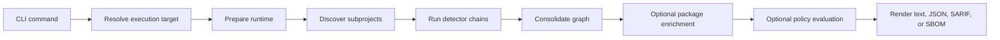

# Bomly

Dependency intelligence for modern software projects.

Bomly scans source trees, SBOMs, Git refs, and container images, generates SPDX and CycloneDX SBOMs, enriches packages with vulnerability and license data, evaluates policy, and diffs dependency state across refs.

One binary. Native detectors for the ecosystems developers use every day. Offline-safe unless you opt in. Built for CI as much as for local use.

## Why Bomly

- **One CLI, full pipeline.** Detect, enrich, audit, explain, diff, and write SBOMs from the same binary.
- **Native detectors first.** Real dependency graphs (with edges) for Go, npm, pnpm, yarn, Maven, Gradle, Python, Composer, Bundler, GitHub Actions, and SBOM ingest. Syft fills the long tail for containers and rarer ecosystems.
- **Offline-safe by default.** A scan without `--enrich` makes zero outbound HTTP calls. The only enrichment endpoints used are OSV, KEV, deps.dev, ClearlyDefined, and endoflife.date.
- **Reachability that respects your time** (experimental). `--reachability` tells you whether your app actually calls a vulnerable symbol — Tier-1 (`govulncheck`) for Go; Tier-3 import-graph closure for npm, Python, and JVM languages. See [REACHABILITY.md](docs/REACHABILITY.md) for limitations.
- **Stable exit codes for CI.** `0` clean, `2` policy violation, plus 1, 3, 4 for other failure classes. See [Exit codes](docs/EXIT_CODES.md).

## Highlights

- Scan local trees, SBOMs (SPDX 2.3, CycloneDX 1.6), Git repositories, container images.
- Write SBOMs in either format alongside any report: `-o spdx-json=…  -o cyclonedx-json=…`.
- Enrich with OSV, KEV, deps.dev, ClearlyDefined, endoflife.date via `--enrich`.
- Audit with `--audit --fail-on <severity>`; SARIF emitted with `--format sarif`.
- Explain transitive paths with `bomly explain <package>`.
- Diff dependency state across Git refs or SBOM files with `bomly diff`.
- Filter by ecosystem, detector, matcher, auditor, scope.

## Quick Start

```bash
# Scan the current project
bomly scan

# Write SBOMs in two formats
bomly scan -o spdx-json=sbom.spdx.json -o cyclonedx-json=sbom.cdx.json

# Enrich packages with external vulnerability and license data
bomly scan --enrich

# Evaluate policy using existing package vulnerability data
bomly scan --audit --fail-on high

# Enrich first, then audit and emit SARIF
bomly scan --enrich --audit --fail-on high --format sarif

# Explain why a dependency exists
bomly explain lodash

# Compare dependency state across Git refs
bomly diff --base main --head feature/my-change
```

Walkthrough: [Getting Started](docs/GETTING_STARTED.md).

## Installation

```bash
# Go toolchain — Go 1.21 or later on PATH
go install github.com/bomly-dev/bomly-cli/cmd/bomly@latest
```

Or grab a prebuilt archive from [GitHub Releases](https://github.com/bomly-dev/bomly-cli/releases). Each release publishes `bomly` (full binary with builtin Syft and Grype) and `bomly-lite` (smaller binary that shells out to external `syft` and `grype`) archives for Linux, macOS, and Windows.

Verify:

```bash
bomly version
```

Full install matrix — `bomly` vs `bomly-lite`, checksum verification, PowerShell instructions, uninstall, CI install — lives in [docs/INSTALLATION.md](docs/INSTALLATION.md).

## What It Scans

Native detectors:

- Go modules
- npm, pnpm, Yarn
- Maven, Gradle
- Python (pip, Pipenv, Poetry, uv)
- Composer (PHP)
- Bundler (Ruby)
- GitHub Actions
- SPDX 2.3 and CycloneDX 1.6 SBOM ingest

Syft-backed for many more, including container images. See [docs/SUPPORT_MATRIX.md](docs/SUPPORT_MATRIX.md) for the full matrix.

Component guides:

- [Detectors](docs/DETECTORS.md), [Matchers](docs/MATCHERS.md), [Auditors](docs/AUDITORS.md), [Reachability](docs/REACHABILITY.md)
- Per-ecosystem [detector guides](docs/detectors/ecosystems/) and per-matcher [reference](docs/matchers/)

## Core Commands

### `bomly scan`

Use `scan` to resolve dependencies from a local path, a remote Git repository, a container image, or an SBOM file.

```bash
# Scan a directory
bomly scan --path .

# Scan a container image
bomly scan --container ghcr.io/example/app:latest

# Treat a file as an SBOM input
bomly scan --sbom --path ./existing-sbom.json

# Filter to runtime dependencies only
bomly scan --scope runtime

# Explore the result in the interactive terminal UI
bomly scan --interactive
```

**Matchers are offline-safe by default** — without `--enrich`, Bomly makes zero outbound HTTP calls. Note that some **detectors** are build-tool primaries (Go's `go list`, Maven's `mvn dependency:tree`, Gradle's `gradle dependencies`, sbt's `sbt dependencyTree`) and may download packages from package registries during normal graph resolution. That's a property of those build tools, not a Bomly choice; lockfile-parser detectors (npm, pnpm, yarn, Composer, Bundler, NuGet, GitHub Actions, …) and SBOM ingest are fully offline. See [Detectors → Network behavior](docs/DETECTORS.md#network-behavior).

Use `--enrich` when you want Bomly to call external vulnerability, license, or lifecycle services. Use `--audit` when you want Bomly to evaluate vulnerability data that already exists on packages. Use both together when you want fetched vulnerability data evaluated in one run.

### `bomly explain`

Use `explain` to show the dependency path that introduced a package.

```bash
bomly explain requests
```

### `bomly diff`

Use `diff` to compare dependency state between two Git refs or two SBOM files.

```bash
# Git refs
bomly diff --base main --head HEAD

# SBOM files
bomly diff --sbom --base ./old.spdx.json --head ./new.spdx.json
```

## Output Modes

| Output | Command |
| --- | --- |
| Human-readable report | `bomly scan` |
| Structured JSON | `bomly scan --format json` |
| SARIF 2.1.0 | `bomly scan --audit --format sarif` |
| SPDX 2.3 JSON | `bomly scan -o spdx-json=sbom.spdx.json` |
| CycloneDX JSON | `bomly scan -o cyclonedx-json=sbom.cdx.json` |

Full details: [Output formats](docs/OUTPUT_FORMATS.md), [SBOM formats](docs/SBOM.md), [Exit codes](docs/EXIT_CODES.md).

## Configuration

Bomly loads configuration in this order, with later sources taking precedence:

1. `~/.bomly/config.yaml`
2. `<project>/.bomly/config.yaml`
3. `BOMLY_*` environment variables
4. CLI flags

Use `--config <path>` to add an explicit config file to the load list.

See [docs/CONFIG_REFERENCE.md](docs/CONFIG_REFERENCE.md) for the generated reference.

## Plugins

Bomly supports managed external plugins for detectors, matchers, and auditors.

The common workflow is:

```bash
# Install a published plugin from GitHub Releases
bomly plugin install github:acme/bomly-plugin-example@v1.2.0
bomly plugin enable acme.detector.example

# Verify it
bomly plugin verify acme.detector.example

# Run it explicitly during a scan
bomly scan --path ./my-go-project --detectors acme.detector.example --format json
```

Detector plugins declare package-manager support and evidence patterns through their detector contract. Bomly uses those patterns during runtime preparation so external detectors can participate in subproject discovery alongside built-ins.

The full getting-started guide lives in [docs/PLUGINS.md](docs/PLUGINS.md), and the working example plugin lives in [examples/plugins/go-module-detector](examples/plugins/go-module-detector).

## Architecture

Bomly keeps the CLI thin and pushes orchestration into the scan runtime.



More detail lives in [docs/ARCHITECTURE.md](docs/ARCHITECTURE.md).

## Repository Layout

```text
cmd/bomly/                 CLI entry point
internal/cli/              Commands, config loading, progress, help
internal/engine/           Runtime preparation, orchestration, consolidation
internal/engine/diff/      Diff orchestration and audit deltas
internal/engine/explain/   Dependency path explanation
internal/engine/scan/      Scan command pipeline API
internal/detectors/        Ecosystem-specific dependency resolution
internal/matchers/         External enrichment matchers and shared matcher cache
internal/analyzers/        Reachability analyzers (govulncheck, jsreach, pyreach, jvmreach)
internal/auditors/         Policy evaluation and finding creation
internal/output/           Text, JSON, SARIF rendering and structured response payloads
internal/sbom/             SPDX and CycloneDX encoding and decoding
internal/registry/         Canonical support and discovery registry
internal/plugin/           Managed external plugins (install, verify, run)
docs/                      Public reference documentation
```

## Development

```bash
make build
make build-lite
make test
make run ARGS="scan"
```

If you change config, schema, or support-matrix inputs, run `make generate` as well.

## CI and Releases

Bomly uses GitHub Actions for:

- fast PR validation
- integrated `go vet` checks in PR validation
- merge-queue smoke coverage before merge
- nightly smoke coverage for upstream drift detection
- automatic semantic version tagging on `main`
- draft prerelease packaging to GitHub Releases

See [docs/CI.md](docs/CI.md) for workflow triggers, required checks, release packaging, checksum handling, and the planned future attestation step.

Contributor guidance lives in [CONTRIBUTING.md](CONTRIBUTING.md).

## License

Bomly CLI is licensed under the [Apache License 2.0](LICENSE).

The core CLI — scanning, SBOM generation, and vulnerability matching against public data sources — is open source and free to use. Premium data enrichment and the SBOM management platform are separate commercial offerings.
