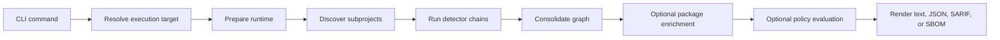

# Bomly

Dependency intelligence for modern software projects.

Bomly scans source trees, SBOMs, Git refs, and container images to show what you depend on, explain why it is there, and surface vulnerability and license data when you ask for it.

## Why Bomly

- One CLI for dependency scanning, package enrichment, policy evaluation, explanation, and diffing.
- Native detectors for the ecosystems developers use every day, with Syft-backed coverage for many more.
- Clear text output for humans, plus JSON and SARIF for automation.
- Offline-safe by default: network-backed matchers only run when you opt into `--enrich`.
- Built for developer workflows and CI, not just post-processing reports.

## Highlights

- Scan local projects, SBOM files, Git repositories, and container images.
- Generate SPDX 2.3 and CycloneDX SBOMs with repeatable `--sbom-output` targets.
- Enrich packages with OSV, Grype, KEV, and license metadata with `--enrich`.
- Evaluate package vulnerability data with `--audit --fail-on <severity>`.
- Combine `--enrich --audit` for full external enrichment plus policy findings.
- SARIF stays audit-only.
- Explain transitive paths with `bomly explain <package>`.
- Compare dependency state across Git refs or SBOM files with `bomly diff`.
- Filter by ecosystem, detector, auditor, matcher, and dependency scope.

## Quick Start

```bash
# Scan the current project
bomly scan

# Write SBOMs in two formats
bomly scan -o spdx-json=sbom.spdx.json -o cyclonedx-json=sbom.cdx.json

# Enrich packages with external vulnerability and license data
bomly scan --enrich

# Evaluate policy using existing package vulnerability data
bomly scan --audit --fail-on high

# Enrich first, then audit and emit SARIF
bomly scan --enrich --audit --fail-on high --format sarif

# Explain why a dependency exists
bomly explain lodash

# Compare dependency state across Git refs
bomly diff --base main --head feature/my-change
```

## Installation

### `go install` for the full Bomly CLI

```bash
go install github.com/bomly/bomly-cli/cmd/bomly@latest
```

`go install` now builds the default full Bomly binary, including builtin Syft and Grype support.

### GitHub Releases

GitHub Releases are the canonical distribution point for packaged binaries. Each draft prerelease includes:

- `bomly` archives for Linux, macOS, and Windows
- `bomly-lite` archives for users who prefer external `syft` and `grype` binaries on `PATH`
- `SHA256SUMS` for checksum verification

Archive naming follows this pattern:

- `bomly_<version>_<os>_<arch>.tar.gz`
- `bomly-lite_<version>_<os>_<arch>.tar.gz`
- Windows archives use `.zip`

### `bomly` vs `bomly-lite`

| Artifact | Behavior |
| --- | --- |
| `bomly` | Full default binary with embedded Syft and Grype support |
| `bomly-lite` | Alternate binary that shells out to external `syft` and `grype` binaries |

### Verify release checksums

On Linux and macOS:

```bash
sha256sum --check SHA256SUMS
```

On PowerShell:

```powershell
Get-FileHash .\bomly_v0.2.0_windows_amd64.zip -Algorithm SHA256
```

## What It Scans

Bomly has native detectors for:

- Go modules
- npm, pnpm, and Yarn
- Maven and Gradle
- Python via pip, Pipenv, Poetry, and uv
- Composer
- Bundler
- GitHub Actions
- SPDX and CycloneDX SBOMs

Bomly also supports many additional ecosystems through Syft-backed detection. See [docs/SUPPORT_MATRIX.md](docs/SUPPORT_MATRIX.md) for the generated matrix.

## Core Commands

### `bomly scan`

Use `scan` to resolve dependencies from a local path, a remote Git repository, a container image, or an SBOM file.

```bash
# Scan a directory
bomly scan --path .

# Scan a container image
bomly scan --container ghcr.io/example/app:latest

# Treat a file as an SBOM input
bomly scan --sbom --path ./existing-sbom.json

# Filter to runtime dependencies only
bomly scan --scope runtime
```

### `bomly explain`

Use `explain` to show the dependency path that introduced a package.

```bash
bomly explain requests
```

### `bomly diff`

Use `diff` to compare dependency state between two Git refs or two SBOM files.

```bash
# Git refs
bomly diff --base main --head HEAD

# SBOM files
bomly diff --sbom --base ./old.spdx.json --head ./new.spdx.json
```

## Output Modes

| Output | Command |
| --- | --- |
| Human-readable report | `bomly scan` |
| Structured JSON | `bomly scan --format json` |
| SARIF 2.1.0 | `bomly scan --audit --format sarif` |
| SPDX 2.3 JSON | `bomly scan -o spdx-json=sbom.spdx.json` |
| CycloneDX JSON | `bomly scan -o cyclonedx-json=sbom.cdx.json` |

## Configuration

Bomly loads configuration in this order, with later sources taking precedence:

1. `~/.bomly/config.yaml`
2. `<project>/.bomly/config.yaml`
3. `BOMLY_*` environment variables
4. CLI flags

Use `--config <path>` to add an explicit config file to the load list.

See [docs/CONFIG_REFERENCE.md](docs/CONFIG_REFERENCE.md) for the generated reference.

## Architecture

Bomly keeps the CLI thin and pushes orchestration into the scan runtime.



More detail lives in [docs/ARCHITECTURE.md](docs/ARCHITECTURE.md).

## Repository Layout

```text
cmd/bomly/           CLI entry point
internal/cli/        Commands, config loading, progress, help
internal/scan/       Runtime preparation, orchestration, consolidation
internal/detectors/  Ecosystem-specific dependency resolution
internal/matchers/   External enrichment matchers and shared matcher cache
internal/auditors/   Policy evaluation and finding creation
internal/licenses/   Shared license helpers
internal/output/     Text, JSON, and SARIF rendering
internal/sbom/       SPDX and CycloneDX encoding and decoding
internal/explain/    Dependency path explanation
internal/registry/   Canonical support and discovery registry
internal/system/     OS-level helpers used internally
docs/                Public reference documentation
```

## Development

```bash
make build
make build-lite
make test
make run ARGS="scan"
```

If you change config, schema, or support-matrix inputs, run `make generate` as well.

## CI and Releases

Bomly uses GitHub Actions for:

- fast PR validation
- deeper branch hardening on `main`
- merge-queue smoke coverage before merge
- nightly smoke coverage for upstream drift detection
- draft prerelease packaging to GitHub Releases

See [docs/CI.md](docs/CI.md) for workflow triggers, required checks, release packaging, checksum handling, and the planned future attestation step.

Contributor guidance lives in [CONTRIBUTING.md](CONTRIBUTING.md).
