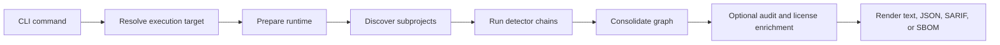

# Bomly

Dependency intelligence for modern software projects.

Bomly scans source trees, SBOMs, Git refs, and container images to show what you depend on, explain why it is there, and surface vulnerability and license data when you ask for it.

## Why Bomly

- One CLI for dependency scanning, SBOM generation, vulnerability auditing, explanation, and diffing.
- Native detectors for the ecosystems developers use every day, with Syft-backed coverage for many more.
- Clear text output for humans, plus JSON and SARIF for automation.
- Offline-safe by default: network-backed enrichment only runs when you opt into `--audit`.
- Built for developer workflows and CI, not just post-processing reports.

## Highlights

- Scan local projects, SBOM files, Git repositories, and container images.
- Generate SPDX 2.3 and CycloneDX SBOMs with repeatable `--sbom-output` targets.
- Audit with OSV and Grype, with KEV and license enrichment behind the same `--audit` switch.
- Explain transitive paths with `bomly explain <package>`.
- Compare dependency state across Git refs or SBOM files with `bomly diff`.
- Filter by ecosystem, detector, auditor, matcher, and dependency scope.

## Quick Start

```bash
# Scan the current project
bomly scan

# Write SBOMs in two formats
bomly scan -o spdx-json=sbom.spdx.json -o cyclonedx-json=sbom.cdx.json

# Audit dependencies and emit SARIF
bomly scan --audit --format sarif

# Explain why a dependency exists
bomly explain lodash

# Compare dependency state across Git refs
bomly diff --base main --head feature/my-change
```

## What It Scans

Bomly has native detectors for:

- Go modules
- npm, pnpm, and Yarn
- Maven and Gradle
- Python via pip, Pipenv, Poetry, and uv
- Composer
- Bundler
- GitHub Actions
- SPDX and CycloneDX SBOMs

Bomly also supports many additional ecosystems through Syft-backed detection. See [docs/SUPPORT_MATRIX.md](docs/SUPPORT_MATRIX.md) for the generated matrix.

## Core Commands

### `bomly scan`

Use `scan` to resolve dependencies from a local path, a remote Git repository, a container image, or an SBOM file.

```bash
# Scan a directory
bomly scan --path .

# Scan a container image
bomly scan --container ghcr.io/example/app:latest

# Treat a file as an SBOM input
bomly scan --sbom --path ./existing-sbom.json

# Filter to runtime dependencies only
bomly scan --scope runtime
```

### `bomly explain`

Use `explain` to show the dependency path that introduced a package.

```bash
bomly explain requests
```

### `bomly diff`

Use `diff` to compare dependency state between two Git refs or two SBOM files.

```bash
# Git refs
bomly diff --base main --head HEAD

# SBOM files
bomly diff --sbom --base ./old.spdx.json --head ./new.spdx.json
```

## Output Modes

| Output | Command |
| --- | --- |
| Human-readable report | `bomly scan` |
| Structured JSON | `bomly scan --format json` |
| SARIF 2.1.0 | `bomly scan --audit --format sarif` |
| SPDX 2.3 JSON | `bomly scan -o spdx-json=sbom.spdx.json` |
| CycloneDX JSON | `bomly scan -o cyclonedx-json=sbom.cdx.json` |

## Configuration

Bomly loads configuration in this order, with later sources taking precedence:

1. `~/.bomly/config.yaml`
2. `<project>/.bomly/config.yaml`
3. `BOMLY_*` environment variables
4. CLI flags

Use `--config <path>` to add an explicit config file to the load list.

See [docs/CONFIG_REFERENCE.md](docs/CONFIG_REFERENCE.md) for the generated reference.

## Architecture

Bomly keeps the CLI thin and pushes orchestration into the scan runtime.



More detail lives in [docs/ARCHITECTURE.md](docs/ARCHITECTURE.md).

## Repository Layout

```text
cmd/bomly/           CLI entry point
internal/cli/        Commands, config loading, progress, help
internal/scan/       Runtime preparation, orchestration, consolidation
internal/detectors/  Ecosystem-specific dependency resolution
internal/auditors/   Vulnerability auditing
internal/licenses/   License enrichment
internal/output/     Text, JSON, and SARIF rendering
internal/sbom/       SPDX and CycloneDX encoding and decoding
internal/explain/    Dependency path explanation
internal/registry/   Canonical support and discovery registry
internal/system/     OS-level helpers used internally
docs/                Public reference documentation
```

## Development

```bash
make build
make build-lite
make test
make run ARGS="scan"
```

If you change config, schema, or support-matrix inputs, run `make generate` as well.

Contributor guidance lives in [CONTRIBUTING.md](CONTRIBUTING.md).
