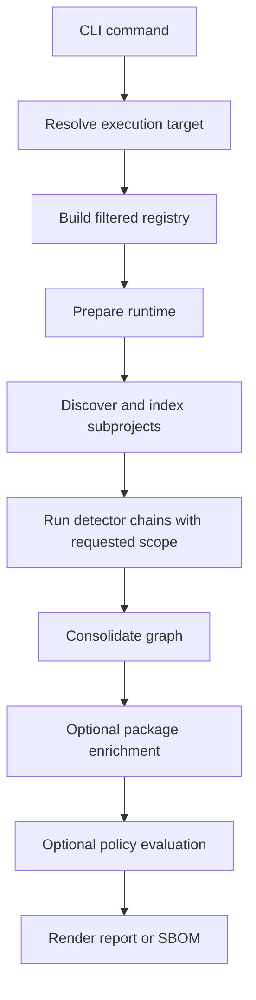
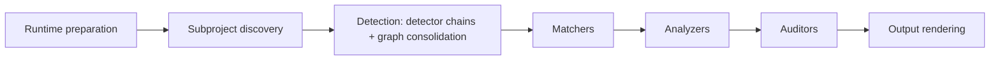
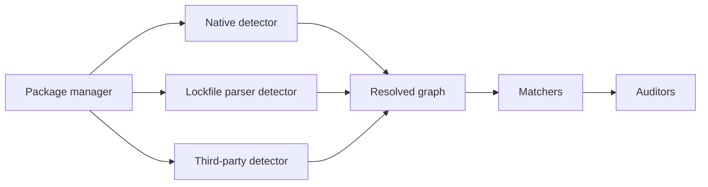

# Bomly Architecture

This document explains how Bomly is structured today and how the main command flows work.

## Product Shape

Bomly is a CLI-first dependency intelligence tool. The command-line interface is the public surface, while the analysis engine underneath is organized so the same runtime can support scanning, explanation, diffing, SBOM generation, and auditing without duplicating logic.

Current public commands:

| Command         | Purpose                                                |
|-----------------|--------------------------------------------------------|
| `bomly scan`    | Resolve dependencies, render reports, and write SBOMs  |
| `bomly explain` | Show why a dependency exists in a graph                |
| `bomly diff`    | Compare dependency state across Git refs or SBOM files |
| `bomly version` | Print version information                              |

## Runtime Overview

Bomly prepares one runtime per command execution. That runtime holds the filtered registry, execution target metadata, planned subprojects, and detector, matcher, and auditor selections so discovery and execution stay aligned.

## Execution Targets

Each invocation operates on exactly one execution target:

- Filesystem path
- Container image
- Remote Git repository
- SBOM file

The CLI resolves the raw user input, but runtime preparation owns discovery and planning. That keeps `scan`, `explain`, and `diff` consistent with one another.

## Scan Pipeline

The scan engine is responsible for orchestration, not the CLI command handlers. The command layer gathers inputs, while the runtime handles ordering, selection, and reuse.

Stage summary:

1. Runtime preparation builds the filtered registry and execution plan.
2. Subproject discovery finds supported package-manager roots for the target.
3. Detection resolves a dependency graph per package manager and then consolidates the per-subproject graphs into the single graph and package registry the rest of the pipeline uses. When `--scope` is set, the requested scope is part of the detector request so build-tool detectors can narrow command execution where the package manager supports it; all detector results pass through the shared SDK scope filter, and consolidation is the tail of this stage rather than a separate step.
4. Matchers enrich packages with additional metadata such as licenses, EOL status, and vulnerability records.
5. Analyzers run when `--analyze` is set. They consume the matched graph and annotate `sdk.Vulnerability.Reachability` (on the PURL-keyed registry package) with status (reachable/unreachable/unknown), tier (symbol/module/package/none), and call paths. Failures degrade to `Status=unknown` rather than aborting the pipeline. See [`../docs/REACHABILITY.md`](../docs/REACHABILITY.md) for ecosystem coverage and tier semantics.
6. Auditors evaluate policy against the enriched graph + registry pair and create reference-style findings (`PackageRef` + `VulnerabilityID`) when `--audit` is enabled. The built-in `vulnerability`, `license`, and `package` auditors cover advisory thresholds, SPDX policy, and denied or suspicious packages respectively.
7. Users combine `--enrich --audit` when they want external matcher data to feed policy evaluation in the same run.
8. Output rendering emits text, JSON, SARIF, or SBOM documents.

`bomly explain` reuses the same detection (resolution + consolidation) and matching stages, then performs dependency path selection in its explain orchestration before optional component audit.

## Extensibility

Extensibility is the core of Bomly's design. **Every built-in is an implementation of the same contract an external plugin implements** — there is no privileged internal path. Adding an ecosystem, an enrichment source, or a policy gate does not require forking the engine. Three extension points are pluggable today (detector, matcher, auditor); external **analyzer** plugins are planned — the built-in reachability analyzers are not yet loadable as plugins.

The diagram shows where plugins hook into the run, after the runtime is configured and subprojects are indexed:

| Extension point | Status | Contract (`sdk`) | Responsibility |
| --- | --- | --- | --- |
| Detector | Available | `sdk.Detector` | Turn evidence (lockfile, manifest, SBOM) into a dependency graph |
| Matcher | Available | `sdk.Matcher` | Enrich packages with vulnerability, license, or lifecycle data |
| Auditor | Available | `sdk.Auditor` | Evaluate policy and emit reference-style findings |
| Analyzer | Planned | `sdk.Analyzer` | Annotate `sdk.Vulnerability.Reachability` for a language |

External plugins run as versioned (`v1`) gRPC binaries and participate in the same runtime planning as built-ins: detector plugins declare evidence patterns and join subproject discovery; matcher and auditor plugins are selected with the same `--matchers` / `--auditors` selector grammar. Plugins are disabled until explicitly enabled. See [PLUGINS.md](../docs/PLUGINS.md) for the trust model and authoring guides.

Analyzers exist as a contract (`sdk.Analyzer`) and ship four built-in implementations (govulncheck, jsreach, pyreach, jvmreach), but the plugin runtime does not yet accept an analyzer kind, so they cannot be supplied by an external plugin today. Making analyzers a first-class plugin extension point is planned.

### Decision: YAML configuration is nested at the file boundary

Bomly's YAML files use strict nested groups such as `target`, `analysis`, `policy`, `network.proxy`, and `matchers.osv`, while `config.Resolved` remains flat. Nesting keeps customer-authored files readable without spreading YAML organization through the CLI and engine. Each YAML leaf maps back to one flat runtime field, and layered files preserve explicit zero values, including empty lists. Unknown keys and the former flat YAML keys fail with migration guidance so typos cannot silently disable requested behavior.

### Decision: Reachability annotates vulnerabilities, not findings

Reachability data lives on `sdk.Vulnerability.Reachability` rather than on `Finding.Reachability` because `--analyze` must be useful without `--audit`. Matchers populate the OSV-aligned `Vulnerability` record on the PURL-keyed registry package; the analyzer enriches it in place; the output layer resolves the analyzer's annotation by `(Finding.PackageRef, Finding.VulnerabilityID)` when emitting SARIF and the JSON `Finding` projection. This keeps a single source of truth (the registry) and removes the per-manifest sync that the old graph-mutating model required.

### Decision: Three-collection domain model — dependencies, packages, findings

`sdk` separates three pipeline concerns that the original model conflated:

1. **`sdk.Dependency`** (`sdk/dependency.go`) is a detection-time graph node. It carries identity (`ID`, `Name`, `Version`, `PURL`), detection metadata (`Scopes`, `Locations`, `FoundBy`), edges through the `Graph`, and a `PackageRef` (PURL) that links to a matching artifact. It does **not** carry licenses, vulnerabilities, or scorecard data.
2. **`sdk.Package`** (`sdk/package.go`) is a matching artifact keyed by PURL on a `sdk.PackageRegistry`. It carries `Licenses`, `Vulnerabilities` (OSV-aligned `sdk.Vulnerability`), `Scorecard`, `EOL`, and similar enrichment. There is one entry per unique PURL across the whole pipeline, so 50 dependencies referencing the same package share one set of CVEs and one license decision.
3. **`sdk.Finding`** (`sdk/vulnerability.go`) is a reference-style audit result. It carries policy fields (`Severity`, `Disposition`, `Reasons`, `Auditor`) plus the references `PackageRef` (PURL) and, for vulnerability findings, `VulnerabilityID`. It does **not** copy CVSS / EPSS / KEV / CWE — consumers resolve those by following the references back into the registry.

`sdk.Vulnerability` is OSV-aligned (id, aliases, summary, details, severity, affected, references, database_specific) and extended with Bomly's matching-stage fields (CVSS, EPSS, KEV, CWE, FixedVersions, AffectedSymbols, `Reachability`). The OSV matcher maps `internal/matchers/osv/response.go` directly to this shape; grype / depsdev / eol / scorecard and enabled external matchers write the equivalent records.

Pipeline plumbing: `engine.PipelineResult` exposes `Graph`, `Registry`, `Findings`, and `RiskScores`. The registry is built right after consolidation (`consolidation.BuildPackageRegistry`) and threaded through match/analyze/audit requests; output helpers (`BuildScanResponse`, `WriteSARIF`, `FindingsFromScan`, `PackagesFromGraph`) all accept `*sdk.PackageRegistry` and re-enrich their projections by resolving `PackageRef` and `VulnerabilityID`. See [`MODELS.md`](MODELS.md) for the full schema reference.

### Decision: Package locations are detector-relative today

`PackageLocation.Position.File` is emitted by detectors in the coordinate space of the detector working directory. For single-root projects that is already repository-relative, which lets `bomly diff` compare SARIF locations with repo-relative changed-line ranges.

Subproject discovery does **not** recurse into subdirectories today (`planFilesystemSubprojects` only inspects the execution-target root), so every subproject currently resolves with `RelativePath` `"."` and detector positions are already repository-relative. To future-proof a recursive scan mode, consolidation rebases core-detector location paths onto the subproject root via `rebaseGraphLocations` (`internal/engine/consolidation/locations.go`): a subproject discovered at `apps/web` reporting `package-lock.json` is rewritten to `apps/web/package-lock.json`. This mirrors the existing manifest-path rebasing (`normalizeNativeManifestPath`) and is a deliberate no-op while `RelativePath` is `"."`. Absolute and already-prefixed paths are left untouched, so the rewrite is idempotent. Until a recursive mode actually produces non-root subprojects, location extraction remains best effort and the output layer only prefers changed lines when the detector path matches the git diff path.

### Decision: Reachability analyzers derive local hierarchy closures

Tier-3 source analyzers discover local workspace and module hierarchies from declarative project files while the consolidated detector graph remains the source of truth for external package edges. `jsreach` follows package-name imports across npm, Yarn, and pnpm workspace members. `jvmreach` follows source namespace imports across Maven `<modules>` and standard Gradle `include` declarations. This keeps hierarchy traversal automatic, avoids package-manager installation or network activity during reachability analysis, and prevents unused sibling projects from widening the reachable set.

### Decision: Scorecard matcher reads precomputed runs, not the library

The OpenSSF Scorecard matcher (`internal/matchers/scorecard`) fetches precomputed per-repo scores from `api.scorecard.dev` instead of importing `github.com/ossf/scorecard/v5` and running checks in-process. Three reasons:

1. **Dependency cost.** The Scorecard Go library pulls in k8s, buildkit, containerd, bigquery, go-containerregistry, and osv-scanner transitive deps — roughly 150–250 MB of additional code that would land in every Bomly build, violating the "standard library + existing deps only" non-negotiable.
2. **Credentials.** Running Scorecard live makes 60+ GitHub API calls per repo and is unusable without a `GITHUB_AUTH_TOKEN`. A customer-facing CLI that quietly demands a token would surprise users and complicate CI integration.
3. **Latency.** Live runs take 1–3 minutes per repo. The precomputed API answers in tens of milliseconds and the OSSF refresh cadence (weekly) is acceptable for project-posture data.

The matcher attaches `sdk.PackageScorecard` to packages whose upstream source resolves to a `github.com/{owner}/{repo}` URL, dedupes by repo so a monorepo's many packages share one HTTP call, caches 200 responses for 24h, and caches 404s as a sentinel so unscored repos are not retried within the TTL. Packages whose source repo lives outside github.com (GitLab, internal Git) or only in registry metadata not yet wired into Bomly are skipped silently. A future revision can add a deps.dev project-endpoint fallback for the second case without breaking changes.

## Detector and Auditor Model

Bomly treats detectors, matchers, and auditors as explicit runtime roles.

- Detectors resolve package graphs.
- Matchers enrich Resolved packages.
- Auditors evaluate policy and produce normalized findings.

Within a package-manager chain, Bomly uses explicit ordering and superseding rules. Native detectors are preferred where available, and Syft-backed detection fills the coverage gaps for additional ecosystems.

Implementation priority:

| Category        | Examples                                                                 | Priority |
|-----------------|--------------------------------------------------------------------------|----------|
| Native          | Go, Node, Maven, Gradle, Python, Composer, Bundler, GitHub Actions, SBOM | Highest  |
| Lockfile parser | Package-manager-specific parsers where applicable                        | High     |
| Third-party     | Syft detector, Grype matcher                                             | Lower    |

Native detector coverage is quality-of-graph coverage, not just support-matrix labeling. A built-in detector should ship with deterministic package metadata, graph edges where the ecosystem source can provide them, direct/development/runtime classification when it can be inferred, package URLs, unit fixtures in the detector package, and smoke coverage when a stable root-level real repository is available. Syft remains the compatibility backstop for package managers or project shapes that Bomly cannot resolve directly.

Some native detector chains intentionally prefer a build-tool command over a committed file parser because the command can expose transitive edges that the lockfile or manifest does not encode. Pub, SwiftPM, and SBT follow this pattern: `pub-native`, `swiftpm-native`, and `sbt-native` run first when `dart`, `swift`, or `sbt` is available, then fall back to the committed-file detector if the tool is missing or fails. When validating graph-shape changes for those ecosystems, run smoke tests and the local benchmark on a host with the relevant toolchain installed.

### Decision: dependency graph benchmarking is hidden and local-only

`bomly benchmark` is a hidden maintainer command backed by `internal/benchmark`. It scans public GitHub repositories with native detectors, compares the filtered dependency graph against GitHub Dependency Graph and external Syft SBOMs, and writes deterministic artifacts under `.benchmark-runs/latest`. Bomly scan and SBOM diff execution run in-process through the engine and output model; only the external `git` and `syft` tools remain subprocesses. The in-process adapter builds a native-only registry directly so local configuration and managed-plugin discovery cannot distort benchmark results. Package and relationship scores are comparative engineering signals, not pass/fail gates and not claims that a baseline is ground truth. The benchmark is intentionally local-only so exploratory scoring does not become a release or merge gate before it is calibrated.

### Decision: Python graph resolution is lockfile-first, validated, and provenance-backed

Python build-tool inspection can accidentally read the wrong environment: `pip inspect --local` reports every package in the interpreter it is pointed at, even if that interpreter belongs to unrelated tooling. Bomly therefore treats Python graph resolution as accurate-or-fail:

1. **Deterministic lock parsers first.** `requirements.lock`, `poetry.lock`, and `uv.lock` are parsed directly when possible. `Pipfile.lock` remains the Pipenv fallback because it is flat but project-owned.
2. **Validated project environments.** When a detector inspects an environment, the graph must contain the dependencies declared by the selected project. Mismatches fail with the missing package names instead of returning a stale or unrelated graph.
3. **Isolated pip installs.** Plain pip projects without `requirements.lock` are installed into a clean, project-scoped virtualenv under the temp dir — keyed by a hash of the absolute working dir — and then inspected from that venv. Ambient site-packages are never accepted as the project graph.
4. **Resolution provenance.** Manifest metadata carries the resolution method, sanitized install command, install working directory, and validation summary into scan JSON so users can see exactly how a graph was produced.

The smoke/benchmark Python targets rely on the fast-paths for determinism: `scan-python-poetry` uses the committed `poetry.lock` fast-path, and `scan-python-pip` commits a `requirements.lock`. The venv isolation remains the correctness backstop for real-world pip projects scanned without a committed lock.

## Build Modes

Syft and Grype each support two build modes:

| Mode     | Build tags                                  | Behavior                                                                                                                                            |
|----------|---------------------------------------------|-----------------------------------------------------------------------------------------------------------------------------------------------------|
| Builtin  | default build                               | Link Syft and Grype libraries directly. No external binary required.                                                                                |
| External | `bomly_external_syft`, `bomly_external_grype` | Shell out to `syft` and `grype` binaries on PATH. Used by `make build-lite` to produce a smaller binary.                                          |

The reachability analyzers are not split: `govulncheck` always uses the vendored `golang.org/x/vuln/scan` library and `jsreach` always uses the vendored `github.com/evanw/esbuild/pkg/api` library. Both libraries are small enough that vendoring them outweighs the maintenance cost of a build-tag split.

`make build` produces both release variants. `make build-full` produces the default builtin binary, and `make build-lite` produces the smaller external-tool build.

## CI and Releases

GitHub Actions handles validation, security analysis, smoke coverage, and release packaging:

- Pull requests run fast validation only.
- Pushes to `main` run deeper quality checks and scheduled smoke coverage.
- Semver tags run GoReleaser to publish GitHub Releases with GitHub-native release notes, cross-platform archives, `SHA256SUMS`, Linux packages, and package-manager manifests.
- GoReleaser also opens package-manager manifest PRs for Homebrew, Scoop, and WinGet. Official distro repositories are intentionally out of scope until usage justifies the maintainer overhead.

See [CI and Release Pipeline](CI.md) for workflow details and release mechanics.

## Network Behavior

**Matchers are offline-safe by default.** Network-backed matchers run only when the user explicitly enables `--enrich`. `--audit` evaluates existing package vulnerability data and does not trigger network enrichment.

**Detector network behavior is per-implementation.** Lockfile-parser detectors (npm, pnpm, yarn, Composer, Bundler, NuGet, GitHub Actions, SBOM ingest, …) are pure file parsers and make no network calls. Build-tool primary detectors (`go-detector`, `maven-detector`, `gradle-detector`, `sbt-native-detector`) shell out to the build tool, which may download packages from registries during normal resolution — this is the build tool's behavior, not Bomly's. Hybrid detectors (`cargo`, `poetry`, `uv`) prefer the lockfile and use `--locked`/`--no-sync` flags on the build-tool fallback to stay offline. See [DETECTORS.md → Network behavior](../docs/DETECTORS.md#network-behavior).

`--install-first` is the explicit opt-in: it tells supporting detectors to run their normal install command (`npm install`, `pip install`, `composer install`, etc.) before resolving the graph. This downloads packages by design.

Permitted enrichment-time services:

- OSV
- CISA KEV
- deps.dev
- OpenSSF Scorecard

Cache failures are non-fatal. The command should warn and continue rather than failing hard.

## Package Map

| Package               | Role                                                                                            |
|-----------------------|-------------------------------------------------------------------------------------------------|
| `cmd/bomly`           | CLI entry point                                                                                 |
| `internal/cli`        | Commands, config loading, progress, and help output                                             |
| `internal/engine`     | Runtime preparation, orchestration, and consolidation                                           |
| `internal/registry`   | Support metadata, package-manager discovery, and built-in detector, matcher, and auditor wiring |
| `internal/detectors`  | Detector contracts and ecosystem implementations                                                |
| `internal/auditors`   | Policy evaluators and finding creation                                                          |
| `internal/analyzers`  | Reachability analyzers (govulncheck for Go, jsreach for JS/TS, pyreach for Python, jvmreach for JVM languages) that annotate `sdk.Vulnerability.Reachability` on registry packages |
| `internal/matchers`   | Matcher contracts plus shared enrichment helpers used by built-in matchers                      |
| `internal/engine/diff` | Diff pipeline orchestration and audit delta classification                                    |
| `internal/engine/explain` | Dependency path traversal                                                                   |
| `internal/engine/scan` | Scan command pipeline API                                                                    |
| `internal/output`     | Text, JSON, SARIF rendering, plus structured response payloads and schema generation            |
| `internal/sbom`       | SPDX and CycloneDX codecs                                                                       |
| `internal/benchmark`  | Hidden local dependency-graph benchmark, baseline comparison, scoring, and embedded presets      |
| `sdk`      | Shared domain types                                                                             |
| `internal/plugin`     | Managed plugin manifests, installation, verification, store state, adapters, and runtime glue  |
| `internal/extensions` | Extension hooks and support code                                                                |
| `internal/system`     | OS-level helpers used internally                                                                |
| `internal/testutil`   | Test helpers                                                                                    |

## Managed Plugins

Bomly uses a hybrid plugin model:

- Built-in detectors, matchers, and auditors stay in-process by default.
- External managed plugins are installed into `~/.bomly/plugins`.
- Runtime preparation loads enabled external plugins into the registry as adapters so the scan engine still owns orchestration. External plugins are disabled on install and become runnable only after `bomly plugins enable <id>`.

Managed plugins currently expose the same three runtime roles as core components:

- Detectors resolve graphs.
- Matchers enrich packages.
- Auditors produce findings and risk signals.

## HashiCorp Runtime

External plugins run through HashiCorp `go-plugin` in gRPC mode. Bomly uses a small public SDK under `sdk` and JSON-encoded v1 request and response schemas under `sdk`.

The runtime layer is responsible for:

- Handshake and plugin API version checks.
- Subprocess launch and cleanup.
- gRPC transport for metadata, detect, match, and audit calls.
- Context-based cancellation and error propagation.

## Plugin SDK

Plugin authors import `sdk` instead of depending on `internal/` packages. The SDK exposes:

- `ServeDetector`
- `ServeMatcher`
- `ServeAuditor`
- Versioned request and response structs in `sdk`
- Identity metadata plus role descriptors for component type, supported modes, matcher required-ness, detector fallback wiring, and install-first support
- Optional runtime hooks for readiness, applicability, and detector install-first execution

The SDK keeps HashiCorp plumbing out of plugin implementations while preserving a typed boundary. Built-ins now use the same SDK contract in-process and are adapted back into the scan engine through shared SDK-to-runtime adapters. That keeps built-ins and external plugins on one metadata and execution model while leaving installation and verification as external-plugin-only concerns.

## Plugin Installation

Managed plugin installation is owned by Bomly rather than by the runtime library. The install flow is:

1. Resolve a local archive, local dev binary, or direct URL source.
2. Validate checksums when required.
3. Extract archives safely into a temp directory.
4. Validate `bomly-plugin.json`.
5. Start the plugin through the SDK/gRPC runtime, fetch the role descriptor named by the manifest kind, require `descriptor.name == manifest.id`, and store Bomly's internal descriptor snapshot.
6. Move the plugin into `~/.bomly/plugins/store/<id>/<version>`.
7. Update `installed.json` atomically.

The installer rejects archive path traversal, absolute paths, unsupported entrypoints, incompatible manifests, and runtime descriptors that do not match the manifest identity.

## Plugin Selection

External plugins are not executed ad hoc from CLI handlers. Runtime preparation loads enabled installed plugins into the engine registry before filtering and subproject planning.

Selection rules stay aligned with the normal scan pipeline:

- Built-ins are registered first.
- External plugins are added as `plugin` components with descriptor-derived support and discovery plans.
- Detector plugins declare package-manager support and evidence patterns in the detector descriptor. Runtime preparation uses those patterns to augment package-manager discovery or create standalone plugin-driven subprojects when no built-in package-manager pattern applies.
- Runtime preparation filters detectors, matchers, auditors, and ecosystems once and reuses that prepared registry for scan execution.

## Built-In vs External Plugins

Built-ins remain the default implementation for core and performance-sensitive logic. External managed plugins are intended for optional or isolatable behavior, especially ecosystem-specific or third-party-backed integrations.

Built-ins and external plugins now share the same SDK-first contract. The difference is operational, not structural:

- built-ins are compiled into the binary and run in-process
- external plugins are installed, verified, and executed behind the managed plugin runtime

## Migration of Existing Components

Bomly no longer assumes that all plugin-capable behavior must stay historical or in-process forever. The registry and scan pipeline now accept either:

- Native built-ins compiled into the main binary.
- External managed plugins adapted into the same detector, matcher, and auditor interfaces.

This keeps the scan engine recognizable while making it possible to migrate selected integrations into managed plugins over time without bypassing runtime preparation, and it prevents drift between built-in and external component metadata.

## Design Boundaries

- Detector packages must not import `internal/engine` or `internal/registry`.
- `sdk` owns shared neutral identifiers and support types.
- `internal/registry` owns discovery, support-matrix data, and built-in registry wiring.
- `internal/engine` owns runtime planning, orchestration, and detector-chain reuse.
- `internal/plugin` owns managed plugin installation, verification, store state, and external runtime adapters.
- The CLI resolves user input but should not perform its own independent discovery pass.
