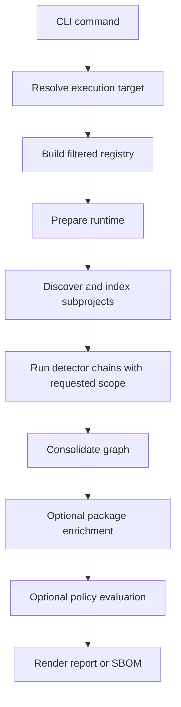
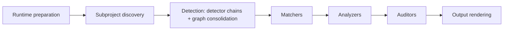
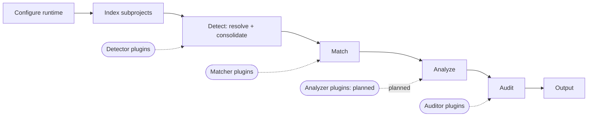
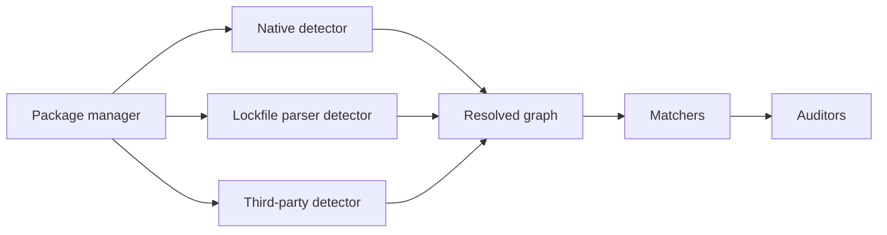

# Bomly Architecture

This document explains how Bomly is structured today and how the main command flows work.

## Product Shape

Bomly is a CLI-first dependency intelligence tool. The command-line interface is the public surface, while the analysis engine underneath is organized so the same runtime can support scanning, explanation, diffing, SBOM generation, and auditing without duplicating logic.

Current public commands:

| Command         | Purpose                                                |
|-----------------|--------------------------------------------------------|
| `bomly scan`    | Resolve dependencies, render reports, and write SBOMs  |
| `bomly explain` | Show why a dependency exists in a graph                |
| `bomly diff`    | Compare dependency state across Git refs or SBOM files |
| `bomly version` | Print version information                              |

## Runtime Overview

Bomly prepares one runtime per command execution. That runtime holds the filtered registry, execution target metadata, planned subprojects, and detector, matcher, and auditor selections so discovery and execution stay aligned.

## Execution Targets

Each invocation operates on exactly one execution target:

- Filesystem path
- Container image
- Remote Git repository
- SBOM file

The CLI resolves the raw user input, but runtime preparation owns discovery and planning. That keeps `scan`, `explain`, and `diff` consistent with one another.

## Scan Pipeline

The scan engine is responsible for orchestration, not the CLI command handlers. The command layer gathers inputs, while the runtime handles ordering, selection, and reuse.

Stage summary:

1. Runtime preparation builds the filtered registry and execution plan.
2. Subproject discovery finds supported package-manager roots for the target. By default only the execution-target root is inspected; `--recursive` walks nested directories (bounded by `--max-depth`, `--exclude`, and built-in ignore rules) and plans one subproject per directory-and-package-manager pair, with workspace-expanding managers pruned below ancestors that already cover them.
3. Detection resolves a dependency graph per package manager and then consolidates the per-subproject graphs into the single graph and package registry the rest of the pipeline uses. When `--scope` is set, the requested scope is part of the detector request so build-tool detectors can narrow command execution where the package manager supports it; all detector results pass through the shared SDK scope filter, and consolidation is the tail of this stage rather than a separate step.
4. Matchers enrich packages with additional metadata such as licenses, EOL status, and vulnerability records.
5. Analyzers run when `--analyze` is set. They consume the matched graph and annotate `sdk.Vulnerability.Reachability` (on the PURL-keyed registry package) with status (reachable/unreachable/unknown), tier (symbol/module/package/none), and call paths. Failures degrade to `Status=unknown` rather than aborting the pipeline. See [`../docs/REACHABILITY.md`](../docs/REACHABILITY.md) for ecosystem coverage and tier semantics.
6. Auditors evaluate policy against the enriched graph + registry pair and create reference-style findings (`PackageRef` + `VulnerabilityID`) when `--audit` is enabled. As the final part of that same audit stage, neutral policy-status resolvers may change only `Finding.PolicyStatus`; they never remove or rewrite finding evidence. The built-in `vulnerability`, `license`, and `package` auditors cover advisory thresholds, SPDX policy, and denied or suspicious packages respectively.
7. Users combine `--enrich --audit` when they want external matcher data to feed policy evaluation in the same run.
8. Output rendering emits text, JSON, SARIF, or SBOM documents.

`bomly explain` reuses the same detection (resolution + consolidation) and matching stages, then performs dependency path selection in its explain orchestration before optional component audit.

## Extensibility

Extensibility is the core of Bomly's design. **Every built-in is an implementation of the same contract an external plugin implements** — there is no privileged internal path. Adding an ecosystem, an enrichment source, or a policy gate does not require forking the engine. Three extension points are pluggable today (detector, matcher, auditor); external **analyzer** plugins are planned — the built-in reachability analyzers are not yet loadable as plugins.

The diagram shows where plugins hook into the run, after the runtime is configured and subprojects are indexed:

| Extension point | Status | Contract (`sdk`) | Responsibility |
| --- | --- | --- | --- |
| Detector | Available | `sdk.Detector` | Turn evidence (lockfile, manifest, SBOM) into a dependency graph |
| Matcher | Available | `sdk.Matcher` | Enrich packages with vulnerability, license, or lifecycle data |
| Auditor | Available | `sdk.Auditor` | Evaluate policy and emit reference-style findings |
| Analyzer | Planned | `sdk.Analyzer` | Annotate `sdk.Vulnerability.Reachability` for a language |

External plugins run as versioned (`v1`) gRPC binaries and participate in the same runtime planning as built-ins: detector plugins declare evidence patterns and join subproject discovery; matcher and auditor plugins are selected with the same `--matchers` / `--auditors` selector grammar. Plugins are disabled until explicitly enabled. See [PLUGINS.md](../docs/PLUGINS.md) for the trust model and authoring guides.

Analyzers exist as a contract (`sdk.Analyzer`) and ship four built-in implementations (govulncheck, jsreach, pyreach, jvmreach), but the plugin runtime does not yet accept an analyzer kind, so they cannot be supplied by an external plugin today. Making analyzers a first-class plugin extension point is planned.

### Decision: YAML configuration is nested at the file boundary

Bomly's YAML files use strict nested groups such as `target`, `analysis`, `policy`, `network.proxy`, and `matchers.osv`, while `config.Resolved` remains flat. Nesting keeps customer-authored files readable without spreading YAML organization through the CLI and engine. Each YAML leaf maps back to one flat runtime field, and layered files preserve explicit zero values, including empty lists. Unknown keys and the former flat YAML keys fail with migration guidance so typos cannot silently disable requested behavior.

### Decision: Reachability annotates vulnerabilities, not findings

Reachability data lives on `sdk.Vulnerability.Reachability` rather than on `Finding.Reachability` because `--analyze` must be useful without `--audit`. Matchers populate the OSV-aligned `Vulnerability` record on the PURL-keyed registry package; the analyzer enriches it in place; the output layer resolves the analyzer's annotation by `(Finding.PackageRef, Finding.VulnerabilityID)` when emitting SARIF and the JSON `Finding` projection. This keeps a single source of truth (the registry) and removes the per-manifest sync that the old graph-mutating model required.

### Decision: Three-collection domain model — dependencies, packages, findings

`sdk` separates three pipeline concerns that the original model conflated:

1. **`sdk.Dependency`** (`sdk/dependency.go`) is a detection-time graph node. It carries identity (`ID`, `Name`, `Version`, `PURL`), detection metadata (`Scopes`, `Locations`, `FoundBy`), an optional direct/transitive/unknown `Relationship`, occurrence `Source`, edges through the `Graph`, and a `PackageRef` (PURL) that links to a matching artifact. It does **not** carry licenses, vulnerabilities, or scorecard data.
2. **`sdk.Package`** (`sdk/package.go`) is a matching artifact keyed by PURL on a `sdk.PackageRegistry`. It carries `Licenses`, `Vulnerabilities` (OSV-aligned `sdk.Vulnerability`), `Scorecard`, `EOL`, and similar enrichment. There is one entry per unique PURL across the whole pipeline, so 50 dependencies referencing the same package share one set of CVEs and one license decision.
3. **`sdk.Finding`** (`sdk/vulnerability.go`) is a reference-style audit result. It carries policy fields (`Severity`, `PolicyStatus`, `Reasons`, `Auditor`, stable `RuleID`) plus the references `PackageRef` (PURL) and, for vulnerability findings, `VulnerabilityID`. It does **not** copy CVSS / EPSS / KEV / CWE — consumers resolve those by following the references back into the registry.

`sdk.Vulnerability` is OSV-aligned (id, aliases, summary, details, severity, affected, references, database_specific) and extended with Bomly's matching-stage fields (CVSS, EPSS, KEV, CWE, FixedVersions, AffectedSymbols, `Reachability`). The OSV matcher maps `internal/matchers/osv/response.go` directly to this shape; grype / depsdev / eol / scorecard and enabled external matchers write the equivalent records.

### Decision: enrichment consolidates alias-equivalent vulnerabilities

Matchers may describe the same package vulnerability under different primary
advisory IDs, even within a single matcher database. After all selected
matchers run, the engine consolidates vulnerability records per PURL using the
transitive closure of `ID` and `Aliases`. The canonical record unions advisory
IDs and evidence, uses the richest input record for scalar metadata, and
retains the highest severity and conservative fix/reachability state. OSV
`Related` IDs never trigger consolidation because
they may identify distinct vulnerabilities. This policy belongs at the central
enrichment boundary so built-in and protocol-v1 external matchers receive the
same behavior without owning global identity policy. Baseline construction
repeats the identity normalization defensively for legacy or independently
constructed registries.

Pipeline plumbing: `engine.PipelineResult` exposes `Graph`, `Registry`, `Findings`, and `RiskScores`. The registry is built right after consolidation (`consolidation.BuildPackageRegistry`) and threaded through match/analyze/audit requests; output helpers (`BuildScanResponse`, `WriteSARIF`, `FindingsFromScan`, `PackagesFromGraph`) all accept `*sdk.PackageRegistry` and re-enrich their projections by resolving `PackageRef` and `VulnerabilityID`. See [`MODELS.md`](MODELS.md) for the full schema reference.

### Decision: finding policy-status resolution belongs inside audit

Auditors remain responsible for creating complete reference-style findings.
After deduplication and `warn-only` handling, the audit stage may run neutral
`sdk.FindingPolicyResolver` implementations. A resolver receives the finding
and package registry, may return a replacement policy status, and cannot remove
or mutate evidence. When multiple resolvers participate, the least suppressive
decision wins.

The first resolver is the package-specific finding baseline under
`internal/baseline`. Its versioned document keys entries by full PURL, finding
kind, auditor, and advisory aliases or stable rule ID. It intentionally contains
no dependency occurrence or project identity, so a baseline is portable across
projects. Discovery happens during normal target preparation: scan and explain
read the materialized project tree, including repositories cloned through
`--url`, while Git diff independently reads the base and head trees. A detected
baseline is logged with its path, entry count, selection mode, and target kind;
each evaluation logs findings evaluated and accepted. Output receives ordinary
findings whose policy status may be `suppressed` through
`Finding.PolicyStatus` / `policy_status`, and no baseline-specific output model
or pipeline stage exists. Renaming the earlier finding field is an intentional
breaking output-contract change while the CLI output schema identifier remains
`1.0` and the compact MCP schema remains `mcp/1`. Protocol-v1 decoding still
accepts the earlier wire field from existing external auditor plugins.

### Decision: registry matching eligibility is an occurrence-level engine boundary

Detection keeps every dependency occurrence and every PURL-backed package artifact, including application roots, workspace members, local sources, and unknown relationships. Immediately before matcher selection and execution, `engine.registryMatchRequest` clones only occurrences for which `Dependency.RegistryMatchEligible()` is true and preserves edges whose endpoints are both eligible. Every built-in and external matcher therefore receives the same filtered graph, while the full `PackageRegistry` remains shared so enrichment is still deduplicated by PURL. Analysis and auditors continue with the complete original graph.

Published registry releases are eligible, including releases downloaded through custom registries or mirrors. First-party and manifest nodes are always ineligible. Project, workspace/link, file, Git, and arbitrary URL occurrences are ineligible. Application type alone is not an ownership signal, so an application artifact imported from an SBOM remains eligible unless it is marked first-party or has a non-registry source. An omitted source and unknown plugin-defined source values remain eligible for protocol-v1 compatibility. Relationship `unknown` does not affect eligibility: a registry package whose parent could not be recovered is still enriched normally. Targeted matching of an ineligible occurrence short-circuits instead of widening to unrelated eligible packages. When eligible and ineligible occurrences share an exact PURL, vulnerability findings reference only the eligible occurrences; if a PURL has no eligible occurrence, detector- or SBOM-supplied vulnerability data remains auditable on its local occurrences.

### Decision: unresolved dependency parents use an explicit unknown relationship

Lockfiles can contain a package component whose parent chain cannot be
recovered. Dropping it hides exposure, while labeling the synthetic manifest
edge direct overstates the evidence. Detectors therefore attach the component
root beneath its owning application or manifest with relationship `unknown`;
known descendants remain transitive. Unknown dependencies are ordinary graph
nodes for every pipeline stage. The optional SDK field is additive for
protocol-v1 plugins, and consumers derive direct/transitive for older graphs
that omit it. Debug logs disclose every attached component without turning a
recoverable graph condition into a warning.

### Decision: JSON findings are references; MCP responses are compact projections

The `--format json` `findings[]` projection now mirrors `sdk.Finding` exactly: an identity-only package ref (display name, org, version, purl), `vulnerability_id`, and `dependency_refs` — no embedded package object and no flat advisory copies. Advisory data lives once in `packages[]` and consumers join by PURL, the way SARIF always did; text/markdown/TUI renderers were converted to the same join. `DiffResponse` gained a `packages[]` collection (PURL-deduplicated union of base and head registries, head wins) so diff audit findings resolve the same way. Rationale: the embedded copies made findings-heavy scan JSON ~10x larger than the data it contained (issue #245) and let the projection drift from the domain model.

The MCP server does not return the CLI JSON documents at all. Tool results land in an agent's context window and MCP clients truncate large results to errors, so `bomly_scan` / `bomly_diff` / `bomly_explain` return compact projections (`schema_version "mcp/1"`, `internal/mcp/types_compact.go`) built from the pipeline's domain data: findings classified by actionability, grouped by the concrete remediation that closes them (direct bump / transitive override with per-package-manager advice / lockfile refresh / no fix upstream), ranked KEV → severity → EPSS → fixability, and hard-capped with explicit truncation counters. `bomly_explain` is the bounded drill-down (full advisory detail for one package); the CLI is the artifact channel for complete documents. The former `bomly_vuln_fix_context` tool was folded into these responses. Shortest dependency paths come from a bounded upward BFS over `Graph.Dependents`, never `CollectPathsTo` (all simple paths is exponential on dense graphs).

### Decision: Recursive discovery prunes native multi-module roots per package manager

`--recursive` discovery (`planRecursiveFilesystemSubprojects`, `internal/cli/opts/planning_recursive.go`) walks the tree with `filepath.WalkDir` and plans subprojects through the same `plannedSubprojectsForPath` helper the root-only path uses. When a package manager whose detector natively expands nested modules (maven, gradle, npm, pnpm, yarn, cargo, sbt, mix) has manifest evidence at an ancestor directory, nested subprojects for that same manager are pruned: the ancestor's detector resolves those modules already (reactor TGF blocks, workspace lockfile importers, `cargo metadata` workspace members), so planning them separately would double-count every dependency. Pruning is per package manager and never skips the directory itself — a Maven ancestor must not hide a nested `requirements.txt`. `gomod` deliberately never prunes: a nested `go.mod` is excluded from the parent module by Go semantics, and the gomod detector has no `go.work` awareness, so each module scans independently (package dedup by PURL absorbs any overlap). Depth counts the root as 0 with a default cap of 3 (`--max-depth 0` = unlimited), matching the discovery probe's existing depth so error hints and the real walk agree. The resolve worker pool stays capped at 4 (`resolveWorkerCount`): recursion mostly adds cheap lockfile subprojects, and raising the cap would multiply concurrent JVM/node build-tool processes on monorepos; revisit only if large lockfile-heavy monorepos show wall-clock pain.

Discovery rules are **detector-owned, not hardcoded**: each detector declares its ecosystem's ignore rules on its descriptor (`sdk.DetectorDescriptor.IgnoredDirectories` basename globs and `IgnoredDirectoryMarkers` marker files such as `pyvenv.cfg`) and marks workspace-expanding support entries with `sdk.PackageManagerSupport.MultiModule` (via `sdk.Support(...).WithMultiModule()`). Discovery aggregates the union across every registered detector (`discoveryRulesFromDetectors`), so external detector plugins contribute rules exactly like built-ins — the fields ride the existing descriptor JSON, making them backward compatible with the v1 plugin protocol (older plugins simply omit them). The walk aggregates from the request's **unfiltered** registry so `--detectors`/`--ecosystems` filters never change which directories are walked; the diagnostic probe falls back to the static built-in catalog (`registry.BuiltinDetectors`). Dot-directory skipping stays core walk behavior, independent of detector declarations.

### Decision: Subprojects and modules are distinct concepts, derived in views

A **subproject** is an independently discovered nested directory (its own discovery-time `sdk.Subproject`, `RelativePath != "."`); a **module** is a member the package manager natively resolves under one root manifest (reactor module, workspace member). The hierarchy is never stored: `output.ClassifyManifest`/`BuildHierarchy` (`internal/output/hierarchy.go`) derive it purely from each manifest's `Subproject` and repo-relative `Path` — a manifest whose directory sits below its subproject directory is a module manifest. Every surface (TUI trees, text report tree, markdown table, MCP compact counts) consumes the same helper, so the JSON schema gained no fields and consumers can apply the identical rule. The scan JSON's per-manifest `subproject` string plus `path` is therefore the single source of truth for project structure.

### Decision: Per-module manifest emission lives in detectors, not consolidation

Workspace/reactor detectors (npm and pnpm lockfile, cargo, maven) emit one `GraphEntry{Graph, ManifestMetadata}` per module using the pre-existing multi-entry `sdk.GraphContainer` — no SDK type changes. Each module entry carries the module's application root plus its reachable subtree (`detectors.SubgraphFrom`), with paths subproject-relative so consolidation's existing rebase/dedup layer stays a pure select/dedup/rebase stage. Shared transitives appear in multiple entries by design; the merged graph and PURL registry deduplicate them, and report-level counts (text manifest count, markdown/MCP package totals) deduplicate by PURL/ID rather than summing per-manifest lengths. Module directories come from the best per-ecosystem source: npm packages-map member keys, pnpm importer keys, `cargo metadata` member `manifest_path` (or `[workspace] members` globs + member `Cargo.toml`s on the lock path — which also fixed virtual workspace roots erroring), a recursive pom `<modules>` walk for maven (TGF output carries no paths; unmatched graph roots fall back into the root entry, and any walk failure degrades to today's single merged manifest), and a `settings.gradle(.kts)` include walk for gradle (see below). **Deferred, degrade to one merged root manifest**: sbt (no machine-readable per-module graph in one invocation), mix and pub (low value/tool limits), yarn classic (v1 lockfiles carry no member info; berry is a follow-up), and the node *native* detectors (`npm ls` is root-scoped; per-member subprocess fan-out multiplies runtime while the lockfile detectors are the chain primaries anyway).

**Gradle multi-project resolution runs one invocation with a task path per subproject.** Gradle was originally deferred as "no machine-readable per-module graph in one invocation" — but `gradle dependencies :app:dependencies :lib:dependencies --console=plain` is exactly that: each report section opens with a `Root project 'x'` / `Project ':x'` banner the parser uses to switch which root the following configuration trees attach to. Subproject paths come from a regex walk of `settings.gradle(.kts)` `include(...)` declarations (`projectDir` overrides honored; composite `includeBuild` not expanded). Inter-project `project :x` tokens — including the colon-less `project x (n)` form declared-only listings print — resolve to the subproject's synthesized application-typed root node, so cross-module dependencies are real edges, mirroring the maven web→core case. Failure degrades in layers: a settings-walk error resolves the root project only; a failed multi-task invocation (stale settings naming removed subprojects) retries the root-only report; subprojects never seen in the report add no orphan nodes. Before this, the gradle detector ran the root `dependencies` task only, while recursive discovery pruned nested gradle modules on the assumption the root detector expands them — multi-project builds silently under-reported.

**First-party packages are inventory, not enrichment targets** (`sdk.NodeIsEnrichable`). Application-typed nodes — workspace members, reactor modules, the project's own package — are absent from public advisory/registry sources, so querying OSV / deps.dev / scorecard / grype for them wastes lookups and risks coincidental name matches (a workspace member named like a real npm package would adopt its advisories). The predicate mirrors `NodeIsDiffable` and gates the two selection chokepoints (`matchers.RegistryPackagesForGraph`, the OSV matcher's graph iteration) plus external grype's result mapping. External grype's SBOM *input* is deliberately not filtered: `sbom.FromDepGraph` is shared with user-facing SBOM generation, where first-party components must remain visible — so first-party matches are dropped when grype results map back into the registry. First-party entries stay in the `packages` collection and SBOMs, just unenriched; external plugin matchers (ClearlyDefined, EOL) are expected to adopt the same predicate.

### Decision: Bun text lockfiles are native; binary lockfiles degrade explicitly

`bun-detector` parses JSONC `bun.lock` versions 0 and 1 directly in Go. The parser removes comments and trailing commas with a string-aware state machine, inventories package tuples before constructing edges, models workspace roots as application nodes, and runs the shared Node relationship finalizer before per-workspace graph partitioning. Bun workspace entries therefore use the same multi-entry `sdk.GraphContainer` contract described above. The lockfile path never invokes or installs Bun, so committed text lockfiles remain deterministic and offline.

The legacy `bun.lockb` binary representation is not parsed in core. The detector chain next invokes `bun-native-detector` when Bun and a package manifest are available. It runs `bun pm ls --all`, preserves displayed nested edges, resolves workspace paths to application identities, normalizes direct npm aliases, and reconciles top-level installed occurrences with `package.json`. Direct edges are created only when one installed occurrence proves the declaration. Duplicate-name occurrences and hoisted packages without a provable parent are attached beneath the application root with `unknown` relationships; they remain eligible for every later pipeline stage. If Bun is unavailable or the installed inventory is empty, Syft remains the final fallback. Users who need full lockfile graph fidelity can migrate with `bun install --save-text-lockfile --frozen-lockfile --lockfile-only`. Install-first is supported only when explicitly requested and runs `bun install`; ordinary detection does not install packages.

### Decision: Package locations are detector-relative today

`PackageLocation.Position.File` is emitted by detectors in the coordinate space of the detector working directory. For single-root projects that is already repository-relative, which lets `bomly diff` compare SARIF locations with repo-relative changed-line ranges.

Subproject discovery inspects only the execution-target root unless `--recursive` is set, so non-recursive subprojects resolve with `RelativePath` `"."` and detector positions are already repository-relative. Recursive discovery produces non-root subprojects, and detectors keep emitting paths in the coordinate space of their own working directory; consolidation rebases core-detector paths onto the subproject root so all output is repository-relative. `rebaseGraphLocations` (`internal/engine/consolidation/locations.go`) rewrites package location paths — a subproject discovered at `apps/web` reporting `package-lock.json` is rewritten to `apps/web/package-lock.json` — and `rebaseManifestPathToRoot` (`internal/engine/consolidation/manifest.go`) applies the same rewrite to manifest paths after `normalizeNativeManifestPath`. The manifest rewrite doubles as a correctness requirement: `manifestDedupKey` is the normalized manifest path alone, so without rebasing, same-named manifests in different subprojects (two nested `requirements.txt`) would collapse to one dedup key and silently drop an entry. Both rewrites are no-ops for `RelativePath` `"."`, and absolute or already-prefixed paths are left untouched, so the rewrite is idempotent. Location extraction remains best effort and the output layer only prefers changed lines when the detector path matches the git diff path.

### Decision: Reachability analyzers derive local hierarchy closures

Tier-3 source analyzers discover local workspace and module hierarchies from declarative project files while the consolidated detector graph remains the source of truth for external package edges. `jsreach` follows package-name imports across npm, Yarn, and pnpm workspace members. `jvmreach` follows source namespace imports across Maven `<modules>` and standard Gradle `include` declarations. This keeps hierarchy traversal automatic, avoids package-manager installation or network activity during reachability analysis, and prevents unused sibling projects from widening the reachable set.

### Decision: Scorecard matcher reads precomputed runs, not the library

The OpenSSF Scorecard matcher (`internal/matchers/scorecard`) fetches precomputed per-repo scores from `api.scorecard.dev` instead of importing `github.com/ossf/scorecard/v5` and running checks in-process. Three reasons:

1. **Dependency cost.** The Scorecard Go library pulls in k8s, buildkit, containerd, bigquery, go-containerregistry, and osv-scanner transitive deps — roughly 150–250 MB of additional code that would land in every Bomly build, violating the "standard library + existing deps only" non-negotiable.
2. **Credentials.** Running Scorecard live makes 60+ GitHub API calls per repo and is unusable without a `GITHUB_AUTH_TOKEN`. A customer-facing CLI that quietly demands a token would surprise users and complicate CI integration.
3. **Latency.** Live runs take 1–3 minutes per repo. The precomputed API answers in tens of milliseconds and the OSSF refresh cadence (weekly) is acceptable for project-posture data.

The matcher attaches `sdk.PackageScorecard` to packages whose upstream source resolves to a `github.com/{owner}/{repo}` URL, dedupes by repo so a monorepo's many packages share one HTTP call, caches 200 responses for 24h, and caches 404s as a sentinel so unscored repos are not retried within the TTL. Packages whose source repo lives outside github.com (GitLab, internal Git) or only in registry metadata not yet wired into Bomly are skipped silently. A future revision can add a deps.dev project-endpoint fallback for the second case without breaking changes.

## Detector and Auditor Model

Bomly treats detectors, matchers, and auditors as explicit runtime roles.

- Detectors resolve package graphs.
- Matchers enrich Resolved packages.
- Auditors evaluate policy and produce normalized findings.

Within a package-manager chain, Bomly uses explicit ordering and superseding rules. Native detectors are preferred where available, and Syft-backed detection fills the coverage gaps for additional ecosystems.

Implementation priority:

| Category        | Examples                                                                 | Priority |
|-----------------|--------------------------------------------------------------------------|----------|
| Native          | Go, Node, Maven, Gradle, Python, Composer, Bundler, GitHub Actions, SBOM | Highest  |
| Lockfile parser | Package-manager-specific parsers where applicable                        | High     |
| Third-party     | Syft detector, Grype matcher                                             | Lower    |

Native detector coverage is quality-of-graph coverage, not just support-matrix labeling. A built-in detector should ship with deterministic package metadata, graph edges where the ecosystem source can provide them, direct/development/runtime classification when it can be inferred, package URLs, unit fixtures in the detector package, and smoke coverage when a stable root-level real repository is available. Syft remains the compatibility backstop for package managers or project shapes that Bomly cannot resolve directly.

Some native detector chains intentionally prefer a build-tool command over a committed file parser because the command can expose transitive edges that the lockfile or manifest does not encode. Pub, SwiftPM, and SBT follow this pattern: `pub-native`, `swiftpm-native`, and `sbt-native` run first when `dart`, `swift`, or `sbt` is available, then fall back to the committed-file detector if the tool is missing or fails. When validating graph-shape changes for those ecosystems, run smoke tests and the local benchmark on a host with the relevant toolchain installed.

### Decision: dependency graph benchmarking is hidden and local-only

`bomly benchmark` is a hidden maintainer command backed by `internal/benchmark`. It scans public GitHub repositories with native detectors, compares the filtered dependency graph against GitHub Dependency Graph and external Syft SBOMs, and writes deterministic artifacts under `.benchmark-runs/latest`. Bomly scan and SBOM diff execution run in-process through the engine and output model; only the external `git` and `syft` tools remain subprocesses. The in-process adapter builds a native-only registry directly so local configuration and managed-plugin discovery cannot distort benchmark results.

The benchmark reports two distinct signals. Raw agreement is the symmetric overlap with every source. Correctness is computed only for evidence sources and excludes reviewable graph extensions: project/non-registry occurrences classified by the native graph and exact target-manifest edges with mandatory evidence text. Observational sources such as Syft remain visible without being promoted to ground truth. `mismatches.json` retains every source-only, Bomly-only, version-mismatched, and adjudicated item, so an extension can never disappear behind the score. Unadjudicated extra data remains a correctness failure. Package and relationship scores are engineering signals, not claims that a baseline is ground truth. The benchmark is intentionally local-only so exploratory scoring does not become a release or merge gate before it is calibrated.

### Decision: Python graph resolution is lockfile-first, validated, and provenance-backed

Python build-tool inspection can accidentally read the wrong environment: `pip inspect --local` reports every package in the interpreter it is pointed at, even if that interpreter belongs to unrelated tooling. Bomly therefore treats Python graph resolution as accurate-or-fail:

1. **Deterministic lock parsers first.** `requirements.lock`, `poetry.lock`, and `uv.lock` are parsed directly when possible. `Pipfile.lock` remains the Pipenv fallback because it is flat but project-owned.
2. **Project-owned environments only.** When a detector inspects an environment, it must be a project-managed environment prepared by the package manager or Bomly itself, not an arbitrary ambient interpreter.
3. **Isolated pip installs.** Plain pip projects without `requirements.lock` are installed into a clean, project-scoped virtualenv under the temp dir — keyed by a hash of the absolute working dir — and then inspected from that venv. Ambient site-packages are never accepted as the project graph.
4. **Resolution provenance.** Manifest metadata carries the resolution method, sanitized install command, and install working directory into scan JSON so users can see exactly how a graph was produced.

The smoke/benchmark Python targets rely on the fast-paths for determinism: `scan-python-poetry` uses the committed `poetry.lock` fast-path, and `scan-python-pip` commits a `requirements.lock`. The venv isolation remains the correctness backstop for real-world pip projects scanned without a committed lock.

### Decision: detector fallbacks are loud, annotated degradations

When a build-tool-primary detector (Maven, Gradle, Go, …) cannot produce a graph and its `sdk.FallbackDetector` succeeds instead, the scan silently loses transitive resolution — the exact capability the primary exists for. That degradation is now first-class provenance rather than a Debug-only log line:

- **Two carriers.** The pipeline stamps `FallbackFrom`/`FallbackReason` on `sdk.DetectionResult` (drives warnings and Warn logs) and nests a `ResolutionFallback` inside each entry's `ManifestMetadata.Resolution` (rides the existing resolution-provenance path into scan JSON, explain, and consolidation with no extra plumbing). The reason is stored without the `"detector <name>: "` prefix so downstream rendering does not repeat the detector name.
- **Degradation vs hand-off.** Only a real primary failure (not-ready, applicability-check error, install failure, resolve error, empty graph, scope-filter error) is annotated and warned about. `Applicable() == false` with no error is designed chain hand-off (e.g. the npm lockfile detector deferring to the native detector when no lockfile exists) and stays quiet. In chained fallbacks the outermost real failure wins, since users care about the planned primary.
- **Default visibility.** At default verbosity the CLI logger is a no-op, so the authoritative channel is the `PipelineWarning` converted from the annotation after the parallel resolve phase — it renders as a ⚠ child in the scan/explain/diff progress UI, as a yellow notice in the text report, a warning blockquote in markdown, and a `resolution.fallback` object in scan JSON. A single Warn log (`pipeline: detector fell back`) fires per unique (subproject, primary, fallback) tuple for `-v` users.
- **Stage observability.** Pipeline stages (detection, consolidation, enrichment, reachability, policy evaluation) emit Info start/completion logs with counts and durations; consolidation stays logger-free and the pipeline logs around it. Detector-internal completion lines remain owned by the detectors themselves, and recoverable detector subprocess failures log at Warn, not Error, because the pipeline degrades and continues.

### Decision: detector logs are request-scoped by subproject

The detect stage resolves subprojects concurrently (`resolveAll` fans out to per-subproject worker goroutines), and a single detector *instance* registered in the registry serves all of them. At `-v`/`-vv` that meant detector log lines from several subprojects interleaved with no way to tell which subproject a line belonged to. Rather than tag lines with an opaque goroutine or worker id (Go hides goroutine ids by design, and a worker processes many subprojects over its life), the pipeline injects a **request-scoped logger** keyed by the thing that actually correlates the lines — the subproject and detector:

- `sdk.DetectionRequest` carries a process-local `Logger *zap.Logger` (`json:"-"`, alongside the existing `Stderr`/`Verbose` runtime fields) and a `DetectorLogger(fallback)` helper that prefers the request logger, then the detector's instance logger, then a no-op — never nil.
- `resolveDetector` sets `req.Logger = p.detectorLogger(subproject, detector)`, which names the logger after the subproject (rendered as a console prefix, e.g. `scan.services/api`) and attaches `detector` as a field. It is re-derived from `p.Logger` on every call so a fallback detector is labelled with its own name, not the primary's.
- Each detector's public `ResolveGraph` rebinds `d.Logger = req.DetectorLogger(d.Logger)` on its value-receiver copy, so every private helper inherits the scoped logger with no signature churn and no shared mutable state.
- The console encoder enables `NameKey`/`EncodeName` so the subproject scope renders as a prefix. Logs remain real-time (not buffered per subproject) because `-vv` is used precisely to watch slow or hung detectors.

## Build Modes

Syft and Grype each support two build modes:

| Mode     | Build tags                                  | Behavior                                                                                                                                            |
|----------|---------------------------------------------|-----------------------------------------------------------------------------------------------------------------------------------------------------|
| Builtin  | default build                               | Link Syft and Grype libraries directly. No external binary required.                                                                                |
| External | `bomly_external_syft`, `bomly_external_grype` | Shell out to `syft` and `grype` binaries on PATH. Used by `make build-lite` to produce a smaller binary.                                          |

The reachability analyzers are not split: `govulncheck` always uses the vendored `golang.org/x/vuln/scan` library and `jsreach` always uses the vendored `github.com/evanw/esbuild/pkg/api` library. Both libraries are small enough that vendoring them outweighs the maintenance cost of a build-tag split.

`make build` produces both release variants. `make build-full` produces the default builtin binary, and `make build-lite` produces the smaller external-tool build.

## CI and Releases

GitHub Actions handles validation, security analysis, smoke coverage, and release packaging:

- Pull requests run fast validation only.
- Pushes to `main` run deeper quality checks and scheduled smoke coverage.
- Semver tags run GoReleaser to publish GitHub Releases with GitHub-native release notes, cross-platform archives, `SHA256SUMS`, Linux packages, and package-manager manifests.
- GoReleaser also opens package-manager manifest PRs for Homebrew, Scoop, and WinGet. Official distro repositories are intentionally out of scope until usage justifies the maintainer overhead.

See [CI and Release Pipeline](CI.md) for workflow details and release mechanics.

## Network Behavior

**Matchers are offline-safe by default.** Network-backed matchers run only when the user explicitly enables `--enrich`. `--audit` evaluates existing package vulnerability data and does not trigger network enrichment.

**Detector network behavior is per-implementation.** Lockfile-parser detectors (npm, pnpm, yarn, Composer, Bundler, NuGet, GitHub Actions, SBOM ingest, …) are pure file parsers and make no network calls. Build-tool primary detectors (`go-detector`, `maven-detector`, `gradle-detector`, `sbt-native-detector`) shell out to the build tool, which may download packages from registries during normal resolution — this is the build tool's behavior, not Bomly's. Hybrid detectors (`cargo`, `poetry`, `uv`) prefer the lockfile and use `--locked`/`--no-sync` flags on the build-tool fallback to stay offline. See [DETECTORS.md → Network behavior](../docs/DETECTORS.md#network-behavior).

`--install-first` is the explicit opt-in: it tells supporting detectors to run their normal install command (`npm install`, `pip install`, `composer install`, etc.) before resolving the graph. This downloads packages by design.

Permitted enrichment-time services:

- OSV
- CISA KEV
- deps.dev
- OpenSSF Scorecard

Cache failures are non-fatal. The command should warn and continue rather than failing hard.

## Package Map

| Package               | Role                                                                                            |
|-----------------------|-------------------------------------------------------------------------------------------------|
| `cmd/bomly`           | CLI entry point                                                                                 |
| `internal/cli`        | Commands, config loading, progress, and help output                                             |
| `internal/engine`     | Runtime preparation, orchestration, and consolidation                                           |
| `internal/registry`   | Support metadata, package-manager discovery, and built-in detector, matcher, and auditor wiring |
| `internal/detectors`  | Detector contracts and ecosystem implementations                                                |
| `internal/auditors`   | Policy evaluators and finding creation                                                          |
| `internal/baseline`   | Portable package-finding baseline codec and audit policy-status resolver                         |
| `internal/analyzers`  | Reachability analyzers (govulncheck for Go, jsreach for JS/TS, pyreach for Python, jvmreach for JVM languages) that annotate `sdk.Vulnerability.Reachability` on registry packages |
| `internal/matchers`   | Matcher contracts plus shared enrichment helpers used by built-in matchers                      |
| `internal/engine/diff` | Diff pipeline orchestration and audit delta classification                                    |
| `internal/engine/explain` | Dependency path traversal                                                                   |
| `internal/engine/scan` | Scan command pipeline API                                                                    |
| `internal/output`     | Text, JSON, SARIF rendering, plus structured response payloads and schema generation            |
| `internal/sbom`       | SPDX and CycloneDX codecs                                                                       |
| `internal/benchmark`  | Hidden local dependency-graph benchmark, baseline comparison, scoring, and embedded presets      |
| `sdk`      | Shared domain types                                                                             |
| `internal/plugin`     | Managed plugin manifests, installation, verification, store state, adapters, and runtime glue  |
| `internal/extensions` | Extension hooks and support code                                                                |
| `internal/system`     | OS-level helpers used internally                                                                |
| `internal/testutil`   | Test helpers                                                                                    |

## Managed Plugins

Bomly uses a hybrid plugin model:

- Built-in detectors, matchers, and auditors stay in-process by default.
- External managed plugins are installed into `~/.bomly/plugins`.
- Runtime preparation loads enabled external plugins into the registry as adapters so the scan engine still owns orchestration. External plugins are disabled on install and become runnable only after `bomly plugins enable <id>`.

Managed plugins currently expose the same three runtime roles as core components:

- Detectors resolve graphs.
- Matchers enrich packages.
- Auditors produce findings and risk signals.

## HashiCorp Runtime

External plugins run through HashiCorp `go-plugin` in gRPC mode. Bomly uses a small public SDK under `sdk` and JSON-encoded v1 request and response schemas under `sdk`.

The runtime layer is responsible for:

- Handshake and plugin API version checks.
- Subprocess launch and cleanup.
- gRPC transport for metadata, detect, match, and audit calls.
- Context-based cancellation and error propagation.

## Plugin SDK

Plugin authors import `sdk` instead of depending on `internal/` packages. The SDK exposes:

- `ServeDetector`
- `ServeMatcher`
- `ServeAuditor`
- Versioned request and response structs in `sdk`
- Identity metadata plus role descriptors for component type, supported modes, matcher required-ness, detector fallback wiring, and install-first support
- Optional runtime hooks for readiness, applicability, and detector install-first execution

The SDK keeps HashiCorp plumbing out of plugin implementations while preserving a typed boundary. Built-ins now use the same SDK contract in-process and are adapted back into the scan engine through shared SDK-to-runtime adapters. That keeps built-ins and external plugins on one metadata and execution model while leaving installation and verification as external-plugin-only concerns.

## Plugin Installation

Managed plugin installation is owned by Bomly rather than by the runtime library. The install flow is:

1. Resolve a local archive, local dev binary, or direct URL source.
2. Validate checksums when required.
3. Extract archives safely into a temp directory.
4. Validate `bomly-plugin.json`.
5. Start the plugin through the SDK/gRPC runtime, fetch the role descriptor named by the manifest kind, require `descriptor.name == manifest.id`, and store Bomly's internal descriptor snapshot.
6. Move the plugin into `~/.bomly/plugins/store/<id>/<version>`.
7. Update `installed.json` atomically.

The installer rejects archive path traversal, absolute paths, unsupported entrypoints, incompatible manifests, and runtime descriptors that do not match the manifest identity.

## Plugin Selection

External plugins are not executed ad hoc from CLI handlers. Runtime preparation loads enabled installed plugins into the engine registry before filtering and subproject planning.

Selection rules stay aligned with the normal scan pipeline:

- Built-ins are registered first.
- External plugins are added as `plugin` components with descriptor-derived support and discovery plans.
- Detector plugins declare package-manager support and evidence patterns in the detector descriptor. Runtime preparation uses those patterns to augment package-manager discovery or create standalone plugin-driven subprojects when no built-in package-manager pattern applies.
- Runtime preparation filters detectors, matchers, auditors, and ecosystems once and reuses that prepared registry for scan execution.

## Built-In vs External Plugins

Built-ins remain the default implementation for core and performance-sensitive logic. External managed plugins are intended for optional or isolatable behavior, especially ecosystem-specific or third-party-backed integrations.

Built-ins and external plugins now share the same SDK-first contract. The difference is operational, not structural:

- built-ins are compiled into the binary and run in-process
- external plugins are installed, verified, and executed behind the managed plugin runtime

## Migration of Existing Components

Bomly no longer assumes that all plugin-capable behavior must stay historical or in-process forever. The registry and scan pipeline now accept either:

- Native built-ins compiled into the main binary.
- External managed plugins adapted into the same detector, matcher, and auditor interfaces.

This keeps the scan engine recognizable while making it possible to migrate selected integrations into managed plugins over time without bypassing runtime preparation, and it prevents drift between built-in and external component metadata.

## Design Boundaries

- Detector packages must not import `internal/engine` or `internal/registry`.
- `sdk` owns shared neutral identifiers and support types.
- `internal/registry` owns discovery, support-matrix data, and built-in registry wiring.
- `internal/engine` owns runtime planning, orchestration, and detector-chain reuse.
- `internal/plugin` owns managed plugin installation, verification, store state, and external runtime adapters.
- The CLI resolves user input but should not perform its own independent discovery pass.
