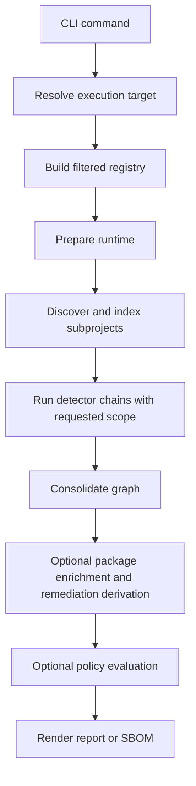
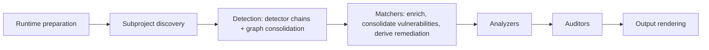
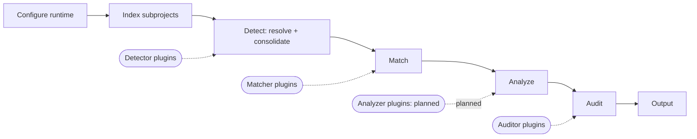
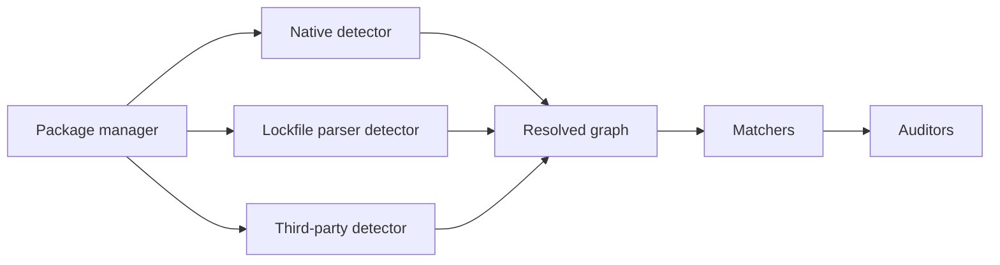

# Bomly Architecture

This document explains how Bomly is structured today and how the main command flows work.

## Product Shape

Bomly is a CLI-first dependency intelligence tool. The command-line interface is the public surface, while the analysis engine underneath is organized so the same runtime can support scanning, explanation, diffing, SBOM generation, and auditing without duplicating logic.

Current public commands:

| Command         | Purpose                                                |
|-----------------|--------------------------------------------------------|
| `bomly scan`    | Resolve dependencies, render reports, and write SBOMs  |
| `bomly explain` | Show why a dependency exists in a graph                |
| `bomly diff`    | Compare dependency state across Git refs or SBOM files |
| `bomly version` | Print version information                              |

## Runtime Overview

Bomly prepares one runtime per command execution. That runtime holds the filtered registry, execution target metadata, planned subprojects, and detector, matcher, and auditor selections so discovery and execution stay aligned.


```mermaid
flowchart TD
    A[CLI command] --> B[Resolve execution target]
    B --> C[Build filtered registry]
    C --> D[Prepare runtime]
    D --> E[Discover and index subprojects]
    E --> F[Run detector chains with requested scope]
    F --> G[Consolidate graph]
    G --> H[Optional package enrichment and remediation derivation]
    H --> I[Optional policy evaluation]
    I --> J[Render report or SBOM]
```

## Execution Targets

Each invocation operates on exactly one execution target:

- Filesystem path
- Container image
- Remote Git repository
- SBOM file

The CLI resolves the raw user input, but runtime preparation owns discovery and planning. That keeps `scan`, `explain`, and `diff` consistent with one another.

## Scan Pipeline

The scan engine is responsible for orchestration, not the CLI command handlers. The command layer gathers inputs, while the runtime handles ordering, selection, and reuse.


```mermaid
flowchart LR
    A[Runtime preparation]
    B[Subproject discovery]
    C[Detection: detector chains + graph consolidation]
    F[Matchers: enrich, consolidate vulnerabilities, derive remediation]
    F2[Analyzers]
    G[Auditors]
    H[Output rendering]

    A --> B --> C --> F --> F2 --> G --> H
```

Stage summary:

1. Runtime preparation builds the filtered registry and execution plan.
2. Subproject discovery finds supported package-manager roots for the target. By default only the execution-target root is inspected; `--recursive` walks nested directories (bounded by `--max-depth`, `--exclude`, and built-in ignore rules) and plans one subproject per directory-and-package-manager pair, with workspace-expanding managers pruned below ancestors that already cover them.
3. Detection resolves a dependency graph per package manager and then consolidates the per-subproject graphs into the single graph and package registry the rest of the pipeline uses. Detection also produces one unified list of `sdk.DetectorWarning`s — resolution failures and fallbacks the engine observed, plus the package-manager problems detectors reported with their graphs (see the decision below). When `--scope` is set, the requested scope is part of the detector request so build-tool detectors can narrow command execution where the package manager supports it; all detector results pass through the shared SDK scope filter, and consolidation is the tail of this stage rather than a separate step.
4. Matchers enrich packages with additional metadata such as licenses, EOL status, and vulnerability records. After vulnerability consolidation, `internal/remediation` derives package fix status and version, validates optional read-only detector hints, and creates occurrence-specific vulnerability suggestions. This is the tail of enrichment, not a separate stage.
5. Analyzers run when `--analyze` is set. They consume the matched graph and annotate `sdk.Vulnerability.Reachability` (on the PURL-keyed registry package) with status (reachable/unreachable/unknown), tier (symbol/module/package/none), and call paths. Failures degrade to `Status=unknown` rather than aborting the pipeline. See [`../docs/REACHABILITY.md`](../docs/REACHABILITY.md) for ecosystem coverage and tier semantics.
6. Auditors evaluate policy against the enriched graph + registry pair and create reference-style findings (`PackageRef` + `VulnerabilityID`) when `--audit` is enabled. As the final part of that same audit stage, neutral policy-status resolvers may change only `Finding.PolicyStatus`; they never remove or rewrite finding evidence. The built-in `vulnerability`, `license`, and `package` auditors cover advisory thresholds, SPDX policy, and denied or suspicious packages respectively.
7. Users combine `--enrich --audit` when they want external matcher data to feed policy evaluation in the same run.
8. Output rendering emits text, JSON, SARIF, or SBOM documents.

`bomly explain` reuses the same detection (resolution + consolidation) and matching stages, then performs dependency path selection in its explain orchestration before optional component audit.

## Extensibility

Extensibility is the core of Bomly's design. **Every built-in is an implementation of the same contract an external plugin implements** — there is no privileged internal path. Adding an ecosystem, an enrichment source, or a policy gate does not require forking the engine. Three extension points are pluggable today (detector, matcher, auditor); external **analyzer** plugins are planned — the built-in reachability analyzers are not yet loadable as plugins.

The diagram shows where plugins hook into the run, after the runtime is configured and subprojects are indexed:


```mermaid
flowchart LR
    R[Configure runtime] --> X[Index subprojects] --> D[Detect: resolve + consolidate] --> M[Match] --> An[Analyze] --> Au[Audit] --> O[Output]

    PD([Detector plugins]) -.-> D
    PM([Matcher plugins]) -.-> M
    PAu([Auditor plugins]) -.-> Au
    PAn([Analyzer plugins: planned]) -. planned .-> An
```

| Extension point | Status | Contract (`sdk`) | Responsibility |
| --- | --- | --- | --- |
| Detector | Available | `sdk.Detector` | Turn evidence (lockfile, manifest, SBOM) into a dependency graph |
| Matcher | Available | `sdk.Matcher` | Enrich packages with vulnerability, license, or lifecycle data |
| Auditor | Available | `sdk.Auditor` | Evaluate policy and emit reference-style findings |
| Analyzer | Planned | `sdk.Analyzer` | Annotate `sdk.Vulnerability.Reachability` for a language |

External plugins run as versioned (`v1`) gRPC binaries and participate in the same runtime planning as built-ins: detector plugins declare evidence patterns and join subproject discovery; matcher and auditor plugins are selected with the same `--matchers` / `--auditors` selector grammar. Plugins are disabled until explicitly enabled. See [PLUGINS.md](../docs/PLUGINS.md) for the trust model and authoring guides.

Analyzers exist as a contract (`sdk.Analyzer`) and ship four built-in implementations (govulncheck, jsreach, pyreach, jvmreach), but the plugin runtime does not yet accept an analyzer kind, so they cannot be supplied by an external plugin today. Making analyzers a first-class plugin extension point is planned.

### Decision: YAML configuration is nested at the file boundary

Bomly's YAML files use strict nested groups such as `target`, `analysis`, `policy`, `network.proxy`, and `matchers.osv`, while `config.Resolved` remains flat. Nesting keeps customer-authored files readable without spreading YAML organization through the CLI and engine. Each YAML leaf maps back to one flat runtime field, and layered files preserve explicit zero values, including empty lists. Unknown keys and the former flat YAML keys fail with migration guidance so typos cannot silently disable requested behavior.

### Decision: repository configuration requires explicit trust

Bomly automatically loads the user-controlled `~/.bomly/config.yaml`, but it
never automatically loads `.bomly/config.yaml` from a scan target. A repository
configuration file may select a target, enable network-backed enrichment,
enable package-manager execution, configure plugins, or choose output paths.
Loading it merely because a user scans an untrusted checkout would let the
checkout grant itself those permissions.

Users can trust and load a repository configuration file with
`--config .bomly/config.yaml` or `BOMLY_CONFIG=.bomly/config.yaml`. When both are
set, the command-line flag selects the file. Environment values and other flags
continue to override values from the selected files. An explicitly selected
file must exist and must be a regular file so configuration mistakes fail
clearly instead of silently falling back.

Automatic finding-baseline discovery is separate. Baselines use a narrow,
versioned policy-status contract: they cannot change targets, start network or
package-manager activity, load plugins, or choose output paths. Their automatic
selection remains visible in logs and run statistics.

### Decision: untrusted documents have input limits

Bomly bounds large documents before decoding them. YAML configuration files are
limited to 4 MiB. Finding baselines are limited to 16 MiB and 10,000 entries.
Explicit SBOM inputs are limited to 256 MiB. Successful deps.dev batch responses
are limited to 16 MiB. OSV vulnerability and batch responses are limited to
4 MiB and 64 MiB. CISA KEV responses are limited to 32 MiB, and Scorecard
project responses are limited to 4 MiB. Failed matcher responses expose only
the HTTP status rather than including an upstream response body in errors or
logs.

The shared file reader checks both the size reported when the file is opened and
the bytes actually read. This keeps the limit in place if a file grows during
the read. Baseline duplicate checks use an index keyed by package finding
identity so validation remains linear as the document approaches its entry
limit.

Repository-controlled manifests, lockfiles, workspace metadata, and analyzer
source files use a shared 64 MiB per-file limit. Both whole-file and streaming
readers check the opened size and the bytes consumed, so a growing file cannot
bypass the limit. Parsers never receive a partial over-limit document.
Matcher and analyzer JSON cache entries have a separate 64 MiB read policy;
corrupt or oversized entries degrade to a cache miss.

Remote Git work uses a different boundary. Each remote materialization flow has
a 10-minute deadline. Bomly does not fetch submodules or Git LFS objects, and it
validates the completed checkout before discovery: at most 1,000,000 paths,
10 GiB of regular files, 256 path levels, and no symlink whose lexical target
escapes the checkout. Internal links remain intact. Git transfer bytes and
`.git` object storage cannot be reliably capped by portable Git options before
checkout, so those remain delegated to an operating-system quota when a hard
cap is needed.

The hidden maintainer benchmark uses its own shallow Git clone runner. It is
outside the customer CLI's remote-target materialization boundary and does not
inherit these checkout validation controls.

### Decision: Reachability annotates vulnerabilities, not findings

Reachability data lives on `sdk.Vulnerability.Reachability` rather than on `Finding.Reachability` because `--analyze` must be useful without `--audit`. Matchers populate the OSV-aligned `Vulnerability` record on the PURL-keyed registry package; the analyzer enriches it in place; the output layer resolves the analyzer's annotation by `(Finding.PackageRef, Finding.VulnerabilityID)` when emitting SARIF and the JSON `Finding` projection. This keeps a single source of truth (the registry) and removes the per-manifest sync that the old graph-mutating model required.

### Decision: SBOM distribution data is classified, not passed through

`sdk.Dependency.ResolvedURL` is not a URL. Detectors write whatever their lockfile records: npm/pnpm/yarn/bun write the exact tarball, Bundler writes the `GEM remote:` registry root, Cargo writes a `registry+`/`sparse+`/`git+`-prefixed index or repo, swiftpm writes a repository, and uv, pipenv, pub, and npm link entries can all write a **local filesystem path**. Some private-registry URLs embed a token.

`internal/sbom/locator.go` therefore classifies each value into artifact / VCS / registry-root / nothing before it can reach an SBOM, rather than mapping the field straight onto `PackageDownloadLocation`. Two rules are load-bearing:

1. **An http(s) scheme is required, and credentials are rejected.** This is what keeps build-machine directory layout and private-registry credentials out of a published document. Credentials travel in two places: `user:password@host` userinfo, and query or fragment values on signed and private-registry links (`?token=`, `?X-Amz-Signature=`). A benign query parameter cannot be told apart from a credential, so any query or fragment disqualifies a non-VCS locator; VCS locators are exempt only because `normalizeVCS` discards both and keeps a character-checked revision. The check is on the value, never on `Source` — uv's `path`/`editable` values arrive under non-`file` sources.

   The same gate applies to URLs read out of an **ingested** SBOM. Those are untrusted input that gets re-emitted verbatim, so a hostile or careless document could otherwise launder a `file://` path or a credential into output Bomly publishes.
2. **A registry root never becomes a download location.** `https://rubygems.org/` is schema-valid and both validators accept it, so the failure would be silent and plausible: every consumer would read it as the artifact's origin. `NOASSERTION` is the honest answer.

Unrecognized shapes degrade toward the weaker claim (registry root, then nothing) rather than toward the stronger one. `FuzzClassifyResolvedURL` asserts the safety property directly: a classified value is either empty or an absolute http(s)/`git+http(s)` URL with no userinfo.

### Decision: ingested SBOM assertions ride `Dependency.Metadata`

SBOM ingest is not decode-then-encode. `internal/detectors/sbom` decodes to a neutral `Document`, `sbom.ToGraph` converts it to an `sdk.Graph`, the graph flows through the whole pipeline, and export rebuilds a *fresh* document via `FromDepGraph`. Anything not carried onto the `sdk.Dependency` is lost before export — which is why supplier, description, and external references were previously dropped by a format conversion even though both decoders could see them.

They are carried on `Dependency.Metadata` under `bomly.sbom.*` keys, following the precedent of `sdk.SetDetectionLicenses`. This needs no SDK contract change, and consolidation preserves the keys because it clones nodes rather than rebuilding them.

`ToGraph` deliberately does **not** set `Dependency.Source` from an ingested document. `Source` feeds `RegistryMatchEligible()`, so classifying an ingested component as `git` or `url` would quietly make it ineligible for enrichment and break `scan --sbom --enrich`. Setting `ResolvedURL` alone is safe; eligibility never reads it.

Precedence is *detection classifies, ingest corrects, enrichment fills gaps*. Ingested values win over Bomly's own derivation because re-exporting must not silently rewrite another producer's assertion — and because `ToGraph` drops `Source`, re-deriving the bucket would be strictly worse information than the one the source document already chose.

### Decision: external lookups use `Coordinates.EcosystemName()`, never the bare `Name`

`Coordinates` stores identity as `Org` + `Name` following the PURL namespace/name split, so `Name` alone is `postcss` for both `postcss` and `@tailwindcss/postcss`. Anything that leaves the process under a name — Grype's DB search, the OSV name-keyed query, name-derived cache keys, SBOM component names, the bare specifiers `jsreach` matches imports against — must use `EcosystemName()`, which rebuilds the ecosystem-native form (`@org/name` for npm, `org:name` for the Maven family, `org/name` for Go, Composer, Swift, and GitHub Actions).

Rejoining is opt-in per ecosystem and every other ecosystem keeps the bare `Name`, because `Org` is only sometimes part of the package name. For OS packages it is the distro that shipped the package (`pkg:apk/alpine/libcrypto3` → `Org: "alpine"`) while Grype's distro-namespace matchers query `libcrypto3`, so a blanket join would trade the npm false positives for missing every OS advisory — the exact data the distro/upstream plumbing below exists to reach. Adding an ecosystem to the join list is a claim about how its advisory databases key packages, and belongs with a test.

This is a correctness boundary, not a formatting preference. Grype searches its DB strictly by the name it is handed and reconstructs a namespace only for Java (from the PURL, in its own resolver), so the bare name made every scoped npm package inherit the same-named unscoped package's advisories, attached to the scoped PURL, with remediation pointing at versions that do not exist for it (issue #319). `DisplayName()` produces a similar string but stays presentation-only and is explicitly not an identity; `QualifiedName()` is the internal `org:name` key. Prefer the PURL wherever a lookup accepts one — `EcosystemName` is for the interfaces that only take a name.

### Decision: Three-collection domain model — dependencies, packages, findings

`sdk` separates three pipeline concerns that the original model conflated:

1. **`sdk.Dependency`** (`sdk/dependency.go`) is a detection-time graph node. It carries identity (`ID`, `Name`, `Version`, `PURL`), detection metadata (`Scopes`, `Locations`, `FoundBy`), an optional direct/transitive/unknown `Relationship`, occurrence `Source`, edges through the `Graph`, and a `PackageRef` (PURL) that links to a matching artifact. It does **not** carry licenses, vulnerabilities, or scorecard data.
2. **`sdk.Package`** (`sdk/package.go`) is a matching artifact keyed by PURL on a `sdk.PackageRegistry`. It carries `Licenses`, `Vulnerabilities` (OSV-aligned `sdk.Vulnerability`), `Scorecard`, `EOL`, and similar enrichment. There is one entry per unique PURL across the whole pipeline, so 50 dependencies referencing the same package share one set of CVEs and one license decision.
3. **`sdk.Finding`** (`sdk/vulnerability.go`) is a reference-style audit result. It carries policy fields (`Severity`, `PolicyStatus`, `Reasons`, `Auditor`, stable `RuleID`) plus the references `PackageRef` (PURL) and, for vulnerability findings, `VulnerabilityID`. It does **not** copy CVSS / EPSS / KEV / CWE — consumers resolve those by following the references back into the registry.

`sdk.Vulnerability` is OSV-aligned (id, aliases, summary, details, severity, affected, references, database_specific) and extended with Bomly's matching-stage fields (CVSS, EPSS, KEV, CWE, FixedVersions, AffectedSymbols, `Reachability`). The OSV matcher (repo `bomly-plugin-osv-matcher`, `plugin/response.go`) maps OSV responses directly to this shape; grype / depsdev / eol / scorecard and enabled external matchers write the equivalent records.

### Decision: enrichment consolidates alias-equivalent vulnerabilities

Matchers may describe the same package vulnerability under different primary
advisory IDs, even within a single matcher database. After all selected
matchers run, the engine consolidates vulnerability records per PURL using the
transitive closure of `ID` and `Aliases`. The canonical record unions advisory
IDs and evidence, uses the richest input record for scalar metadata, and
retains the highest severity and conservative fix/reachability state. OSV
`Related` IDs never trigger consolidation because
they may identify distinct vulnerabilities. This policy belongs at the central
enrichment boundary so built-in and protocol-v1 external matchers receive the
same behavior without owning global identity policy. Baseline construction
repeats the identity normalization defensively for legacy or independently
constructed registries.

### Decision: vulnerability remediation is derived enrichment

After vulnerability consolidation, `internal/remediation` replaces
`sdk.Package.Remediation` with one canonical result. Package-level status is
`complete`, `partial`, `unavailable`, or `unknown`. A recommended version is
present only when every vulnerability has usable, compatible fix evidence.
When versions can be compared, the recommendation must be newer than the
installed package.

The same component joins that package evidence to the complete detected graph
and creates occurrence-specific suggestions. It selects only
`direct-bump`, `transitive-override`, `lockfile-refresh`,
`no-fix-upstream`, or `manual-review`. Unknown-parent and non-registry
occurrences always use `manual-review`. Workspaces, aliases, duplicate
versions, and separate manifests remain distinct through affected dependency
references and manifest paths. Each suggestion separately names the dependency
or manifest anchor that its action targets. When a legacy detector leaves
relationship metadata empty,
core infers direct or transitive placement from the shortest path to a real
project root. A synthetic manifest root is never accepted as executable parent
evidence.

Detectors may advertise optional remediation capabilities and provide
read-only occurrence hints after enrichment. Built-in and external detectors
use the same additive protocol-v1 contract. Core validates each dependency
ref, manifest path, package manager, and advertised strategy. Hints may explain
manager syntax, but they cannot choose the version or final action. Each
detector implementation owns its capability declaration and advice; registry
wiring does not infer either one. Native and fallback implementations declare
their support separately even when their package-manager syntax is identical.
Plugins that omit the capability are not called and remain compatible.

This work stays inside enrichment because it applies only to vulnerabilities.
License and package-policy findings remain audit results; they do not receive
remediation suggestions. Analysis and audit may add reachability
or policy information to output, but neither changes canonical remediation.
Derivation performs no additional network calls, subprocess execution, or
filesystem writes.

Pipeline plumbing: `engine.PipelineResult` exposes `Graph`, `Registry`, `Findings`, and `RiskScores`. The registry is built right after consolidation (`consolidation.BuildPackageRegistry`) and threaded through match/analyze/audit requests; output helpers (`BuildScanResponse`, `WriteSARIF`, `FindingsFromScan`, `PackagesFromGraph`) all accept `*sdk.PackageRegistry` and re-enrich their projections by resolving `PackageRef` and `VulnerabilityID`. See [`MODELS.md`](MODELS.md) for the full schema reference.

### Decision: finding policy-status resolution belongs inside audit

Auditors remain responsible for creating complete reference-style findings.
After deduplication and `warn-only` handling, the audit stage may run neutral
`sdk.FindingPolicyResolver` implementations. A resolver receives the finding
and package registry, may return a replacement policy status, and cannot remove
or mutate evidence. When multiple resolvers participate, the least suppressive
decision wins.

The first resolver is the package-specific finding baseline under
`internal/baseline`. Its versioned document keys entries by full PURL, finding
kind, auditor, and advisory aliases or stable rule ID. It intentionally contains
no dependency occurrence or project identity, so a baseline is portable across
projects. Discovery happens during normal target preparation: scan and explain
read the materialized project tree, including repositories cloned through
`--url`, while Git diff independently reads the base and head trees. A detected
baseline is logged with its path, entry count, selection mode, and target kind;
automatic discovery warns and behaves as though no baseline exists when path
inspection finds a symbolic-link `.bomly` directory or baseline file. This
rejects discovered links but cannot prevent another process from replacing a
path between inspection and reading. Explicit baseline paths remain trusted
user-selected inputs and may refer outside the project or through a symbolic
link. Each evaluation logs
findings evaluated and accepted. Output receives ordinary findings whose policy
status may be `suppressed` through `Finding.PolicyStatus` / `policy_status`, and
no baseline-specific output model or pipeline stage exists. Renaming the
earlier finding field is an intentional breaking output-contract change while
the CLI output schema identifier remains `1.0` and the compact MCP schema
remains `mcp/1`. Protocol-v1 decoding still accepts the earlier wire field from
existing external auditor plugins.

### Decision: dependency detail changes are canonical diff results

`sdk.Compare` classifies package version changes separately from changes to an
occurrence's dependency relationship, source, or registry-matching
eligibility. The same occurrence may appear in both lists when both kinds of
change happened. Keeping these as parallel results avoids treating a move from
direct to transitive, registry to Git, or eligible to ineligible as a package
addition or removal.

Each transition keeps before and after evidence and an ordered list of changed
fields. Explicit detector relationships win. For older protocol-v1 graphs that
omit the relationship, the classifier derives direct or transitive from graph
edges and uses unknown when the graph cannot prove either. Exact and trusted
fuzzy identity matches call the same SDK classifier. Output code only projects
that result; it does not repeat the policy.

Manifest results preserve duplicate occurrences. The global JSON and MCP
views deduplicate only identical evidence and use stable ordering and bounded
MCP truncation. Diff package enrichment still uses the head-side registry, so
reporting a detail change does not replace current vulnerability or
remediation data.

The SDK also classifies the small set of transitions that need extra review:
a source moving to Git or a URL, and a loss of vulnerability-check coverage.
Text, Markdown, and TUI use this classifier for styling and plain-language
reasons. The structured transition remains unchanged; the review label is a
presentation aid and has no effect on exit status.

When diff auditing is enabled, `internal/engine/diff` passes a deep copy of the
canonical transitions only to the head-side audit request. The existing
package auditor turns Git and URL source moves into warnings and may enforce
configured source types. The existing vulnerability auditor turns covered to
not-covered transitions into warning-severity coverage findings and applies
the existing severity `--fail-on` constraints. Auditors do not infer these
changes from the focused audit graphs, and no new pipeline stage is introduced.

### Decision: registry matching eligibility is an occurrence-level engine boundary

Detection keeps every dependency occurrence and every PURL-backed package artifact, including application roots, workspace members, local sources, and unknown relationships. Immediately before matcher selection and execution, `engine.registryMatchRequest` clones only occurrences for which `Dependency.RegistryMatchEligible()` is true and preserves edges whose endpoints are both eligible. Every built-in and external matcher therefore receives the same filtered graph, while the full `PackageRegistry` remains shared so enrichment is still deduplicated by PURL. Analysis and auditors continue with the complete original graph.

Published registry releases are eligible, including releases downloaded through custom registries or mirrors. First-party and manifest nodes are always ineligible. Project, workspace/link, file, Git, and arbitrary URL occurrences are ineligible. Application type alone is not an ownership signal, so an application artifact imported from an SBOM remains eligible unless it is marked first-party or has a non-registry source. An omitted source and unknown plugin-defined source values remain eligible for protocol-v1 compatibility. Relationship `unknown` does not affect eligibility: a registry package whose parent could not be recovered is still enriched normally. Targeted matching of an ineligible occurrence short-circuits instead of widening to unrelated eligible packages. When eligible and ineligible occurrences share an exact PURL, vulnerability findings reference only the eligible occurrences; if a PURL has no eligible occurrence, detector- or SBOM-supplied vulnerability data remains auditable on its local occurrences.

### Decision: unresolved dependency parents use an explicit unknown relationship

Lockfiles can contain a package component whose parent chain cannot be
recovered. Dropping it hides exposure, while labeling the synthetic manifest
edge direct overstates the evidence. Detectors therefore attach the component
root beneath its owning application or manifest with relationship `unknown`;
known descendants remain transitive. Unknown dependencies are ordinary graph
nodes for every pipeline stage. The optional SDK field is additive for
protocol-v1 plugins, and consumers derive direct/transitive for older graphs
that omit it. Debug logs disclose every attached component without turning a
recoverable graph condition into a warning.

### Decision: JSON findings are references; MCP responses are compact projections

The `--format json` `findings[]` projection now mirrors `sdk.Finding` exactly: an identity-only package ref (display name, org, version, purl), `vulnerability_id`, and `dependency_refs` — no embedded package object and no flat advisory copies. Advisory data lives once in `packages[]` and consumers join by PURL, the way SARIF always did; text/markdown/TUI renderers were converted to the same join. `DiffResponse` gained a `packages[]` collection (PURL-deduplicated union of base and head registries, head wins) so diff audit findings resolve the same way. Rationale: the embedded copies made findings-heavy scan JSON ~10x larger than the data it contained (issue #245) and let the projection drift from the domain model.

The MCP server does not return the CLI JSON documents at all. Tool results land in an agent's context window and MCP clients truncate large results to errors, so `bomly_scan` / `bomly_diff` / `bomly_explain` return compact projections (`schema_version "mcp/1"`, `internal/mcp/types_compact.go`) built from the pipeline's domain data. MCP projects canonical package remediation suggestions; it does not select actions, versions, or package-manager advice. Groups are ranked KEV → severity → EPSS → fixability and hard-capped with explicit truncation counters. Audit may overlay policy status on matching vulnerability entries but cannot create or change suggestions. `bomly_explain` is the bounded drill-down (full advisory detail for one package); the CLI is the artifact channel for complete documents. The former `bomly_vuln_fix_context` tool was folded into these responses. Shortest dependency paths come from a bounded upward BFS over `Graph.Dependents`, never `CollectPathsTo` (all simple paths is exponential on dense graphs).

MCP tool failures expose only stable categories such as request validation,
target preparation, target resolution, pipeline execution, and plugin
inventory. Raw adapter errors never cross the protocol boundary because they
may contain local paths, command output, URLs, or credentials. The server logs
the tool, category, and unwrapped Go cause type without the arbitrary cause
text. Detailed stage logs remain available at debug verbosity only when the
component that produced the failure emits them independently. Validation
messages intentionally remain generic because otherwise a rejected path, URL,
or other user value could be copied into the protocol response.

### Decision: one typed detector-warning channel, no CI-readiness stage

Issue #245 surfaced CI failures that were never vulnerabilities: a lockfile written by pnpm 11 against a project that pins pnpm 9, and a pnpm `minimumReleaseAge` gate that rejects a freshly published fix version. The Node detectors find these while resolving (`internal/detectors/node/package_manager_warnings.go`) and return them with their graphs in `DetectionResult.Warnings`.

Detection had accumulated three separate warning paths — an error-derived list for failed chains, fallback annotations, and (briefly) a manifest-scoped list for package-manager problems — reaching different surfaces with different fidelity. They are now one type, `sdk.DetectorWarning{Type, Code, Source, Subproject, Manifest, Message}`, collected into `PipelineResult.DetectorWarnings`.

**`Type` carries the meaning, and policy branches on it.** `resolution-failure` and `fallback` mean the graph may be incomplete; `package-manager` means the graph is sound and the project's configuration is not. `DetectorWarningType.DegradesCoverage` is the single predicate: `baselineMutationWarningCount` uses it so a manager mismatch does not block recording a baseline, while a failed chain still does. `Code` names the specific check for consumers that branch further; it is empty for the warnings the engine synthesizes, where the type already says everything. Location lives in `Subproject`/`Manifest` fields rather than being interpolated into the message, so grouping and deduplication stay message-based and single-line channels compose the prefix themselves.

**Why not `Ready`, and why not a stage.** The knowledge belongs with the detectors — `Ready` is where "is this toolchain usable here" already lives, and it receives the same per-subproject working directory a separate stage would have had to reconstruct. But `Ready` cannot carry this: its verdict is binary and a non-nil error routes the subproject to `resolveFallback`, so reporting a lockfile-format mismatch through it would demote a perfectly good lockfile parser to Syft over an advisory-only condition. Its plugin transport has the same gap — `ReadyResponse.Reason` is dropped when `Ready` is true. A dedicated pipeline stage was rejected outright: it duplicated detector knowledge, re-derived the working directory, and made a cross-cutting concern look like a phase of the run. The detector already parsed the lockfile and already knows the manager, so the finding is a resolution output, returned with the graph.

**Every surface, because `-q` exists.** One list feeds the `warnings` collection of the scan/diff/explain JSON documents, the text and Markdown reports above the summary, ⚠ progress children, `-v` logs, and MCP diagnostics under the `detect` stage. Progress alone was not enough: `-q` silences it and CI runs have no TTY. Unification also removed the duplicate fallback pass MCP diagnostics used to run over manifests.

**Committed files only — no `--version` probe.** `pnpm`/`yarn` on `PATH` are frequently Corepack shims, and invoking one can download the pinned manager on demand and mutate Corepack's cache, which would mean a plain scan contacts a registry without `--enrich`. Comparing what the repository declares is also the more accurate question, since CI installs from the repository, not from this machine's `PATH`. The trade-off is accepted deliberately: a project that pins nothing gets no version comparison, and a laptop-versus-CI skew is not reported. Reading CI workflow files for setup-node/`pnpm/action-setup` pins would recover some of that and is left as a follow-up.

**Manager-specific semantics, verified against each manager's docs.** Install gates and lockfile interoperability differ per manager and are modelled per manager, not shared: pnpm reads `minimumReleaseAge` (minutes) from `pnpm-workspace.yaml` and only auth/registry settings from `.npmrc`, while npm reads `min-release-age` (days) and `before` from `.npmrc`; npm accepts `yarn.lock` as install input and Bun converts `pnpm-lock.yaml`, so neither is a mismatch, whereas pnpm's conversion is the manual `pnpm import` and therefore is. Combinations no manager documents either way stay silent — a false "your lockfile will be ignored" is worse than no warning.

**Rendering treats every warning field as untrusted.** Messages embed values read from scanned repositories (version pins, config values, subprocess error text) and file names come from the tree itself, so `render.SanitizeUntrusted` strips CSI, OSC/DCS-family, and C0/DEL control bytes before a notice is wrapped in `Style(...)`; whitespace folding alone would leave a crafted `package.json` able to clear the terminal or forge output.

### Decision: Recursive discovery prunes native multi-module roots per package manager

`--recursive` discovery (`planRecursiveFilesystemSubprojects`, `internal/cli/opts/planning_recursive.go`) walks the tree with `filepath.WalkDir` and plans subprojects through the same `plannedSubprojectsForPath` helper the root-only path uses. When a package manager whose detector natively expands nested modules (maven, gradle, npm, pnpm, yarn, cargo, sbt, mix) has manifest evidence at an ancestor directory, nested subprojects for that same manager are pruned: the ancestor's detector resolves those modules already (reactor TGF blocks, workspace lockfile importers, `cargo metadata` workspace members), so planning them separately would double-count every dependency. Pruning is per package manager and never skips the directory itself — a Maven ancestor must not hide a nested `requirements.txt`. `gomod` deliberately never prunes: a nested `go.mod` is excluded from the parent module by Go semantics, and the gomod detector has no `go.work` awareness, so each module scans independently (package dedup by PURL absorbs any overlap). Depth counts the root as 0 with a default cap of 3 (`--max-depth 0` = unlimited), matching the discovery probe's existing depth so error hints and the real walk agree. The resolve worker pool stays capped at 4 (`resolveWorkerCount`): recursion mostly adds cheap lockfile subprojects, and raising the cap would multiply concurrent JVM/node build-tool processes on monorepos; revisit only if large lockfile-heavy monorepos show wall-clock pain.

Discovery rules are **detector-owned, not hardcoded**: each detector declares its ecosystem's ignore rules on its descriptor (`sdk.DetectorDescriptor.IgnoredDirectories` basename globs and `IgnoredDirectoryMarkers` marker files such as `pyvenv.cfg`) and marks workspace-expanding support entries with `sdk.PackageManagerSupport.MultiModule` (via `sdk.Support(...).WithMultiModule()`). Discovery aggregates the union across every registered detector (`discoveryRulesFromDetectors`), so external detector plugins contribute rules exactly like built-ins — the fields ride the existing descriptor JSON, making them backward compatible with the v1 plugin protocol (older plugins simply omit them). The walk aggregates from the request's **unfiltered** registry so `--detectors`/`--ecosystems` filters never change which directories are walked; the diagnostic probe falls back to the static built-in catalog (`registry.BuiltinDetectors`). Dot-directory skipping stays core walk behavior, independent of detector declarations.

### Decision: The discovery probe attributes a skip reason per candidate

`noSubprojectsError` (`internal/cli/opts/planning.go`) annotates every probed manifest candidate with the reason discovery did not turn it into a subproject (`internal/cli/opts/planning_diagnostics.go`). The reasons are produced by **replaying the real planning checks in planning order** — recursion scope, `--max-depth`, `--exclude` (matched against the candidate and every ancestor, since the walk prunes whole subtrees), `--ecosystems`, detector registration, `--detectors` — rather than by threading a parallel reason channel through discovery. Planning's hot path stays allocation-free and unaware of diagnostics; the replay runs only on the failure path, over at most `discoveryProbeMaxLines` candidates. The cost of replay is that a reason is a re-derivation, not a recording: whenever a check moves, its replay must move with it, which the per-reason tests in `planning_diagnostics_test.go` pin. Candidate detector names come from the request's **unfiltered** registry and the surviving chain from the **filtered** planning registry, so the message can name what the filter removed. There is deliberately no "no detector registered" reason: the probe only surfaces built-in catalog managers, and `registry.TestEveryDetectablePackageManagerHasADetectorChain` pins that every catalog manager with evidence ships a chain, so an empty chain always means the selectors emptied it. The exported `DescribeDiscovery` probe has no request to replay and therefore emits evidence lines with no skip clauses.

Readiness is deliberately **not** replayed in the probe. Planning never probes readiness — chains are planned statically and probed when they resolve — so any candidate that clears the checks above is planned, and a missing toolchain cannot produce "no subprojects discovered". It produces a resolution failure instead, which is where the diagnostic lives: `resolveDetector` marks readiness failures with `detectorNotReadyError`, and when every link in a chain failed that way `resolveDetectors` returns `noUsableDetectorError` — one line naming each link and what it needs (`no usable detector: npm-native not ready (npm not on PATH); npm not ready (no committed lockfile)`) while keeping the joined error for `errors.Is`/`As`. A chain where some detector actually ran and failed keeps its verbatim error: that failure explains itself better than a summary.

The error text itself is a short indented report (target, search scope, active filters, candidate list, hint) rather than one long sentence, because a home directory or monorepo contributes enough candidates that a single line wraps into an unreadable block. A skip reason shared by every candidate is hoisted into the section header instead of repeating per line.

### Decision: Subprojects and modules are distinct concepts, derived in views

A **subproject** is an independently discovered nested directory (its own discovery-time `sdk.Subproject`, `RelativePath != "."`); a **module** is a member the package manager natively resolves under one root manifest (reactor module, workspace member). The hierarchy is never stored: `output.ClassifyManifest`/`BuildHierarchy` (`internal/output/hierarchy.go`) derive it purely from each manifest's `Subproject` and repo-relative `Path` — a manifest whose directory sits below its subproject directory is a module manifest. Every surface (TUI trees, text report tree, markdown table, MCP compact counts) consumes the same helper, so the JSON schema gained no fields and consumers can apply the identical rule. The scan JSON's per-manifest `subproject` string plus `path` is therefore the single source of truth for project structure.

### Decision: Per-module manifest emission lives in detectors, not consolidation

Workspace/reactor detectors (npm and pnpm lockfile, cargo, maven) emit one `GraphEntry{Graph, ManifestMetadata}` per module using the pre-existing multi-entry `sdk.GraphContainer` — no SDK type changes. Each module entry carries the module's application root plus its reachable subtree (`detectors.SubgraphFrom`), with paths subproject-relative so consolidation's existing rebase/dedup layer stays a pure select/dedup/rebase stage. Shared transitives appear in multiple entries by design; the merged graph and PURL registry deduplicate them, and report-level counts (text manifest count, markdown/MCP package totals) deduplicate by PURL/ID rather than summing per-manifest lengths. Module directories come from the best per-ecosystem source: npm packages-map member keys, pnpm importer keys, `cargo metadata` member `manifest_path` (or `[workspace] members` globs + member `Cargo.toml`s on the lock path — which also fixed virtual workspace roots erroring), a recursive pom `<modules>` walk for maven (TGF output carries no paths; unmatched graph roots fall back into the root entry, and any walk failure degrades to today's single merged manifest), and a `settings.gradle(.kts)` include walk for gradle (see below). **Deferred, degrade to one merged root manifest**: sbt (no machine-readable per-module graph in one invocation), mix and pub (low value/tool limits), yarn classic (v1 lockfiles carry no member info; berry is a follow-up), and the node *native* detectors (`npm ls` is root-scoped; per-member subprocess fan-out multiplies runtime while the lockfile detectors are the chain primaries anyway).

**Gradle multi-project resolution runs one invocation with a task path per subproject.** Gradle was originally deferred as "no machine-readable per-module graph in one invocation" — but `gradle dependencies :app:dependencies :lib:dependencies --console=plain` is exactly that: each report section opens with a `Root project 'x'` / `Project ':x'` banner the parser uses to switch which root the following configuration trees attach to. Subproject paths come from a regex walk of `settings.gradle(.kts)` `include(...)` declarations (`projectDir` overrides honored; composite `includeBuild` not expanded). Inter-project `project :x` tokens — including the colon-less `project x (n)` form declared-only listings print — resolve to the subproject's synthesized application-typed root node, so cross-module dependencies are real edges, mirroring the maven web→core case. Failure degrades in layers: a settings-walk error resolves the root project only; a failed multi-task invocation (stale settings naming removed subprojects) retries the root-only report; subprojects never seen in the report add no orphan nodes. Before this, the gradle detector ran the root `dependencies` task only, while recursive discovery pruned nested gradle modules on the assumption the root detector expands them — multi-project builds silently under-reported.

**First-party packages are inventory, not enrichment targets** (`sdk.NodeIsEnrichable`). Application-typed nodes — workspace members, reactor modules, the project's own package — are absent from public advisory/registry sources, so querying OSV / deps.dev / scorecard / grype for them wastes lookups and risks coincidental name matches (a workspace member named like a real npm package would adopt its advisories). The predicate mirrors `NodeIsDiffable` and gates the two selection chokepoints (`matchers.RegistryPackagesForGraph`, the OSV matcher's graph iteration) plus external grype's result mapping. External grype's SBOM *input* is deliberately not filtered: `sbom.FromDepGraph` is shared with user-facing SBOM generation, where first-party components must remain visible — so first-party matches are dropped when grype results map back into the registry. First-party entries stay in the `packages` collection and SBOMs, just unenriched; external plugin matchers (ClearlyDefined, EOL) are expected to adopt the same predicate.

**Dependency source classification belongs to detectors.** Source is an
occurrence fact, so the detector that reads the manifest, lockfile, or build
tool output owns it. The engine and package auditor consume the canonical
`sdk.Dependency.Source` value but never infer one from an ecosystem, package
name, PURL, or repository metadata. Detectors classify only explicit evidence:
for example Cargo `registry+` and `git+` sources, Bundler `GEM`/`GIT`/`PATH`
sections, pub lock sources, SwiftPM pin kinds, Python direct-URL metadata, and
Python lock source tables. When a format does not retain the selected origin,
the source stays unknown. This trades some source-change coverage for avoiding
false provenance claims and keeps external protocol-v1 detectors compatible.
Source and matcher eligibility are related but not identical: SwiftPM remote
source control is classified as Git, while remaining eligible because the
repository URL is the canonical SwiftURL identity used for vulnerability
matching.

### Decision: Bun text lockfiles are native; binary lockfiles degrade explicitly

`bun-detector` parses JSONC `bun.lock` versions 0 and 1 directly in Go. The parser removes comments and trailing commas with a string-aware state machine, inventories package tuples before constructing edges, models workspace roots as application nodes, and runs the shared Node relationship finalizer before per-workspace graph partitioning. Bun workspace entries therefore use the same multi-entry `sdk.GraphContainer` contract described above. The lockfile path never invokes or installs Bun, so committed text lockfiles remain deterministic and offline.

The legacy `bun.lockb` binary representation is not parsed in core. The detector chain next invokes `bun-native-detector` when Bun and a package manifest are available. It runs `bun pm ls --all`, preserves displayed nested edges, resolves workspace paths to application identities, normalizes direct npm aliases, and reconciles top-level installed occurrences with `package.json`. Direct edges are created only when one installed occurrence proves the declaration. Duplicate-name occurrences and hoisted packages without a provable parent are attached beneath the application root with `unknown` relationships; they remain eligible for every later pipeline stage. If Bun is unavailable or the installed inventory is empty, Syft remains the final fallback. Users who need full lockfile graph fidelity can migrate with `bun install --save-text-lockfile --frozen-lockfile --lockfile-only`. Install-first is supported only when explicitly requested and runs `bun install`; ordinary detection does not install packages.

### Decision: Package locations are detector-relative today

`PackageLocation.Position.File` is emitted by detectors in the coordinate space of the detector working directory. For single-root projects that is already repository-relative, which lets `bomly diff` compare SARIF locations with repo-relative changed-line ranges.

Subproject discovery inspects only the execution-target root unless `--recursive` is set, so non-recursive subprojects resolve with `RelativePath` `"."` and detector positions are already repository-relative. Recursive discovery produces non-root subprojects, and detectors keep emitting paths in the coordinate space of their own working directory; consolidation rebases core-detector paths onto the subproject root so all output is repository-relative. `rebaseGraphLocations` (`internal/engine/consolidation/locations.go`) rewrites package location paths — a subproject discovered at `apps/web` reporting `package-lock.json` is rewritten to `apps/web/package-lock.json` — and `rebaseManifestPathToRoot` (`internal/engine/consolidation/manifest.go`) applies the same rewrite to manifest paths after `normalizeNativeManifestPath`. The manifest rewrite doubles as a correctness requirement: `manifestDedupKey` is the normalized manifest path alone, so without rebasing, same-named manifests in different subprojects (two nested `requirements.txt`) would collapse to one dedup key and silently drop an entry. Both rewrites are no-ops for `RelativePath` `"."`, and absolute or already-prefixed paths are left untouched, so the rewrite is idempotent. Location extraction remains best effort and the output layer only prefers changed lines when the detector path matches the git diff path.

### Decision: Reachability analyzers derive local hierarchy closures

Tier-3 source analyzers discover local workspace and module hierarchies from declarative project files while the consolidated detector graph remains the source of truth for external package edges. `jsreach` follows package-name imports across npm, Yarn, and pnpm workspace members. `jvmreach` follows source namespace imports across Maven `<modules>` and standard Gradle `include` declarations. This keeps hierarchy traversal automatic, avoids package-manager installation or network activity during reachability analysis, and prevents unused sibling projects from widening the reachable set.

### Decision: Grype OS-package distro comes from the PURL, not pipeline plumbing

Grype's OS matchers (apk, dpkg, rpm, portage, pacman) are distro-namespace
driven: a package that reaches them without a distro matches nothing, and
because Bomly passes no CPEs and leaves `UseCPEs` false the stock matcher does
not pick up the slack — container OS packages came back clean rather than
unchecked (issue #316). The builtin matcher
(`bomly-plugin-grype-matcher`, `plugin/purl_builtin.go`) derives the distro, and the upstream
source package, from the `distro=` and `upstream=` PURL qualifiers Syft records,
mirroring Grype's own PURL provider.

The alternative was carrying the detected `linux.Release` from the Syft detector
through the graph container, consolidation, and the match stage into
`grypepkg.Context`. The PURL is the better carrier: it is already the registry
key so nothing new has to be threaded through four stages, it survives SBOM
input where no live distro detection is possible, and it keeps a per-package
distro (correct for a graph consolidated from more than one image) instead of a
single scan-wide one. The cost is that OS matching depends on the qualifier
being present — true for image scans and for SBOMs produced from them, false
for hand-written PURLs, which is documented in `docs/matchers/grype.md`.

### Decision: Scorecard matcher reads precomputed runs, not the library

The OpenSSF Scorecard matcher (repo `bomly-plugin-scorecard-matcher`) fetches precomputed per-repo scores from `api.scorecard.dev` instead of importing `github.com/ossf/scorecard/v5` and running checks in-process. Three reasons:

1. **Dependency cost.** The Scorecard Go library pulls in k8s, buildkit, containerd, bigquery, go-containerregistry, and osv-scanner transitive deps — roughly 150–250 MB of additional code that would land in every Bomly build, violating the "standard library + existing deps only" non-negotiable.
2. **Credentials.** Running Scorecard live makes 60+ GitHub API calls per repo and is unusable without a `GITHUB_AUTH_TOKEN`. A customer-facing CLI that quietly demands a token would surprise users and complicate CI integration.
3. **Latency.** Live runs take 1–3 minutes per repo. The precomputed API answers in tens of milliseconds and the OSSF refresh cadence (weekly) is acceptable for project-posture data.

The matcher attaches `sdk.PackageScorecard` to packages whose upstream source resolves to a `github.com/{owner}/{repo}` URL, dedupes by repo so a monorepo's many packages share one HTTP call, caches 200 responses for 24h, and caches 404s as a sentinel so unscored repos are not retried within the TTL. Packages whose source repo lives outside github.com (GitLab, internal Git) or only in registry metadata not yet wired into Bomly are skipped silently. A future revision can add a deps.dev project-endpoint fallback for the second case without breaking changes.

## Detector and Auditor Model

Bomly treats detectors, matchers, and auditors as explicit runtime roles.

- Detectors resolve package graphs.
- Matchers enrich Resolved packages.
- Auditors evaluate policy and produce normalized findings.

Within a package-manager chain, Bomly uses explicit ordering and superseding rules. Native detectors are preferred where available, and Syft-backed detection fills the coverage gaps for additional ecosystems.


```mermaid
flowchart LR
    A[Package manager]
    A --> B[Native detector]
    A --> C[Lockfile parser detector]
    A --> D[Third-party detector]
    B --> E[Resolved graph]
    C --> E
    D --> E
    E --> F[Matchers]
    F --> G[Auditors]
```

Implementation priority:

| Category        | Examples                                                                 | Priority |
|-----------------|--------------------------------------------------------------------------|----------|
| Native          | Go, Node, Maven, Gradle, Python, Composer, Bundler, GitHub Actions, SBOM | Highest  |
| Lockfile parser | Package-manager-specific parsers where applicable                        | High     |
| Third-party     | Syft detector, Grype matcher                                             | Lower    |

Native detector coverage is quality-of-graph coverage, not just support-matrix labeling. A built-in detector should ship with deterministic package metadata, graph edges where the ecosystem source can provide them, direct/development/runtime classification when it can be inferred, package URLs, unit fixtures in the detector package, and smoke coverage when a stable root-level real repository is available. Syft remains the compatibility backstop for package managers or project shapes that Bomly cannot resolve directly.

Some native detector chains intentionally prefer a build-tool command over a committed file parser because the command can expose transitive edges that the lockfile or manifest does not encode. Pub, SwiftPM, and SBT follow this pattern: `pub-native`, `swiftpm-native`, and `sbt-native` run first when `dart`, `swift`, or `sbt` is available, then fall back to the committed-file detector if the tool is missing or fails. When validating graph-shape changes for those ecosystems, run smoke tests and the local benchmark on a host with the relevant toolchain installed.

### Decision: dependency graph benchmarking is hidden and local-only

`bomly benchmark` is a hidden maintainer command backed by `internal/benchmark`. It scans public GitHub repositories with native detectors, compares the filtered dependency graph against GitHub Dependency Graph and external Syft SBOMs, and writes deterministic artifacts under `.benchmark-runs/latest`. Bomly scan and SBOM diff execution run in-process through the engine and output model; only the external `git` and `syft` tools remain subprocesses. The in-process adapter builds a native-only registry directly so local configuration and managed-plugin discovery cannot distort benchmark results.

The benchmark reports two distinct signals. Raw agreement is the symmetric overlap with every source. Correctness is computed only for evidence sources and excludes reviewable graph extensions: project/non-registry occurrences classified by the native graph and exact target-manifest edges with mandatory evidence text. Observational sources such as Syft remain visible without being promoted to ground truth. `mismatches.json` retains every source-only, Bomly-only, version-mismatched, and adjudicated item, so an extension can never disappear behind the score. Unadjudicated extra data remains a correctness failure. Package and relationship scores are engineering signals, not claims that a baseline is ground truth. The benchmark is intentionally local-only so exploratory scoring does not become a release or merge gate before it is calibrated.

### Decision: Python graph resolution is lockfile-first, validated, and provenance-backed

Python build-tool inspection can accidentally read the wrong environment: `pip inspect --local` reports every package in the interpreter it is pointed at, even if that interpreter belongs to unrelated tooling. Bomly therefore treats Python graph resolution as accurate-or-fail:

1. **Deterministic lock parsers first.** `requirements.lock`, `poetry.lock`, and `uv.lock` are parsed directly when possible. `Pipfile.lock` remains the Pipenv fallback because it is flat but project-owned.
2. **Project-owned environments only.** When a detector inspects an environment, it must be a project-managed environment prepared by the package manager or Bomly itself, not an arbitrary ambient interpreter.
3. **Isolated pip installs.** Plain pip projects without `requirements.lock` are installed into a clean, project-scoped virtualenv under the temp dir — keyed by a hash of the absolute working dir — and then inspected from that venv. Ambient site-packages are never accepted as the project graph.
4. **Resolution provenance.** Manifest metadata carries the resolution method, sanitized install command, and install working directory into scan JSON so users can see exactly how a graph was produced.

The smoke/benchmark Python targets rely on the fast-paths for determinism: `scan-python-poetry` uses the committed `poetry.lock` fast-path, and `scan-python-pip` commits a `requirements.lock`. The venv isolation remains the correctness backstop for real-world pip projects scanned without a committed lock.

Two consequences of inspecting an environment rather than reading a manifest:

- **Shape is reconstructed, not reported.** `pip inspect` returns a flat installed set. Edges come from each distribution's `requires_dist`; the direct set comes from what the project declares by name, plus the installer's `REQUESTED` marker for what those declarations cannot name (`-r` includes, environments populated by another front-end). Anything the root cannot reach is re-parented onto it, so a `requires_dist` cycle cannot strand a component. Treating every installed distribution as direct — the pre-fix behavior — reported pure transitives as top-level dependencies.
- **Declarations are hand-authored files only.** `directPythonDeclarations` reads requirements files, the dependency tables of `pyproject.toml`, and the `Pipfile`. Lockfiles — including `requirements.lock` — are excluded on purpose: they record the resolved closure, where a transitive package appears exactly like a direct one. Since the inspect path is shared by pip, Poetry, uv, and Pipenv, admitting `poetry.lock` or `uv.lock` here would recreate the all-direct bug for those detectors. This is a deliberately narrower question than `declaredPythonDependencies`, which asks only whether a package belongs to the project at all (used to keep declared tool packages).
- **`pip inspect` needs pip ≥ 22.2.** `python -m venv` seeds the virtualenv from the ambient interpreter, so an old system Python yields a venv that cannot inspect itself. Bomly diagnoses this before the install and fails with the pip version and the requirement named, which surfaces through the fallback notice instead of a bare `exit status 1`. It does not upgrade pip: installing package managers is out of scope (see Non-Negotiables), and mutating the environment before resolution would add an unpinned network write to every scan.

Python roots are named, not labeled `root`: `pyproject.toml`'s project name, else the subproject directory, else the scanned repository, else the project directory. Bomly's own `bomly-git-*` clone directories are never used — they are random per run, which would make remote-target output non-deterministic.

### Decision: detector fallbacks are loud, annotated degradations

When a build-tool-primary detector (Maven, Gradle, Go, …) cannot produce a graph and its `sdk.FallbackDetector` succeeds instead, the scan silently loses transitive resolution — the exact capability the primary exists for. That degradation is now first-class provenance rather than a Debug-only log line:

- **Two carriers.** The pipeline stamps `FallbackFrom`/`FallbackReason` on `sdk.DetectionResult` (drives warnings and Warn logs) and nests a `ResolutionFallback` inside each entry's `ManifestMetadata.Resolution` (rides the existing resolution-provenance path into scan JSON, explain, and consolidation with no extra plumbing). The reason is stored without the `"detector <name>: "` prefix so downstream rendering does not repeat the detector name.
- **Degradation vs hand-off.** Only a real primary failure (not-ready, applicability-check error, install failure, resolve error, empty graph, scope-filter error) is annotated and warned about. `Applicable() == false` with no error is designed chain hand-off (e.g. the npm lockfile detector deferring to the native detector when no lockfile exists) and stays quiet. In chained fallbacks the outermost real failure wins, since users care about the planned primary.
- **Default visibility.** At default verbosity the CLI logger is a no-op, so the authoritative channel is the `PipelineWarning` converted from the annotation after the parallel resolve phase — it renders as a ⚠ child in the scan/explain/diff progress UI, as a yellow notice in the text report, a warning blockquote in markdown, and a `resolution.fallback` object in scan JSON. A single Warn log (`pipeline: detector fell back`) fires per unique (subproject, primary, fallback) tuple for `-v` users.
- **Stage observability.** Pipeline stages (detection, consolidation, enrichment, reachability, policy evaluation) emit Info start/completion logs with counts and durations; consolidation stays logger-free and the pipeline logs around it. Detector-internal completion lines remain owned by the detectors themselves, and recoverable detector subprocess failures log at Warn, not Error, because the pipeline degrades and continues.
- **Secret-safe subprocess logs.** Subprocess owners log the executable,
  sanitized argument list, and working directory at Debug. The shared logging
  sanitizer removes credential-shaped flag values and URL user information
  while preserving ordinary arguments for reproduction. Executable values are
  resolved binary paths or names and are assumed not to contain arguments or
  credentials. URL query values are not parsed as credentials, so callers must
  not treat URL sanitization as a general query-string redactor. The engine
  logs orchestration state but never logs raw `install_args`. At DEBUG
  verbosity (`-vv`), subprocess stderr is streamed to Bomly's stderr so users
  can diagnose package-manager, analyzer, matcher, Git, Java, and managed
  plugin failures. It is hidden at lower verbosity and is not stored in
  structured results. Because Bomly cannot reliably sanitize arbitrary tool
  output, DEBUG logs may contain credentials or other sensitive values printed
  by those tools and must be handled as sensitive data. The serialized
  `DetectionRequest.AllowStdErrLogging` field lets protocol-v1 detectors see
  that the user enabled this output; process-local `Stderr` and `Verbose`
  fields carry the destination and compatibility signal for built-ins.

### Decision: detector logs are request-scoped by subproject

The detect stage resolves subprojects concurrently (`resolveAll` fans out to per-subproject worker goroutines), and a single detector *instance* registered in the registry serves all of them. At `-v`/`-vv` that meant detector log lines from several subprojects interleaved with no way to tell which subproject a line belonged to. Rather than tag lines with an opaque goroutine or worker id (Go hides goroutine ids by design, and a worker processes many subprojects over its life), the pipeline injects a **request-scoped logger** keyed by the thing that actually correlates the lines — the subproject and detector:

- `sdk.DetectionRequest` carries a process-local `Logger *zap.Logger` (`json:"-"`, alongside the existing `Stderr`/`Verbose` runtime fields) and a `DetectorLogger(fallback)` helper that prefers the request logger, then the detector's instance logger, then a no-op — never nil.
- `resolveDetector` sets `req.Logger = p.detectorLogger(subproject, detector)`, which names the logger after the subproject (rendered as a console prefix, e.g. `scan.services/api`) and attaches `detector` as a field. It is re-derived from `p.Logger` on every call so a fallback detector is labelled with its own name, not the primary's.
- Each detector's public `ResolveGraph` rebinds `d.Logger = req.DetectorLogger(d.Logger)` on its value-receiver copy, so every private helper inherits the scoped logger with no signature churn and no shared mutable state.
- The console encoder enables `NameKey`/`EncodeName` so the subproject scope renders as a prefix. Logs remain real-time (not buffered per subproject) because `-vv` is used precisely to watch slow or hung detectors.

### Decision: startup banner frames are procedural; animation is opt-in; gating is env-var-only

The help-path startup banner (`internal/cli/render/logo.go`) is a frame-based animation in the style of GitHub Copilot CLI's banner: the art itself changes per frame. Four variants exist — `reveal` (a boundary sweeps left to right with a scramble band), `rain` (matrix-style green code glyphs fall down the logo silhouette), `glitch` (the full logo is visible from frame one but corrupted, and the noise density decays to zero), and `slide` (rows enter alternately from the left and right edges). All variants share the finale (finished art, tagline fading in), the frame budget (28 frames × 45ms ≈ 1.3s), and the cell/run-grouping renderer.

**The animation is opt-in; the default is the static colored logo.** The banner originally animated by default, but user feedback was consistent that a CLI — and the help command especially — must render instantly, so the default flipped to static. `BOMLY_LOGO` is the single opt-in knob: any truthy value animates a random variant, and a variant name (`reveal`, `rain`, `glitch`, `slide`) animates that variant. Three further choices worth recording:

- **Frames are generated procedurally, not stored as files.** Copilot ships ~20 hand-drawn frame files plus a position→color-role→theme mapping layer. At our scale (6×42 cells, a handful of visual roles) that indirection is over-engineering: frames are computed from the final art with a deterministic FNV-1a hash (stable across runs, so tests assert exact frame properties per variant), and styling uses lightweight run-grouped style constants — consecutive same-style cells share one escape sequence. Only variant *selection* is random; frame content is deterministic.
- **Gating is env-var-only (`BOMLY_LOGO` to opt in; `NO_COLOR`, `BOMLY_NO_ANIMATION`, `CI`, `BOMLY_QUIET` to force static), deliberately not a config key.** Cobra's `execute()` returns `flag.ErrHelp` right after flag parsing, *before* the `PersistentPreRunE` chain where `options.ResolveConfig` runs — so on `bomly --help` / `bomly <cmd> --help` (the banner's primary path) resolved config simply does not exist yet. A `logo.animate` config key would silently work only for bare `bomly` and `bomly help <cmd>`, which is a trap. When animation is gated off but stderr is a TTY, the static final frame prints instead (plain under `NO_COLOR`, colored otherwise); non-TTY stderr prints nothing.
- **The animation leaves cursor visibility unchanged.** Hiding the cursor would make the animation slightly cleaner, but a process-level interrupt can bypass deferred cleanup and leave the user's shell cursor hidden. Avoiding that terminal-state mutation keeps interruption safe without introducing signal handling into the render package.

### Decision: shared helper code lives in bomly-sdk subpackages, not CLI-internal packages

The former `internal/system`, `internal/matchers/cache`, and `internal/testutil` helpers (plus subprocess logging and detector/matcher helper functions) moved to `bomly-sdk` subpackages: `system`, `filecache`, `logkit`, `detectorkit`, `matcherkit`, and `testkit`. Two forces drove this:

- **One helper surface for both sides of the plugin boundary.** The component-extraction program moved external-integration built-ins into their own `bomly-plugin-*` module repositories, and external plugin authors implement the same SDK contracts. Both need the same bounded filesystem/subprocess ops, file cache, and logging discipline; keeping the helpers CLI-internal would have forced extracted components and plugins to copy them.
- **The SDK stays lightweight.** The helper subpackages depend on the standard library plus zap only, so importing them does not drag CLI dependencies into plugin builds.

Do not reintroduce CLI-internal copies of these helpers; new shared helper code goes into the appropriate SDK subpackage.

### Decision: external-integration components live in their own repositories, consumed as ordinary Go modules

The component-extraction program's final shape: components whose job is integrating an external tool or service — the reachability analyzers (govulncheck, jsreach, pyreach, jvmreach), the external enrichment matchers (osv, deps.dev license, scorecard, grype), and the Syft catch-all detector — each live in a public `bomly-plugin-*` repository and are consumed by the CLI as ordinary pinned Go modules. Auditors and native detectors stay CLI-internal.

Each component repository exposes a `plugin` package with two consumption surfaces:

```go
// Embedded: the CLI composition constructs the component directly.
analyzer := plugin.Analyzer{Logger: logger}

// Managed: the same code packaged for subprocess plugin execution.
module := plugin.Module()
```

The embedded surface preserves the exact constructor shapes the CLI used in-tree (`Config`/`DefaultConfig`/`New` for the configurable matchers, plain struct literals for grype and the analyzers, host-injected catalog fields for the Syft detector), so swapping the import path was the whole migration. Descriptor names are unchanged, which keeps goldens, detector aliases, and generated component docs stable. The grype and syft repositories carry both build-tag variants of their code; the root build's `bomly_external_syft` / `bomly_external_grype` tags select files inside those modules, so full and lite builds work exactly as before.

Two nested-module designs were evaluated and abandoned before this: a committed `go.work` workspace with `components/<kind>/<name>/` modules plus a lockstep release train, and a variant consuming the same nested modules through root `replace` directives. Both kept the code in-repo but added machinery the ordinary-module model does not need — workspace/pinned-build split in CI, a replace-directive allowlist, a bespoke tagging script — and the replace-based variant broke remote `go install`. With external repositories, `go install github.com/bomly-dev/bomly-cli/cmd/bomly@latest` keeps working, Dependabot handles version bumps, and each component repository owns its tests, fuzz targets, and releases.

### Decision: syft-JSON SBOM ingest is removed; treated as any unsupported format

Syft's proprietary JSON SBOM format is no longer an accepted `--sbom` ingest input. It had exactly one consumer in the codebase — the SBOM ingest detector — while the syft detector itself always shells out with `-o spdx-json`. The lite build (`bomly_external_syft`) never actually ingested it either: its fallback re-ran the generic decoder, which returned a nil document for the syft target, so `ToGraph(nil)` hard-failed with an unhelpful `sbom document is nil` error. The change therefore unifies full and lite behavior on one explicit, actionable rejection; the compatibility impact is on full builds only, which previously decoded the format. Removing the decode path made `internal/detectors/sbom` build-tag-free and dropped its `anchore/syft` dependency.

Follow-up simplification (same decision, second pass): the format-specific sniffing and the `syft convert` migration error were removed too. There is nothing special about syft-JSON — an unsupported format is an unsupported format, and the generic `ErrUnsupportedFormat` rejection covers it. This also deleted the last root-module import of `github.com/anchore/syft` (the `syftjson` decoder used only for identification), so the anchore tree now reaches the binary exclusively through the syft/grype component modules. Supported ingest formats are SPDX 2.3 JSON and CycloneDX 1.4–1.7 JSON.
### Decision: SBOM exports carry a synthesized primary component and shared document identity

A scan that discovers multiple manifests produces a graph with many roots (one per workflow file, one per module). Before this decision the CycloneDX `metadata.component` was simply `Roots[0]` — an arbitrary manifest node such as `.github/workflows/auto-version.yml` — while the SPDX document was named after a static default, so the two exports of one scan disagreed about their own subject and third-party graph analysis saw disconnected islands.

`sbom.FromDepGraph` now synthesizes a pseudo root when a `ProjectRoot` is supplied and the graph does not already have exactly one root. The pseudo root is named after the scanned project, typed `application`, given a `pkg:generic` PURL for cross-update traceability, and depends on every graph root, which makes the exported dependency graph a single connected component. Its ID carries the `DocumentRoot-` prefix so `ToGraph` excludes it on re-ingestion (the prefix check deliberately overrides the it-has-a-PURL heuristic); the CycloneDX encoder keeps it out of the component inventory (it lives in `metadata.component` plus one `dependencies` entry), while SPDX includes it as the `DESCRIBES` target because SPDX relationships must reference document packages. When the graph has a single natural root — for example a pure Go module scan — that root remains the primary component, since a real package with a real PURL is strictly better identity than a synthesized one.

Document identity is shared across formats: one generated UUIDv4 becomes both the CycloneDX `serialNumber` (`urn:uuid:`) and the nonce in the SPDX document namespace, so the two files produced by one scan are correlatable. Detection-time dependency digests (npm SRI integrity, `go.sum` `h1:` tree hashes, GitHub Actions manifest-file SHA-256s and SHA-pinned action commit IDs) are projected into component hashes, normalized to lowercase hex because both formats' schemas require hex; the `go.sum` h1 value is exposed as `sha256` following cyclonedx-gomod's convention (it is SHA-256 over the module dirhash manifest, not over a zip artifact). Registry (matching-stage) digests still win when present. Optional producer metadata (manufacturer, security contact, disclosure URL, support end) is config-driven (`sbom:` section) and never invented: per-component supplier/description stay empty rather than being fabricated to satisfy compliance profile checkers.

Further identity and claim rules follow the same only-say-what-we-know principle. The project version comes from `--ref` or `git describe` and is stamped onto the primary component and first-party (main-module) components only — third-party versions are never touched, and no version is emitted when Git has nothing to say. The CycloneDX composition declaration is `complete` only for an unfiltered scan with no detector warnings; a `--scope` filter downgrades it to `incomplete` and degraded resolution to `unknown`. Vulnerability `recommendation` text is rendered only from enrichment-known fixed versions. Deprecated SPDX license identifiers are normalized to their current names token-wise inside expressions (`GPL-2.0` → `GPL-2.0-only`), leaving free-text license values untouched. Every SPDX package carries a `PrimaryPackagePurpose`; decode still prefers the `bomly:type=` comment so round-trips keep the richer domain types (workflow, action) that SPDX's vocabulary lacks.

## Build Modes

Syft and Grype each support two build modes:

| Mode     | Build tags                                  | Behavior                                                                                                                                            |
|----------|---------------------------------------------|-----------------------------------------------------------------------------------------------------------------------------------------------------|
| Builtin  | default build                               | Link Syft and Grype libraries directly. No external binary required.                                                                                |
| External | `bomly_external_syft`, `bomly_external_grype` | Shell out to `syft` and `grype` binaries on PATH. Used by `make build-lite` to produce a smaller binary.                                          |

The reachability analyzers are not split: `govulncheck` always uses the vendored `golang.org/x/vuln/scan` library and `jsreach` always uses the vendored `github.com/evanw/esbuild/pkg/api` library. Both libraries are small enough that vendoring them outweighs the maintenance cost of a build-tag split.

`make build` produces both release variants. `make build-full` produces the default builtin binary, and `make build-lite` produces the smaller external-tool build.

## CI and Releases

Pull requests and pushes to `main` run the full validation suite (tests, vet, formatting, module-tidy drift, generated-docs drift). End-to-end smoke coverage, GoReleaser packaging, `SHA256SUMS`, Linux packages, and the Homebrew/Scoop/WinGet manifest PRs all run in this repository's workflows.

See [CI](CI.md) for workflow details.

## Network Behavior

**Network-backed matchers are off by default.** They run only when the user
explicitly enables `--enrich`. `--audit` evaluates existing package
vulnerability data and does not trigger network enrichment.

**Detector network behavior is per-implementation.** Lockfile-parser detectors (npm, pnpm, yarn, Composer, Bundler, NuGet, GitHub Actions, SBOM ingest, …) are pure file parsers and make no network calls. Build-tool primary detectors (`go-detector`, `maven-detector`, `gradle-detector`, `sbt-native-detector`) shell out to the build tool, which may download packages from registries during normal resolution — this is the build tool's behavior, not Bomly's. Hybrid detectors (`cargo`, `poetry`, `uv`) prefer the lockfile and use `--locked`/`--no-sync` flags on the build-tool fallback to stay offline. See [DETECTORS.md → Network behavior](../docs/DETECTORS.md#network-behavior).

**CI-readiness warnings read committed files only.** The Node detectors' package-manager warnings inspect `package.json`, the lockfile they already parsed, `pnpm-workspace.yaml`, and `.npmrc`. They execute no package manager: `pnpm`/`yarn` on `PATH` are frequently Corepack shims, and running even `--version` can download the pinned manager on demand, which would put a registry call in a plain scan.

**Target materialization is a separate network boundary.** `--url` explicitly
authorizes Bomly to clone the requested Git repository before the scan
pipeline starts. Matcher gating does not suppress that clone. The clone has a
10-minute deadline and disables submodule recursion and Git LFS smudging for
every clone and ref checkout. Bomly validates the completed checkout's size,
entry count, depth, and symlink containment before repository discovery. Local
repository diffs preserve the selected checkout's symlinks because that
repository is already a user-trusted input.

`--install-first` is the explicit opt-in: it tells supporting detectors to run their normal install command (`npm install`, `pip install`, `composer install`, etc.) before resolving the graph. This downloads packages by design.

Permitted enrichment-time services:

- OSV
- CISA KEV
- deps.dev
- OpenSSF Scorecard
- Grype's vulnerability database distribution service

Installed external matcher plugins may use their own documented services.

**Custom network settings are trusted authority.** The OSV and Scorecard base
URLs may point to public, private, loopback, or plain HTTP services. Proxy
destinations and additional CA files have the same reach. Bomly supports these
choices for self-hosted services and enterprise networks; it does not apply a
private-network block. Only the user config is loaded automatically. A
repository config must be selected with `--config` or `BOMLY_CONFIG`, and
network-specific environment variables are also explicit inputs.

The shared SDK HTTP client follows Go's normal redirect rules. Redirects are
allowed because custom services commonly use them, but sensitive headers are
not forwarded to a different hostname. The standard client also permits an
HTTPS endpoint to redirect to HTTP. This is intentional trusted-endpoint
behavior for self-hosted services; Bomly does not add a downgrade block. Proxy
and endpoint passwords must not appear in errors or logs. Configured PEM
certificates extend the system trust roots for the current process rather than
replacing them. The executable assurance matrix is recorded in
[`test/assurance/NETWORK_BOUNDARIES.md`](../test/assurance/NETWORK_BOUNDARIES.md).

**Native plugins are trusted processes, not sandboxes.** Installation verifies
the managed artifact and records it disabled by default. Enabling a plugin
authorizes a native process with the same user-level filesystem, network,
environment, and subprocess privileges as Bomly. Protocol validation limits
the data core accepts from that process; it does not restrict host access.

Cache failures are non-fatal. The command should warn and continue rather than failing hard.

## Package Map

| Package               | Role                                                                                            |
|-----------------------|-------------------------------------------------------------------------------------------------|
| `cmd/bomly`           | CLI entry point                                                                                 |
| `internal/cli`        | Commands, config loading, progress, and help output                                             |
| `internal/engine`     | Runtime preparation, orchestration, and consolidation                                           |
| `internal/registry`   | Support metadata, package-manager discovery, and built-in detector, matcher, and auditor wiring |
| `internal/detectors`  | Detector contracts and ecosystem implementations                                                |
| `internal/auditors`   | Policy evaluators and finding creation                                                          |
| `internal/baseline`   | Portable package-finding baseline codec and audit policy-status resolver                         |
| `bomly-plugin-*` (external modules) | Reachability analyzers (govulncheck, jsreach, pyreach, jvmreach), external enrichment matchers (osv, deps.dev license, scorecard, grype), and the Syft detector, each in its own repository and consumed as a pinned Go module |
| `internal/engine/diff` | Diff pipeline orchestration and audit delta classification                                    |
| `internal/engine/explain` | Dependency path traversal                                                                   |
| `internal/engine/scan` | Scan command pipeline API                                                                    |
| `internal/output`     | Text, JSON, SARIF rendering, plus structured response payloads and schema generation            |
| `internal/sbom`       | SPDX and CycloneDX codecs                                                                       |
| `internal/benchmark`  | Hidden local dependency-graph benchmark, baseline comparison, scoring, and embedded presets      |
| `sdk`      | Shared domain types                                                                             |
| `internal/plugin`     | Managed plugin manifests, installation, verification, store state, adapters, and runtime glue  |
| `internal/extensions` | Extension hooks and support code                                                                |
| `bomly-sdk/system` (external) | Bounded filesystem and subprocess helpers shared by components and plugins             |
| `bomly-sdk/filecache` (external) | Shared TTL file cache for matcher and analyzer results                              |
| `bomly-sdk/logkit` (external) | Subprocess logging helpers                                                             |
| `bomly-sdk/detectorkit` / `matcherkit` (external) | Shared detector and matcher helper functions                       |
| `bomly-sdk/testkit` (external) | Shared test helpers (binary builds, fuzz bounds, graph validation)                    |

## Managed Plugins

Bomly uses a hybrid plugin model:

- Built-in detectors, matchers, and auditors stay in-process by default.
- External managed plugins are installed into `~/.bomly/plugins`.
- Runtime preparation loads enabled external plugins into the registry as adapters so the scan engine still owns orchestration. External plugins are disabled on install and become runnable only after `bomly plugins enable <id>`.

Managed plugins currently expose the same three runtime roles as core components:

- Detectors resolve graphs.
- Matchers enrich packages.
- Auditors produce findings and risk signals.

## HashiCorp Runtime

External plugins run through HashiCorp `go-plugin` in gRPC mode. Bomly uses a small public SDK under `sdk` and JSON-encoded v1 request and response schemas under `sdk`.

The runtime layer is responsible for:

- Handshake and plugin API version checks.
- Subprocess launch and cleanup.
- gRPC transport for metadata, detect, match, and audit calls.
- Context-based cancellation and error propagation.

## Plugin SDK

Plugin authors import `sdk` instead of depending on `internal/` packages. The SDK exposes:

- `ServeDetector`
- `ServeMatcher`
- `ServeAuditor`
- Versioned request and response structs in `sdk`
- Identity metadata plus role descriptors for component type, supported modes, matcher required-ness, detector fallback wiring, and install-first support
- Optional runtime hooks for readiness, applicability, and detector install-first execution

The SDK keeps HashiCorp plumbing out of plugin implementations while preserving a typed boundary. Built-ins now use the same SDK contract in-process and are adapted back into the scan engine through shared SDK-to-runtime adapters. That keeps built-ins and external plugins on one metadata and execution model while leaving installation and verification as external-plugin-only concerns.

## Plugin Installation

Managed plugin installation is owned by Bomly rather than by the runtime library. The install flow is:

1. Resolve a local archive, local dev binary, or direct URL source.
2. Validate checksums when required.
3. Extract archives safely into a temp directory.
4. Validate `bomly-plugin.json`.
5. Start the plugin through the SDK/gRPC runtime, fetch the role descriptor named by the manifest kind, require `descriptor.name == manifest.id`, and store Bomly's internal descriptor snapshot.
6. Move the plugin into `~/.bomly/plugins/store/<id>/<version>`.
7. Update `installed.json` atomically.

The installer rejects archive path traversal, absolute paths, unsupported
entrypoints, incompatible manifests, and runtime descriptors that do not match
the manifest identity. Remote archive downloads are limited to 256 MiB, and
GitHub release metadata responses are limited to 4 MiB before JSON decoding.
Extraction accepts at most 4,096 entries, 256 MiB for one expanded file, and
512 MiB across all expanded files. Zip metadata allows all limits to be checked
before extraction. Tar streams are checked before each entry is written and
again while bytes are copied, so a false size header cannot bypass the limit.
Partial over-limit files are removed.

Plugin JSON is bounded before decoding. `bomly-plugin.json` and
`bomly-plugin.runtime.json` each have a 1 MiB limit. The shared
`installed.json` database has a 16 MiB limit so a large plugin collection
remains practical without allowing an unbounded read.

## Plugin Selection

External plugins are not executed ad hoc from CLI handlers. Runtime preparation loads enabled installed plugins into the engine registry before filtering and subproject planning.

Selection rules stay aligned with the normal scan pipeline:

- Built-ins are registered first.
- External plugins are added as `plugin` components with descriptor-derived support and discovery plans.
- Detector plugins declare package-manager support and evidence patterns in the detector descriptor. Runtime preparation uses those patterns to augment package-manager discovery or create standalone plugin-driven subprojects when no built-in package-manager pattern applies.
- Runtime preparation filters detectors, matchers, auditors, and ecosystems once and reuses that prepared registry for scan execution.

## Built-In vs External Plugins

Built-ins remain the default implementation for core and performance-sensitive logic. External managed plugins are intended for optional or isolatable behavior, especially ecosystem-specific or third-party-backed integrations.

Built-ins and external plugins now share the same SDK-first contract. The difference is operational, not structural:

- built-ins are compiled into the binary and run in-process
- external plugins are installed, verified, and executed behind the managed plugin runtime

## Migration of Existing Components

Bomly no longer assumes that all plugin-capable behavior must stay historical or in-process forever. The registry and scan pipeline now accept either:

- Native built-ins compiled into the main binary.
- External managed plugins adapted into the same detector, matcher, and auditor interfaces.

This keeps the scan engine recognizable while making it possible to migrate selected integrations into managed plugins over time without bypassing runtime preparation, and it prevents drift between built-in and external component metadata.

## Design Boundaries

- Detector packages must not import `internal/engine` or `internal/registry`. They may use the SDK's `system` subpackage for shared bounded filesystem and subprocess operations, and `detectorkit` for shared detector helpers.
- Built-in reachability analyzers live in their own `bomly-plugin-*-analyzer` repositories; they use the SDK's `system`, `filecache`, and `logkit` subpackages and never import any `internal/*` package.
- `sdk` owns shared neutral identifiers and support types.
- `internal/registry` owns discovery, support-matrix data, and built-in registry wiring.
- `internal/engine` owns runtime planning, orchestration, and detector-chain reuse.
- `internal/plugin` owns managed plugin installation, verification, store state, and external runtime adapters.
- The CLI resolves user input but should not perform its own independent discovery pass.
