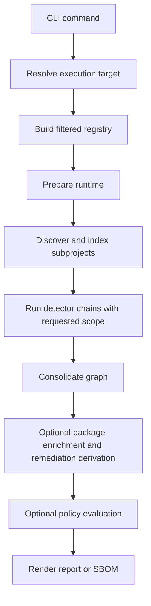
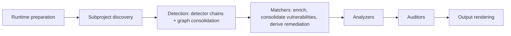
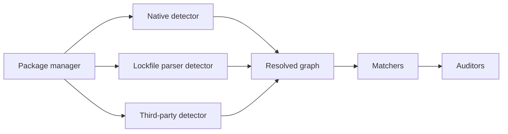

# Bomly Architecture

This document explains how Bomly is structured today and how the main command flows work.

## Decision Records

The design decisions behind this architecture are recorded as individual
architecture decision records (ADRs) in [`adr/`](adr/README.md). Each decision
is one file with an ID, date, and status. To record a new decision, copy
[`adr/TEMPLATE.md`](adr/TEMPLATE.md), take the next number, and add a row to
the [index](adr/README.md). This document stays the architecture narrative;
it links to ADRs where a section's behavior comes from a recorded decision.

An active cross-repo program to mature the SDK model (canonical-PURL
identity on a typed node union, SBOM-complete typed fields, single-home
PURL/SPDX behavior, Go 1.27) is planned in
[`SDK_MATURITY_PLAN.md`](SDK_MATURITY_PLAN.md), backed by ADR-0037 through
ADR-0039 and [ADR-0041](adr/0041-identity-is-the-canonical-purl-on-typed-nodes.md)
(which supersedes ADR-0036's content-addressable design). The standing placement rule the program restores —
model behavior lands in the SDK first; the CLI and plugins hold only what is
theirs by nature — is
[ADR-0040](adr/0040-the-sdk-is-the-default-home-for-behavior.md).

## Product Shape

Bomly is a CLI-first dependency intelligence tool. The command-line interface is the public surface, while the analysis engine underneath is organized so the same runtime can support scanning, explanation, diffing, SBOM generation, and auditing without duplicating logic.

Current public commands:

| Command         | Purpose                                                |
|-----------------|--------------------------------------------------------|
| `bomly scan`    | Resolve dependencies, render reports, and write SBOMs  |
| `bomly explain` | Show why a dependency exists in a graph                |
| `bomly diff`    | Compare dependency state across Git refs or SBOM files |
| `bomly version` | Print version information                              |

## Runtime Overview

Bomly prepares one runtime per command execution. That runtime holds the filtered registry, execution target metadata, planned subprojects, and detector, matcher, and auditor selections so discovery and execution stay aligned.

```mermaid
flowchart TD
    A[CLI command] --> B[Resolve execution target]
    B --> C[Build filtered registry]
    C --> D[Prepare runtime]
    D --> E[Discover and index subprojects]
    E --> F[Run detector chains with requested scope]
    F --> G[Consolidate graph]
    G --> H[Optional package enrichment and remediation derivation]
    H --> I[Optional policy evaluation]
    I --> J[Render report or SBOM]
```

## Execution Targets

Each invocation operates on exactly one execution target:

- Filesystem path
- Container image
- Remote Git repository
- SBOM file

The CLI resolves the raw user input, but runtime preparation owns discovery and planning. That keeps `scan`, `explain`, and `diff` consistent with one another.

## Scan Pipeline

The scan engine is responsible for orchestration, not the CLI command handlers. The command layer gathers inputs, while the runtime handles ordering, selection, and reuse.

```mermaid
flowchart LR
    A[Runtime preparation]
    B[Subproject discovery]
    C[Detection: detector chains + graph consolidation]
    F[Matchers: enrich, consolidate vulnerabilities, derive remediation]
    F2[Analyzers]
    G[Auditors]
    H[Output rendering]

    A --> B --> C --> F --> F2 --> G --> H
```

Stage summary:

1. Runtime preparation builds the filtered registry and execution plan.
2. Subproject discovery finds supported package-manager roots for the target. By default only the execution-target root is inspected; `--recursive` walks nested directories (bounded by `--max-depth`, `--exclude`, and built-in ignore rules) and plans one subproject per directory-and-package-manager pair, with workspace-expanding managers pruned below ancestors that already cover them.
3. Detection resolves a dependency graph per package manager and then consolidates the per-subproject graphs into the single graph and package registry the rest of the pipeline uses. Detection also produces one unified list of `sdk.DetectorWarning`s — resolution failures and fallbacks the engine observed, plus the package-manager problems detectors reported with their graphs (see [ADR-0024](adr/0024-one-typed-detector-warning-channel-no-ci-readiness-stage.md)). When `--scope` is set, the requested scope is part of the detector request so build-tool detectors can narrow command execution where the package manager supports it; all detector results pass through the shared SDK scope filter, and consolidation is the tail of this stage rather than a separate step.
4. Matchers enrich packages with additional metadata such as licenses, EOL status, and vulnerability records. After vulnerability consolidation, `internal/remediation` derives package fix status and version, validates optional read-only detector hints, and creates occurrence-specific vulnerability suggestions. This is the tail of enrichment, not a separate stage.
5. Analyzers run when `--analyze` is set. They consume the matched graph and annotate `sdk.Vulnerability.Reachability` (on the PURL-keyed registry package) with status (reachable/unreachable/unknown), tier (symbol/module/package/none), and call paths. Failures degrade to `Status=unknown` rather than aborting the pipeline. See [`../docs/REACHABILITY.md`](../docs/REACHABILITY.md) for ecosystem coverage and tier semantics.
6. Auditors evaluate policy against the enriched graph + registry pair and create reference-style findings (`PackageRef` + `VulnerabilityID`) when `--audit` is enabled. As the final part of that same audit stage, neutral policy-status resolvers may change only `Finding.PolicyStatus`; they never remove or rewrite finding evidence. The built-in `vulnerability`, `license`, and `package` auditors cover advisory thresholds, SPDX policy, and denied or suspicious packages respectively.
7. Users combine `--enrich --audit` when they want external matcher data to feed policy evaluation in the same run.
8. Output rendering emits text, JSON, SARIF, or SBOM documents.

`bomly explain` reuses the same detection (resolution + consolidation) and matching stages, then performs dependency path selection in its explain orchestration before optional component audit.

## Extensibility

Extensibility is the core of Bomly's design. **Every built-in is an implementation of the same contract an external plugin implements** — there is no privileged internal path. Adding an ecosystem, an enrichment source, or a policy gate does not require forking the engine. Three extension points are pluggable today (detector, matcher, auditor); external **analyzer** plugins are planned — the built-in reachability analyzers are not yet loadable as plugins.

The diagram shows where plugins hook into the run, after the runtime is configured and subprojects are indexed:

```mermaid
flowchart LR
    R[Configure runtime] --> X[Index subprojects] --> D[Detect: resolve + consolidate] --> M[Match] --> An[Analyze] --> Au[Audit] --> O[Output]

    PD([Detector plugins]) -.-> D
    PM([Matcher plugins]) -.-> M
    PAu([Auditor plugins]) -.-> Au
    PAn([Analyzer plugins: planned]) -. planned .-> An
```

| Extension point | Status | Contract (`sdk`) | Responsibility |
| --- | --- | --- | --- |
| Detector | Available | `sdk.Detector` | Turn evidence (lockfile, manifest, SBOM) into a dependency graph |
| Matcher | Available | `sdk.Matcher` | Enrich packages with vulnerability, license, or lifecycle data |
| Auditor | Available | `sdk.Auditor` | Evaluate policy and emit reference-style findings |
| Analyzer | Planned | `sdk.Analyzer` | Annotate `sdk.Vulnerability.Reachability` for a language |

External plugins run as versioned (`v1`) gRPC binaries and participate in the same runtime planning as built-ins: detector plugins declare evidence patterns and join subproject discovery; matcher and auditor plugins are selected with the same `--matchers` / `--auditors` selector grammar. Plugins are disabled until explicitly enabled. See [PLUGINS.md](../docs/PLUGINS.md) for the trust model and authoring guides.

Analyzers exist as a contract (`sdk.Analyzer`) and ship four built-in implementations (govulncheck, jsreach, pyreach, jvmreach), but the plugin runtime does not yet accept an analyzer kind, so they cannot be supplied by an external plugin today. Making analyzers a first-class plugin extension point is planned.

## Detector and Auditor Model

Bomly treats detectors, matchers, and auditors as explicit runtime roles.

- Detectors resolve package graphs.
- Matchers enrich Resolved packages.
- Auditors evaluate policy and produce normalized findings.

Within a package-manager chain, Bomly uses explicit ordering and superseding rules. Native detectors are preferred where available, and Syft-backed detection fills the coverage gaps for additional ecosystems.

```mermaid
flowchart LR
    A[Package manager]
    A --> B[Native detector]
    A --> C[Lockfile parser detector]
    A --> D[Third-party detector]
    B --> E[Resolved graph]
    C --> E
    D --> E
    E --> F[Matchers]
    F --> G[Auditors]
```

Implementation priority:

| Category        | Examples                                                                 | Priority |
|-----------------|--------------------------------------------------------------------------|----------|
| Native          | Go, Node, Maven, Gradle, Python, Composer, Bundler, GitHub Actions, SBOM | Highest  |
| Lockfile parser | Package-manager-specific parsers where applicable                        | High     |
| Third-party     | Syft detector, Grype matcher                                             | Lower    |

Native detector coverage is quality-of-graph coverage, not just support-matrix labeling. A built-in detector should ship with deterministic package metadata, graph edges where the ecosystem source can provide them, direct/development/runtime classification when it can be inferred, package URLs, unit fixtures in the detector package, and smoke coverage when a stable root-level real repository is available. Syft remains the compatibility backstop for package managers or project shapes that Bomly cannot resolve directly.

Some native detector chains intentionally prefer a build-tool command over a committed file parser because the command can expose transitive edges that the lockfile or manifest does not encode. Pub, SwiftPM, and SBT follow this pattern: `pub-native`, `swiftpm-native`, and `sbt-native` run first when `dart`, `swift`, or `sbt` is available, then fall back to the committed-file detector if the tool is missing or fails. When validating graph-shape changes for those ecosystems, run smoke tests and the local benchmark on a host with the relevant toolchain installed.

## Build Modes

Syft and Grype each support two build modes:

| Mode     | Build tags                                  | Behavior                                                                                                                                            |
|----------|---------------------------------------------|-----------------------------------------------------------------------------------------------------------------------------------------------------|
| Builtin  | default build                               | Link Syft and Grype libraries directly. No external binary required.                                                                                |
| External | `bomly_external_syft`, `bomly_external_grype` | Shell out to `syft` and `grype` binaries on PATH. Used by `make build-lite` to produce a smaller binary.                                          |

The reachability analyzers are not split: `govulncheck` always uses the vendored `golang.org/x/vuln/scan` library and `jsreach` always uses the vendored `github.com/evanw/esbuild/pkg/api` library. Both libraries are small enough that vendoring them outweighs the maintenance cost of a build-tag split.

`make build` produces both release variants. `make build-full` produces the default builtin binary, and `make build-lite` produces the smaller external-tool build.

## CI and Releases

Pull requests and pushes to `main` run the full validation suite (tests, vet, formatting, module-tidy drift, generated-docs drift). End-to-end smoke coverage, GoReleaser packaging, `SHA256SUMS`, Linux packages, and the Homebrew/Scoop/WinGet manifest PRs all run in this repository's workflows.

See [CI](CI.md) for workflow details.

## Network Behavior

**Network-backed matchers are off by default.** They run only when the user
explicitly enables `--enrich`. `--audit` evaluates existing package
vulnerability data and does not trigger network enrichment.

**Detector network behavior is per-implementation.** Lockfile-parser detectors (npm, pnpm, yarn, Composer, Bundler, NuGet, GitHub Actions, SBOM ingest, …) are pure file parsers and make no network calls. Build-tool primary detectors (`go-detector`, `maven-detector`, `gradle-detector`, `sbt-native-detector`) shell out to the build tool, which may download packages from registries during normal resolution — this is the build tool's behavior, not Bomly's. Hybrid detectors (`cargo`, `poetry`, `uv`) prefer the lockfile and use `--locked`/`--no-sync` flags on the build-tool fallback to stay offline. See [DETECTORS.md → Network behavior](../docs/DETECTORS.md#network-behavior).

**CI-readiness warnings read committed files only.** The Node detectors' package-manager warnings inspect `package.json`, the lockfile they already parsed, `pnpm-workspace.yaml`, and `.npmrc`. They execute no package manager: `pnpm`/`yarn` on `PATH` are frequently Corepack shims, and running even `--version` can download the pinned manager on demand, which would put a registry call in a plain scan.

**Target materialization is a separate network boundary.** `--url` explicitly
authorizes Bomly to clone the requested Git repository before the scan
pipeline starts. Matcher gating does not suppress that clone. The clone has a
10-minute deadline and disables submodule recursion and Git LFS smudging for
every clone and ref checkout. Bomly validates the completed checkout's size,
entry count, depth, and symlink containment before repository discovery. Local
repository diffs preserve the selected checkout's symlinks because that
repository is already a user-trusted input.

`--install-first` is the explicit opt-in: it tells supporting detectors to run their normal install command (`npm install`, `pip install`, `composer install`, etc.) before resolving the graph. This downloads packages by design.

Permitted enrichment-time services:

- OSV
- CISA KEV
- deps.dev
- OpenSSF Scorecard
- Grype's vulnerability database distribution service

Installed external matcher plugins may use their own documented services.

**Custom network settings are trusted authority.** The OSV and Scorecard base
URLs may point to public, private, loopback, or plain HTTP services. Proxy
destinations and additional CA files have the same reach. Bomly supports these
choices for self-hosted services and enterprise networks; it does not apply a
private-network block. Only the user config is loaded automatically. A
repository config must be selected with `--config` or `BOMLY_CONFIG`, and
network-specific environment variables are also explicit inputs.

The shared SDK HTTP client follows Go's normal redirect rules. Redirects are
allowed because custom services commonly use them, but sensitive headers are
not forwarded to a different hostname. The standard client also permits an
HTTPS endpoint to redirect to HTTP. This is intentional trusted-endpoint
behavior for self-hosted services; Bomly does not add a downgrade block. Proxy
and endpoint passwords must not appear in errors or logs. Configured PEM
certificates extend the system trust roots for the current process rather than
replacing them. The executable assurance matrix is recorded in
[`test/assurance/NETWORK_BOUNDARIES.md`](../test/assurance/NETWORK_BOUNDARIES.md).

**Native plugins are trusted processes, not sandboxes.** Installation verifies
the managed artifact and records it disabled by default. Enabling a plugin
authorizes a native process with the same user-level filesystem, network,
environment, and subprocess privileges as Bomly. Protocol validation limits
the data core accepts from that process; it does not restrict host access.

Cache failures are non-fatal. The command should warn and continue rather than failing hard.

## Package Map

| Package               | Role                                                                                            |
|-----------------------|-------------------------------------------------------------------------------------------------|
| `cmd/bomly`           | CLI entry point                                                                                 |
| `internal/cli`        | Commands, config loading, progress, and help output                                             |
| `internal/engine`     | Runtime preparation, orchestration, and consolidation                                           |
| `internal/registry`   | Support metadata, package-manager discovery, and built-in detector, matcher, and auditor wiring |
| `internal/detectors`  | Detector contracts and ecosystem implementations                                                |
| `internal/auditors`   | Policy evaluators and finding creation                                                          |
| `internal/baseline`   | Portable package-finding baseline codec and audit policy-status resolver                         |
| `bomly-plugin-*` (external modules) | Reachability analyzers (govulncheck, jsreach, pyreach, jvmreach), external enrichment matchers (osv, deps.dev license, scorecard, grype), and the Syft detector, each in its own repository and consumed as a pinned Go module |
| `internal/engine/diff` | Diff pipeline orchestration and audit delta classification                                    |
| `internal/engine/explain` | Dependency path traversal                                                                   |
| `internal/engine/scan` | Scan command pipeline API                                                                    |
| `internal/output`     | Text, JSON, SARIF rendering, plus structured response payloads and schema generation            |
| `internal/sbom`       | SPDX and CycloneDX codecs                                                                       |
| `internal/benchmark`  | Hidden local dependency-graph benchmark, baseline comparison, scoring, and embedded presets      |
| `sdk`      | Shared domain types                                                                             |
| `internal/plugin`     | Managed plugin manifests, installation, verification, store state, adapters, and runtime glue  |
| `internal/extensions` | Extension hooks and support code                                                                |
| `bomly-sdk/system` (external) | Bounded filesystem and subprocess helpers shared by components and plugins             |
| `bomly-sdk/filecache` (external) | Shared TTL file cache for matcher and analyzer results                              |
| `bomly-sdk/logkit` (external) | Subprocess logging helpers                                                             |
| `bomly-sdk/detectorkit` / `matcherkit` (external) | Shared detector and matcher helper functions                       |
| `bomly-sdk/testkit` (external) | Shared test helpers (binary builds, fuzz bounds, graph validation)                    |

## Managed Plugins

Bomly uses a hybrid plugin model:

- Built-in detectors, matchers, and auditors stay in-process by default.
- External managed plugins are installed into `~/.bomly/plugins`.
- Runtime preparation loads enabled external plugins into the registry as adapters so the scan engine still owns orchestration. External plugins are disabled on install and become runnable only after `bomly plugins enable <id>`.

Managed plugins currently expose the same three runtime roles as core components:

- Detectors resolve graphs.
- Matchers enrich packages.
- Auditors produce findings and risk signals.

## HashiCorp Runtime

External plugins run through HashiCorp `go-plugin` in gRPC mode. Bomly uses a small public SDK under `sdk` and JSON-encoded v1 request and response schemas under `sdk`.

The runtime layer is responsible for:

- Handshake and plugin API version checks.
- Subprocess launch and cleanup.
- gRPC transport for metadata, detect, match, and audit calls.
- Context-based cancellation and error propagation.

## Plugin SDK

Plugin authors import `sdk` instead of depending on `internal/` packages. The SDK exposes:

- `ServeDetector`
- `ServeMatcher`
- `ServeAuditor`
- Versioned request and response structs in `sdk`
- Identity metadata plus role descriptors for component type, supported modes, matcher required-ness, detector fallback wiring, and install-first support
- Optional runtime hooks for readiness, applicability, and detector install-first execution

The SDK keeps HashiCorp plumbing out of plugin implementations while preserving a typed boundary. Built-ins now use the same SDK contract in-process and are adapted back into the scan engine through shared SDK-to-runtime adapters. That keeps built-ins and external plugins on one metadata and execution model while leaving installation and verification as external-plugin-only concerns.

## Plugin Installation

Managed plugin installation is owned by Bomly rather than by the runtime library. The install flow is:

1. Resolve a local archive, local dev binary, or direct URL source.
2. Validate checksums when required.
3. Extract archives safely into a temp directory.
4. Validate `bomly-plugin.json`.
5. Start the plugin through the SDK/gRPC runtime, fetch the role descriptor named by the manifest kind, require `descriptor.name == manifest.id`, and store Bomly's internal descriptor snapshot.
6. Move the plugin into `~/.bomly/plugins/store/<id>/<version>`.
7. Update `installed.json` atomically.

The installer rejects archive path traversal, absolute paths, unsupported
entrypoints, incompatible manifests, and runtime descriptors that do not match
the manifest identity. Remote archive downloads are limited to 256 MiB, and
GitHub release metadata responses are limited to 4 MiB before JSON decoding.
Extraction accepts at most 4,096 entries, 256 MiB for one expanded file, and
512 MiB across all expanded files. Zip metadata allows all limits to be checked
before extraction. Tar streams are checked before each entry is written and
again while bytes are copied, so a false size header cannot bypass the limit.
Partial over-limit files are removed.

Plugin JSON is bounded before decoding. `bomly-plugin.json` and
`bomly-plugin.runtime.json` each have a 1 MiB limit. The shared
`installed.json` database has a 16 MiB limit so a large plugin collection
remains practical without allowing an unbounded read.

## Plugin Selection

External plugins are not executed ad hoc from CLI handlers. Runtime preparation loads enabled installed plugins into the engine registry before filtering and subproject planning.

Selection rules stay aligned with the normal scan pipeline:

- Built-ins are registered first.
- External plugins are added as `plugin` components with descriptor-derived support and discovery plans.
- Detector plugins declare package-manager support and evidence patterns in the detector descriptor. Runtime preparation uses those patterns to augment package-manager discovery or create standalone plugin-driven subprojects when no built-in package-manager pattern applies.
- Runtime preparation filters detectors, matchers, auditors, and ecosystems once and reuses that prepared registry for scan execution.

## Built-In vs External Plugins

Built-ins remain the default implementation for core and performance-sensitive logic. External managed plugins are intended for optional or isolatable behavior, especially ecosystem-specific or third-party-backed integrations.

Built-ins and external plugins now share the same SDK-first contract. The difference is operational, not structural:

- built-ins are compiled into the binary and run in-process
- external plugins are installed, verified, and executed behind the managed plugin runtime

## Migration of Existing Components

Bomly no longer assumes that all plugin-capable behavior must stay historical or in-process forever. The registry and scan pipeline now accept either:

- Native built-ins compiled into the main binary.
- External managed plugins adapted into the same detector, matcher, and auditor interfaces.

This keeps the scan engine recognizable while making it possible to migrate selected integrations into managed plugins over time without bypassing runtime preparation, and it prevents drift between built-in and external component metadata.

## Design Boundaries

- Detector packages must not import `internal/engine` or `internal/registry`. They may use the SDK's `system` subpackage for shared bounded filesystem and subprocess operations, and `detectorkit` for shared detector helpers.
- Built-in reachability analyzers live in their own `bomly-plugin-*-analyzer` repositories; they use the SDK's `system`, `filecache`, and `logkit` subpackages and never import any `internal/*` package.
- `sdk` owns shared neutral identifiers and support types.
- `internal/registry` owns discovery, support-matrix data, and built-in registry wiring.
- `internal/engine` owns runtime planning, orchestration, and detector-chain reuse.
- `internal/plugin` owns managed plugin installation, verification, store state, and external runtime adapters.
- The CLI resolves user input but should not perform its own independent discovery pass.
