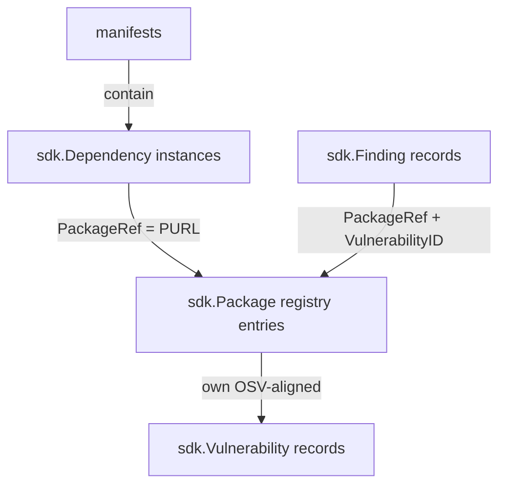

# Domain Models

Bomly's domain model standardizes around three pipeline stages — detection, matching, and audit — surfaced as three deduplicated collections in JSON, SARIF, and SBOM output. This page is the reference for the SDK types that back those collections and how they connect.

## Overview

| Stage      | Type                | Lives in                 | Identity     | Purpose                                                  |
|------------|---------------------|--------------------------|--------------|----------------------------------------------------------|
| Detection  | `sdk.Dependency`    | per-manifest `sdk.Graph` | `Dependency.ID` (stable within manifest) | One node per dependency instance; carries scope, locations, edges |
| Matching   | `sdk.Package`       | `sdk.PackageRegistry`    | `Package.PURL` (canonical) | One artifact per unique PURL; carries licenses, vulnerabilities, scorecard, EOL |
| Audit      | `sdk.Finding`       | `engine.PipelineResult.Findings` | `Finding.ID` + `Finding.PackageRef` + `Finding.VulnerabilityID` | Reference-style policy outcome with no inlined vuln fields |

Vulnerabilities themselves are OSV-aligned `sdk.Vulnerability` records owned by the registry; analyzers annotate them in place with reachability.



## `sdk.Dependency` — detection node

```go
type Dependency struct {
    Coordinates
    ID string

    // Detection metadata
    Scopes      []Scope             // runtime / development / unknown; supports multiple
    Locations   []PackageLocation   // manifest paths + line/column
    CPEs        []string
    Digests     []Digest
    Copyright   string
    FoundBy     string              // detector name
    ResolvedURL string
    Metadata    map[string]any      // including detection-time licenses under MetadataKeyDetectionLicenses

    // Match link
    Matched    bool
    PackageRef string                // PURL into the package registry
}
```

Key helpers:

- `dep.PrimaryScope()`, `dep.HasScope(s)`, `dep.AddScope(s)` — scope helpers.
- `sdk.DetectionLicenses(dep)` / `sdk.SetDetectionLicenses(dep, licenses)` — read/write detection-time license facts stashed in `dep.Metadata`.
- `sdk.NormalizeDependencyIdentity(dep)` — canonical identity for diff matching.
- `sdk.CanonicalPackageURLFromDependency(dep)` — derive the canonical PURL when the detector didn't supply one.

Dependencies **do not** carry `Licenses`, `Vulnerabilities`, or `Scorecard` fields. Detection-time licenses ride along in metadata; matching-stage data lives on the registry package.

## `sdk.Package` — registry artifact (matching)

```go
type Package struct {
    Coordinates
    ID string                       // registry/database identifier; defaults to PURL in PackageRegistry

    // Enrichment
    CPEs            []string
    Digests         []Digest
    Licenses        []PackageLicense
    Vulnerabilities []Vulnerability       // OSV-aligned
    Scorecard       *PackageScorecard
    EOL             *PackageEOL
    Copyright       string
    ResolvedURL     string
    Metadata        map[string]any
    Matched         bool                  // set by any matcher that touched this package
}
```

Registry API (`sdk/registry.go`):

- `sdk.NewPackageRegistry()` — empty registry.
- `reg.Ensure(purl)` — get-or-create. The way matchers populate enrichment.
- `reg.Get(purl) (*Package, bool)` — lookup.
- `reg.Add(pkg)` — merge a fully-formed package.
- `reg.All()` — iterate. `reg.Len()` — count.

Built by `consolidation.BuildPackageRegistry(consolidated)` right after the consolidation stage; threaded through match/analyze/audit and into the output layer via `PipelineResult.Registry`.

## `sdk.Vulnerability` — OSV-aligned

```go
type Vulnerability struct {
    // OSV spec
    ID, Source, Title, Summary, Details string
    Aliases                             []string
    Severity                            []Severity  // CVSS vectors
    Affected                            []Affected
    References                          []Reference
    Published, Modified                 time.Time
    DatabaseSpecific                    map[string]any

    // Bomly extensions (typed, not buried in DatabaseSpecific)
    ParsedSeverity       string
    SeveritySource       string
    CVSS                 []CVSSScore
    AffectedVersionRange string
    AffectedSymbols      []AffectedSymbol
    FixedIn              string
    FixedVersions        []string
    FixState             string
    FixAvailable         []FixAvailable
    KEVExploited         bool
    KnownExploited       []KnownExploited
    EPSS                 []EPSSScore
    CWEs                 []CWE
    RiskScore            float64
    Reachability         *Reachability  // populated by analyzers, not matchers
    Reasons              []string
    DataSource, Namespace string
    CPEs                 []string
}
```

Matchers (OSV, grype, depsdev, eol, scorecard, and enabled external matcher plugins) write these records onto registry packages by PURL. Reachability is the only field analyzers touch; they annotate it in place.

## `sdk.Finding` — reference-style audit result

```go
type Finding struct {
    // Identity + policy
    ID          string             // CVE / GHSA / policy ID
    Kind        FindingKind        // vulnerability | license | package | ...
    Severity    string
    Title       string
    Reasons     []string
    Source      string             // osv | grype | license | package | ...
    Auditor     string             // which auditor emitted it
    Disposition FindingDisposition // pass | fail | warn

    // References (the whole point of "reference-style")
    PackageRef      string         // PURL → resolve via registry.Get
    DependencyRefs  []string       // dependency IDs that triggered the finding
    VulnerabilityID string         // resolve via lookupVulnerability(pkg, ...)

    // VEX
    VexStatus, VEXJustification string
}
```

Findings carry **no** CVSS/EPSS/KEV/CWE/fix-state/reachability fields. Consumers (JSON output, SARIF, render, TUI) resolve those by following `PackageRef` and `VulnerabilityID` into the registry. This eliminates the ~25-field duplication the old `Finding` shape had.

`engine.DeduplicateFindings(findings)` keys on `(PackageRef, VulnerabilityID, Kind)` with `(grype > osv > other)` source-rank tiebreaks.

## `sdk.Graph` — id-based topology

The graph is node-centric over `*sdk.Dependency`. The canonical API is in `sdk/graph.go`:

```go
g := sdk.New()
_ = g.AddNode(dep)             // returns ErrNodeAlreadyExist on collision
n, ok := g.Node(id)            // lookup by stable ID
_ = g.AddEdge(fromID, toID)    // returns ErrSelfDependency on self-loop

nodes := g.Nodes()                       // []*Dependency
direct, _ := g.DirectDependencies(id)    // outgoing edges
back, _ := g.Dependents(id)              // incoming edges
roots := g.Roots()                       // no incoming edges
leaves := g.Leaves()                     // no outgoing edges
sorted, _ := g.TopologicalSort()
paths, _ := g.CollectPathsTo(id)
g.WalkNodes(func(d *sdk.Dependency) bool { ... })
g.WalkEdges(func(from, to *sdk.Dependency) bool { ... })
```

The graph deals in dependency instances. The registry deals in deduplicated package facts. The split lets a 50-manifest monorepo's many `react@18.2.0` dependency instances share one `Package` entry — and one set of CVEs.

## `engine.PipelineResult`

```go
type PipelineResult struct {
    ResolveResults    []sdk.DetectionResult
    Consolidated      sdk.ConsolidatedGraph
    Graph             *sdk.Graph
    Registry          *sdk.PackageRegistry  // built after consolidation
    Findings          []sdk.Finding
    RiskScores        []sdk.RiskScore
    ...
}
```

`Graph` and `Registry` together are the canonical view of a scan: the graph is the topology, the registry is the matching artifact set, the findings reference both. The output layer (`internal/output`), render layer (`internal/cli/render`), and TUI all accept the registry as a parameter and re-enrich their projections by PURL lookup.

## Output JSON contract (schema v1)

The three collections map to three top-level keys: `manifests` (detection-stage
dependencies, one node per instance), `packages` (matching-stage artifacts,
deduplicated by PURL), and `findings` (reference-style audit results). Manifest
dependencies are **lean** — they carry detection-time facts and a `package_ref`
into `packages`, but no inlined vulnerabilities/scorecard. Enrichment lives once,
in `packages`, and is resolved by PURL.

```jsonc
{
  "schema_version": "1.0",
  "command": "scan",
  "manifests": [
    {
      "path": "package-lock.json", "kind": "package-lock.json",
      "ecosystem": "npm", "package_manager": "npm", "detector": "npm-detector",
      "dependencies": [
        {
          "id": "react@18.2.0", "name": "react", "version": "18.2.0",
          "purl": "pkg:npm/react@18.2.0",
          "scopes": ["runtime"],
          "depends_on": ["loose-envify@1.4.0"],
          "matched": true,
          "package_ref": "pkg:npm/react@18.2.0",
          "licenses": [ /* detection-time license facts only */ ]
        }
      ]
    }
  ],
  "packages": [
    {
      "purl": "pkg:npm/react@18.2.0", "name": "react", "version": "18.2.0",
      "ecosystem": "npm", "matched": true,
      "licenses": [ /* matching-stage licenses */ ],
      "vulnerabilities": [ /* OSV-aligned, with cvss/epss/reachability */ ],
      "scorecard": { ... }, "eol": { ... }, "cpes": [ ... ], "digests": [ ... ]
    }
  ],
  "findings": [
    {
      "id": "CVE-2021-23337", "kind": "vulnerability", "severity": "high",
      "package": { "purl": "pkg:npm/lodash@4.17.15", "name": "lodash", "version": "4.17.15" },
      "fixed_in": "4.17.21", "cvss": [ ... ], "epss": [ ... ],
      "reachability": { "status": "reachable", "tier": "symbol" }
    }
  ],
  "audit_summary": { "critical": 0, "high": 1, ... }
}
```

SARIF projects the same registry-resolved findings; SBOM (SPDX/CycloneDX)
projects the `packages` enrichment onto components (licenses, vulnerabilities,
CPEs, checksums, EOL).

`bomly diff` and `bomly explain` use the same vocabulary. SARIF and SBOM output are projected from the same registry-aware helpers; see [`../docs/OUTPUT_FORMATS.md`](../docs/OUTPUT_FORMATS.md) and [`../docs/SBOM.md`](../docs/SBOM.md) for format-specific details.

## Common patterns

### Matchers: enrich the registry, not the graph

```go
func (m Matcher) Match(ctx context.Context, req sdk.MatchRequest) (sdk.MatchResult, error) {
    packages := matchers.RegistryPackagesForGraph(req.Graph, req.Registry, req.Mode, req.Target)
    for _, pkg := range packages {
        pkg.Vulnerabilities = append(pkg.Vulnerabilities, vulnsForPURL(pkg.PURL)...)
        pkg.Matched = true
    }
    return sdk.MatchResult{Registry: req.Registry, MatcherStats: sdk.MatcherStats{Name: matcherName}}, nil
}
```

### Auditors: emit reference findings

```go
for _, dep := range req.Graph.Nodes() {
    pkg, ok := req.Registry.Get(dep.PURL)
    if !ok { continue }
    for _, vuln := range pkg.Vulnerabilities {
        findings = append(findings, sdk.Finding{
            ID:              vuln.ID,
            Kind:            sdk.FindingKindVulnerability,
            Severity:        vuln.ParsedSeverity,
            Source:          vuln.Source,
            Auditor:         auditorName,
            PackageRef:      dep.PURL,
            DependencyRefs:  []string{dep.ID},
            VulnerabilityID: vuln.ID,
        })
    }
}
```

### Output: resolve references at projection time

```go
af := output.AuditFinding{ID: f.ID, Kind: string(f.Kind), Severity: f.Severity}
if pkg, ok := registry.Get(f.PackageRef); ok && pkg != nil {
    af.Package = output.PackageRef{Purl: pkg.PURL, Name: pkg.Name, Version: pkg.Version, ...}
    if vuln := lookupVulnerability(pkg, f.VulnerabilityID, f.ID); vuln != nil {
        af.CVSS, af.EPSS, af.CWEs = vuln.CVSS, vuln.EPSS, vuln.CWEs
        af.FixedIn, af.FixedVersions = vuln.FixedIn, vuln.FixedVersions
        af.Reachability = vuln.Reachability.Clone()
    }
}
```

The reference style means the registry is authoritative. A single CVE update flows to every dependency instance that references the affected package, with no per-manifest copy step.

## Migration notes

If you're reading code or tests that still reference the old shape, here is the rename table:

| Old API                                       | New API                                                       |
|-----------------------------------------------|---------------------------------------------------------------|
| `*sdk.Package` graph nodes                    | `*sdk.Dependency` graph nodes; registry holds `*sdk.Package`  |
| `g.AddPackage(pkg)`, `g.Package(id)`          | `g.AddNode(dep)`, `g.Node(id)`                                |
| `g.AddDependency(from, to)`                   | `g.AddEdge(from, to)`                                         |
| `g.Packages()`                                | `g.Nodes()`                                                   |
| `g.Dependencies(id)`                          | `g.DirectDependencies(id)`                                    |
| `WalkRelationships`                           | `WalkEdges`                                                   |
| `sdk.PackageVulnerability`                    | `sdk.Vulnerability` (OSV-aligned)                             |
| `vuln.Severity` (string)                      | `vuln.ParsedSeverity` (string); `vuln.Severity []Severity` for CVSS vectors |
| `vuln.Description`                            | `vuln.Details`                                                |
| `sdk.PackageIsDiffable`                       | `sdk.NodeIsDiffable`                                          |
| `sdk.NormalizePackageIdentity`                | `sdk.NormalizeDependencyIdentity`                             |
| `Finding{Package: pkg, ...vuln fields...}`    | `Finding{PackageRef: pkg.PURL, VulnerabilityID: vuln.ID, ...}` |
| Single `Scope` string                         | `Scopes []Scope` via `sdk.ScopesOf(scope)`                    |
| Detection-time licenses on `Dependency.Licenses` | `sdk.SetDetectionLicenses(dep, licenses)` / `sdk.DetectionLicenses(dep)` |
