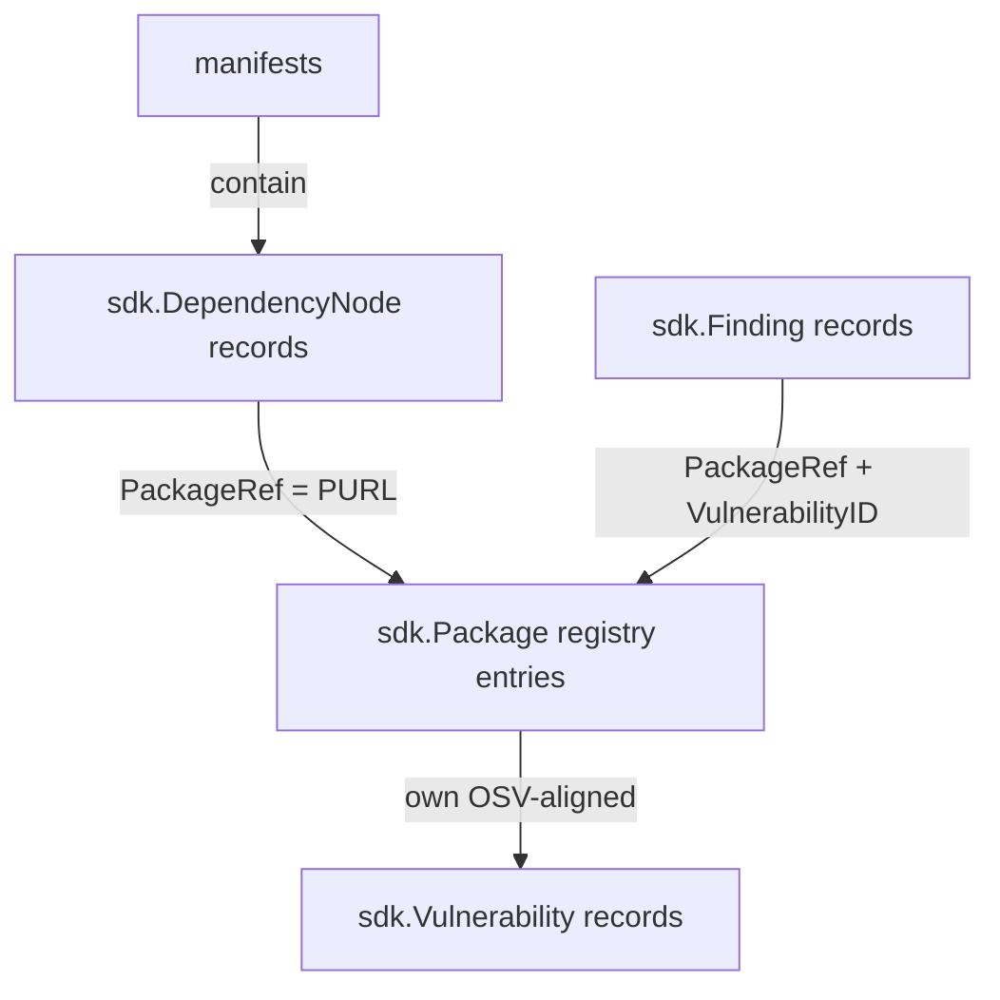
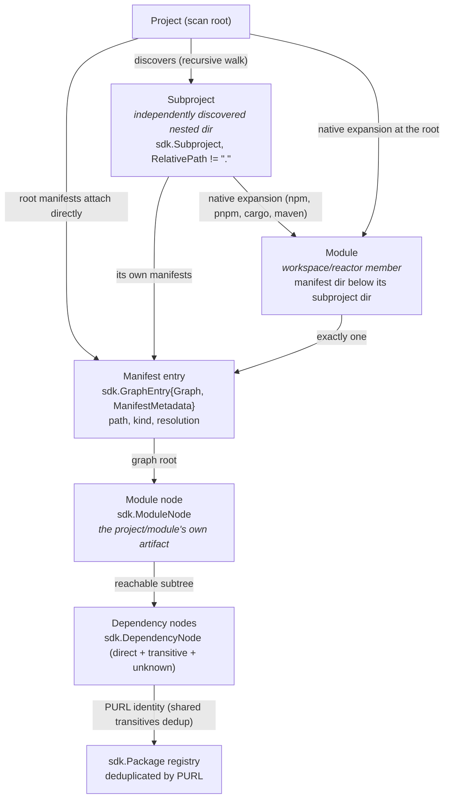

# Domain Models

Bomly's domain model standardizes around three pipeline stages — detection, matching, and audit — surfaced as three deduplicated collections in JSON, SARIF, and SBOM output. This page is the reference for the SDK types that back those collections and how they connect.

## Overview

| Stage      | Type                | Lives in                 | Identity     | Purpose                                                  |
|------------|---------------------|--------------------------|--------------|----------------------------------------------------------|
| Detection  | `sdk.GraphNode` (manifest / module / dependency) | per-manifest `sdk.Graph` | the node's own identity — for a dependency node, its canonical PURL | One node per identity; carries scope, locations, edges, origins |
| Matching   | `sdk.Package`       | `sdk.PackageRegistry`    | `Package.PURL` (canonical) | One artifact per unique PURL; carries licenses, vulnerabilities, remediation, scorecard, EOL |
| Audit      | `sdk.Finding`       | `engine.PipelineResult.Findings` | `Finding.ID` + `Finding.PackageRef` + `Finding.VulnerabilityID` | Reference-style policy outcome with no inlined vuln fields |

Vulnerabilities themselves are OSV-aligned `sdk.Vulnerability` records owned by the registry; analyzers annotate them in place with reachability.


```mermaid
flowchart TD
    M[manifests]
    D[sdk.DependencyNode records]
    P[sdk.Package registry entries]
    V[sdk.Vulnerability records]
    F[sdk.Finding records]

    M -->|contain| D
    D -->|PackageRef = PURL| P
    P -->|own OSV-aligned| V
    F -->|PackageRef + VulnerabilityID| P
```

## Project structure: projects, subprojects, modules, manifests

How dependencies relate to manifests, and manifests to the project tree. A
**subproject** is an independently discovered nested directory (its own
`sdk.Subproject`, what `--recursive` finds); a **module** is a member the
package manager natively resolves under one root manifest (reactor module,
workspace member) and gets its own manifest entry from the detector. A
project/module and its manifest are two faces of the same thing — user-facing
views merge them into one node when the mapping is 1:1; machine formats
(JSON, SARIF, SBOM) keep the flat manifests collection.


```mermaid
flowchart TD
    PR["Project (scan root)"]
    SP["Subproject<br/><i>independently discovered nested dir</i><br/>sdk.Subproject, RelativePath != &quot;.&quot;"]
    MOD["Module<br/><i>workspace/reactor member</i><br/>manifest dir below its subproject dir"]
    MAN["Manifest entry<br/>sdk.GraphEntry{Graph, ManifestMetadata}<br/>path, kind, resolution"]
    ROOT["Module node<br/>sdk.ModuleNode<br/><i>the project/module's own artifact</i>"]
    DEP["Dependency nodes<br/>sdk.DependencyNode (direct + transitive + unknown)"]
    PKG["sdk.Package registry<br/>deduplicated by PURL"]

    PR -->|"discovers (recursive walk)"| SP
    PR -->|"root manifests attach directly"| MAN
    SP -->|"its own manifests"| MAN
    SP -->|"native expansion (npm, pnpm, cargo, maven)"| MOD
    PR -->|"native expansion at the root"| MOD
    MOD -->|"exactly one"| MAN
    MAN -->|"graph root"| ROOT
    ROOT -->|"reachable subtree"| DEP
    DEP -->|"PURL identity (shared transitives dedup)"| PKG
```

Derivation rule (implemented once in `output.ClassifyManifest` /
`BuildHierarchy`, consumed by every view): `dir(manifest.path)` equal to the
manifest's `subproject` directory → the manifest belongs directly to that
subproject (or the project when `"."`); `dir(manifest.path)` nested beneath it
→ a module keyed by that directory. Shared transitive dependencies appear in
every module entry that reaches them; the PURL-keyed registry counts each
package once.

## `sdk.Coordinates` — shared identity, and its three names

`Coordinates` (embedded by every node kind and by `Package`) splits a package's
identity into `Org` + `Name`, mirroring the PURL namespace/name split: npm's
`@tailwindcss/postcss` is stored as `Org: "tailwindcss"`, `Name: "postcss"`.
The bare `Name` is therefore **never** a package identity on its own, and three
accessors exist for the three things callers actually want:

| Accessor | Form | Use it for |
| --- | --- | --- |
| `QualifiedName()` | `org:name` for everything | Internal keying where only uniqueness matters. It is not a node ID — node identity is the PURL (see below). |
| `DisplayName()` | `@org/name`, `org/name`, `org:name` | Presentation only — text reports, JSON `name` fields. Never an identity key. |
| `EcosystemName()` | `@org/name` (npm), `org:name` (Maven family), `org/name` (Go, Composer, Swift, GitHub Actions), bare `name` everywhere else | Anything that leaves the process: advisory-database lookups, cache keys derived from a name, SBOM component names, names handed to Grype/Syft. |

`EcosystemName` exists because the bare `Name` silently collides across scopes:
querying Grype or OSV for `@tailwindcss/postcss` under `postcss` returns every
postcss advisory and attaches it to the scoped package (issue #319). Prefer the
PURL when a lookup accepts one; reach for `EcosystemName` when it only accepts a
name.

Joining is **opt-in per ecosystem** and everything else keeps the bare `Name`,
because `Org` is not always part of the package name. For OS packages `Org` is
the distro that shipped it — `pkg:apk/alpine/libcrypto3` gives `Org: "alpine"` —
and Grype's distro-namespace matchers query `libcrypto3`, so joining would miss
every OS advisory. Adding an ecosystem to the join list means asserting that its
advisory databases key on the namespaced form.

## The graph node union — detection nodes

A graph node is one of three kinds and the set is sealed: nothing outside the
SDK can add a fourth (ADR-0041).

| Kind | Type | What it stands for | Identity |
| --- | --- | --- | --- |
| `sdk.NodeKindManifest` | `*sdk.ManifestNode` | A file record — a `package.json`, a lockfile, a build script. Structural: never matched, never enriched. | `manifest:` + the canonical repository-relative path |
| `sdk.NodeKindModule` | `*sdk.ModuleNode` | One of the scanned project's own artifacts: the root project, a workspace member, a reactor module. | `module:` + the declaring manifest's path + `#` + the canonical PURL, or the module name when no PURL is derivable |
| `sdk.NodeKindDependency` | `*sdk.DependencyNode` | One resolved third-party package — the unit of matching and enrichment. | its canonical package URL |

Every kind satisfies `sdk.GraphNode`:

```go
type GraphNode interface {
    NodeID() string                    // the node's identity, which is its published graph ID
    Kind() NodeKind
    NodeLocations() []PackageLocation
    NodeWarnings() []NodeWarning
    CloneNode() GraphNode
    // sealed: the SDK owns the member set
}
```

Constructors are the only way to make a node, because identity is minted there
and nowhere else: `sdk.NewManifestNode(path, kind)`,
`sdk.NewModuleNode(declaringManifestPath, coords)`,
`sdk.NewDependencyNode(coords)`, `sdk.NewDependencyNodeFromPURL(raw)`, and
`sdk.NewDependencyNodeFrom(proto)`. Each returns an error rather than a
fabricated identity: coordinates that cannot mint a spec-valid package URL are
refused, and so is a module whose asserted PURL does not parse.
`sdk.ParseNodeKind` rejects an unrecognized kind instead of guessing.

### Identity is the canonical PURL

A dependency node's ID **is** its canonical package URL. There is no ID
override, no occurrence suffix, and no content address. Two nodes are the same
node exactly when their IDs match, which is why `left-pad@1.0.0` from npm and
`left-pad@1.0.0` from PyPI are two nodes in one merged graph: their PURL types
differ.

`g.InsertNode(node)` is the fold-by-identity entry point. When a node with the
same identity is already present, the two records fold into one: scopes,
locations, origins, CPEs, digests, licenses, and external references union,
scalar fields fill gaps, and `Matched` ORs. IDs are disjoint across kinds, so a
fold always joins records of one kind.

Origins are metadata, never identity. `DependencyNode.Origins` is a
union-merged list of where the dependency was resolved from, and the ADR-0033
publication gates are the only door in. More than one origin on a node is an
observable fact — the shape of a dependency-confusion signal — not a reason to
split the node. The three URL-valued PURL qualifiers (`repository_url`,
`download_url`, `vcs_url`) are relocated into `Origins` at construction rather
than published as part of an identity.

Constructors record recoverable conditions as `NodeWarning` values instead of
failing: `NodeWarningMissingVersion`, `NodeWarningDroppedEvidenceQualifier`,
`NodeWarningGenericIdentity`. Warnings are in-process state, re-derived
wherever a node is reconstructed, so they never travel on the wire.

### Ownership is the kind, not a flag

`sdk.IsProjectOwned(node)` reports whether a node stands for the project's own
code, and it reads `node.Kind() == sdk.NodeKindModule`. ADR-0041 removed the
`FirstParty` flag, so a fold cannot drop ownership and an ingested document
cannot assert it. The `application` package type is not an ownership signal on
its own — an application-typed *import* is a package the project consumes.

Module nodes are never matched or enriched. They keep their PURLs and stay
visible in `packages` output and generated SBOMs, unenriched by design: they
are absent from public sources, and a coincidental name match would attach
someone else's advisories to the project's own code.

### `sdk.DependencyNode`

```go
type DependencyNode struct {
    Coordinates
    Relationship DependencyRelationship // direct / transitive / unknown
    Source       DependencySource       // registry / project / workspace / file / git / URL

    // Detection facts
    Scopes      []Scope             // runtime / development / unknown; a set
    Locations   []PackageLocation   // path, position, and per-site attribution
    CPEs        []string
    Digests     []Digest
    Copyright   string
    FoundBy     string              // detector name
    ResolvedURL string              // raw manifest evidence, never published
    Origins     []DependencyOrigin  // validated, union-merged, never identity

    // Component assertions the detecting or ingesting source made (ADR-0037)
    Licenses           []PackageLicense
    Description        string
    Homepage           string
    Supplier           *Contact
    Originator         *Contact
    ExternalReferences []ExternalReference

    Metadata map[string]any // escape hatch; the "bomly." key prefix is reserved

    // Match link
    Matched    bool
    PackageRef string // the PURL into the package registry — the node's own ID
}
```

Every assertion field carries a gate and a declared merge class, and the gate
runs on both wire directions and again when a node seeds a registry package.
`Description` passes `NormalizeDescription`, `Homepage` passes
`NormalizeHomepage`, both contacts pass `Contact.Normalized` (which never
retains an email address), `ExternalReferences` passes
`ExternalReference.Normalized`, and `Licenses` passes
`PackageLicense.Normalized`. The four scalars fill gaps; the two sets union.

`Licenses` is the typed replacement for the `MetadataKeyDetectionLicenses`
stash. `sdk.SetDetectionLicenses` writes the typed field and
`sdk.DetectionLicenses` reads it, falling back to the metadata key only for
producers that predate the field. Nothing should write the metadata key.

Key helpers:

- `node.PrimaryScope()`, `node.HasScope(s)`, `node.AddScope(s)` — scope helpers.
- `sdk.CompareDependencyDetails(baseGraph, headGraph, before, after)` — classify relationship, source, and registry-matching eligibility transitions.
- `sdk.RelationshipForPath(path []GraphNode)` — preserve an explicit relationship or derive direct/transitive from a root-to-target path.
- `node.RegistryMatchEligible()` — whether this node may be sent to external registry enrichment.
- Reader helpers over the union, for code that holds a `GraphNode`: `sdk.NodeCoordinates`, `sdk.NodeDisplayName`, `sdk.NodeVersion`, `sdk.NodePURL`, `sdk.AsDependencyNode`, `sdk.AsModuleNode`, `sdk.DependencyNodesOf`, `sdk.IsProjectOwned`, `sdk.IsNilNode` (a typed nil is not an untyped one).

### Per-site attribution on locations

`PackageLocation` carries more than a path. `ModuleRoot`, `Scopes`, and
`Relationship` record what was true *at that site*, because the node-level
values are unions and a workspace can make one package direct-in-development in
one module and transitive-at-runtime in another — a question with two answers
can only be asked per module root.

`sdk.ReachabilityEvidence` is the matching per-module-root record analyzers
emit, with optional `DependencyRefs` naming the exact nodes an analyzer can
attribute. `sdk.DeriveReachability` folds the evidence into the summary that
rides on a vulnerability, and `sdk.SelectUsages(node, evidence, filter)` joins
evidence to locations within one module root, so a conjunctive filter such as
reachable ∧ runtime ∧ direct selects one usage rather than a union.

Adding these fields cost `PackageLocation` its comparability: it holds a slice,
so it can no longer be compared with `==` or used as a map key. Compare
`RealPath` and `AccessPath`, or key by them.

`DependencyNode.Source` is detection evidence, not a guess based on package
name or ecosystem. A detector sets it only when the manifest, lockfile, or
build tool output proves the origin. Cargo, Bundler, the JavaScript package
managers, pub, SwiftPM, and the pip, Pipenv, Poetry, and uv Python paths
currently expose that evidence. Formats that do not retain the selected feed or
source leave the field empty. An empty source remains eligible for matching for
protocol-v1 compatibility, but it cannot create a source-change finding in a
diff.

An `unknown` relationship means the package was present in the owning manifest
but its parent could not be recovered. The component root is attached beneath
the manifest or module node so it continues through matching, analysis,
auditing, diff, and output. Only that component root is unknown; known edges
below it remain transitive. An omitted relationship remains valid for
protocol-v1 plugins and is derived from graph structure by consumers.

Dependency nodes carry no `Vulnerabilities` or `Scorecard` fields: matching-stage
data lives on the registry package.

Registry matching eligibility is **node-level, folded toward eligible**: a
folded node is matchable when any witness was. Withholding enrichment from a
PURL that a registry release genuinely uses would hide vulnerabilities, while
the reverse merely enriches a PURL the registry also serves; the per-source
observations stay readable in the origins list. This narrows ADR-0015's
occurrence-level rule to the node level (ADR-0041). Ordinary registry releases
are eligible even when their `ResolvedURL` points at a custom registry or
mirror. Module nodes, and nodes sourced from project, workspace, link/file,
Git, or arbitrary URL references, are normally ineligible but remain in the
complete graph and package registry for analysis, auditing, diff, SBOM, and
output. Swift source-control packages are the exception: their repository URL
is the canonical SwiftURL package identity, so Git-sourced Swift packages
remain eligible for vulnerability matching. Application type alone is not an
ownership signal — an application artifact imported from an SBOM is a
dependency node and stays eligible unless it has a non-registry source. An
omitted source remains eligible for protocol-v1 and legacy detector
compatibility. Before any built-in or external matcher runs, the engine passes
it a cloned graph containing only eligible nodes and eligible-to-eligible
edges; the original graph and full registry continue to later stages unchanged.

## `sdk.Package` — registry artifact (matching)

```go
type Package struct {
    Coordinates
    ID string                       // registry/database identifier; defaults to PURL in PackageRegistry

    // Component assertions (ADR-0037): what a source document or registry
    // said about the package itself. Same gates and merge classes as the
    // matching fields on DependencyNode.
    Description        string
    Homepage           string
    Supplier           *Contact
    Originator         *Contact
    ExternalReferences []ExternalReference

    // Enrichment
    CPEs            []string
    Digests         []Digest
    Licenses        []PackageLicense
    Vulnerabilities []Vulnerability       // OSV-aligned
    Attestations    []PackageAttestation
    Remediation     *PackageRemediation   // derived from vulnerability fix evidence
    Scorecard       *PackageScorecard
    EOL             *PackageEOL
    Copyright       string
    ResolvedURL     string                // raw detection evidence, never published
    DetectedOrigins []DependencyOrigin    // the node's vetted origins, for matchers
    Metadata        map[string]any
    Matched         bool                  // set by any matcher that touched this package
}
```

`PackageLicense` is a claim, not a string: `Value` is what the source said,
`SPDXExpression` is the validated form (a minted `LicenseRef-*` when the value
is not on the SPDX list), `Type` says whether the claim was declared or
concluded, `Source` says who made it, and `ExtractedText` carries the text a
`LicenseRef-*` names. The reference and its text travel on one record because
both formats require them together.

Digest algorithms are a registry, not two constants: `sdk.DigestAlgorithms()`
enumerates the vocabulary and `algorithm.CycloneDXName()` renders it.

Registry API (`sdk/registry.go`):

- `sdk.NewPackageRegistry()` — empty registry.
- `reg.Ensure(purl)` — get-or-create. The way matchers populate enrichment.
- `reg.Get(purl) (*Package, bool)` — lookup.
- `reg.Add(pkg)` — merge a fully-formed package.
- `reg.All()` — iterate. `reg.Len()` — count.

Built by `consolidation.BuildPackageRegistry(consolidated)` right after the consolidation stage; threaded through match/analyze/audit and into the output layer via `PipelineResult.Registry`.

`Package.Remediation` is canonical vulnerability guidance derived by
`internal/remediation` after all matcher results and alias-equivalent
vulnerabilities have been consolidated. It is absent when a package has no
vulnerabilities:

- `complete` means every vulnerability has usable fix evidence and
  `RecommendedVersion` is the lowest package version known to address all of
  them. When the installed version can be compared, the recommendation is
  always newer.
- `partial` means some fix evidence exists but it does not support one complete
  recommendation. This includes fix evidence that is incomparable with or not
  newer than the installed version.
- `unavailable` means every vulnerability explicitly reports no fix or
  won't-fix.
- `unknown` means evidence is missing or contradictory.

Machine-readable output keeps these compact enum values. Human-facing
surfaces render them as `Complete fix available`, `Partial fix available`,
`No fix available`, and `Fix availability unknown`. Summary counts include
only complete packages with a concrete `direct-bump`,
`transitive-override`, or `lockfile-refresh` suggestion. Manual review and
no-fix guidance remain visible in detailed output but are not counted as fix
suggestions.

`Suggestions` joins that package result to dependency occurrences:

```go
type PackageRemediationSuggestion struct {
    AffectedDependencyRefs    []string
    SuggestedActionDependencyRef string
    ManifestPath              string
    Action                    RemediationAction
    OverrideAdvice            string
}
```

`AffectedDependencyRefs` identifies occurrences of the vulnerable package.
`SuggestedActionDependencyRef` identifies the direct dependency or manifest
anchor the suggested action targets. For a direct dependency, the affected and
target references are normally the same. For a transitive dependency, the
target may be its nearest direct parent.
Suggestions are grouped only when action, target, manifest, and advice match.
This preserves workspaces, aliases, duplicate versions, and separate
manifests.

The central component chooses `direct-bump`, `transitive-override`,
`lockfile-refresh`, `no-fix-upstream`, or `manual-review`. Unknown-parent and
non-registry occurrences always require manual review. Detector hints can
confirm a package-manager strategy and supply manager advice, but cannot choose
the package version or final action. When an older detector omits relationship
metadata, core may infer placement from the shortest path to a real project
root. Synthetic manifest ownership is never treated as a safe parent.

This is derived data, not matcher, detector, or audit policy. The engine
replaces any incoming value after matching. Derivation makes no additional
network calls, runs no commands, and writes no files.

## `sdk.Vulnerability` — OSV-aligned

```go
type Vulnerability struct {
    // OSV spec
    ID, Source, Title, Summary, Details string
    Aliases                             []string
    Severity                            []Severity  // CVSS vectors
    Affected                            []Affected
    References                          []Reference
    Published, Modified                 time.Time
    DatabaseSpecific                    map[string]any

    // Bomly extensions (typed, not buried in DatabaseSpecific)
    ParsedSeverity       SeverityLevel
    SeveritySource       string
    CVSS                 []CVSSScore
    AffectedVersionRange string
    AffectedSymbols      []AffectedSymbol
    FixedIn              string
    FixedVersions        []string
    FixState             string
    FixAvailable         []FixAvailable
    KEVExploited         bool
    KnownExploited       []KnownExploited
    EPSS                 []EPSSScore
    CWEs                 []CWE
    RiskScore            float64
    Reachability         *Reachability  // populated by analyzers, not matchers
    Reasons              []string
    DataSource, Namespace string
    CPEs                 []string
}
```

Matchers (OSV, grype, depsdev, eol, scorecard, and enabled external matcher
plugins) write these records onto registry packages by PURL. At the end of
matching, the engine consolidates records whose `ID` and `Aliases` form one
transitively connected identity set within a package. The record with the
broadest populated metadata becomes the base, the remaining evidence is
unioned, the highest severity and conservative fix state are retained, and
every non-canonical primary ID becomes an alias. `Related` IDs are not identity
evidence because OSV uses them for associated but distinct vulnerabilities.
Reachability is the only field analyzers touch; they annotate it in place.

The project's own artifacts — the root project, workspace members, reactor
modules — are module nodes, and they appear in the packages collection
**unenriched by design**: they never enter a matcher's work list, because they
are absent from public sources and a coincidental name match would attach
someone else's advisories. They keep their PURLs and stay visible in `packages`
output and generated SBOMs. See "Ownership is the kind, not a flag" above.

## `sdk.Finding` — reference-style audit result

```go
type Finding struct {
    // Identity + policy
    ID          string             // CVE / GHSA / policy ID
    Kind        FindingKind        // vulnerability | license | package | ...
    Severity    SeverityLevel      // CVSS band (critical|high|medium|low) for
                                   // vulnerabilities; GitHub-aligned level
                                   // (error|warning|note) for findings without
                                   // a CVSS score (license, package)
    Title       string
    Reasons     []string
    Source      string             // osv | grype | license | package | ...
    Auditor     string             // which auditor emitted it
    RuleID      string             // stable auditor rule, independent of project occurrence
    PolicyStatus FindingPolicyStatus // fail | warn | suppressed; empty defaults to fail

    // References (the whole point of "reference-style")
    PackageRef      string         // PURL → resolve via registry.Get
    DependencyRefs  []string       // dependency IDs that triggered the finding
    VulnerabilityID string         // resolve via lookupVulnerability(pkg, ...)

    // VEX
    VexStatus, VEXJustification string
}
```

`PolicyStatus` is the SDK field name and `policy_status` is its structured-output
key. User interfaces describe the values as fail, warning, or accepted
(`suppressed`). An omitted value retains the historical failing behavior.

Findings carry **no** CVSS/EPSS/KEV/CWE/fix-state/reachability fields. Consumers (JSON output, SARIF, render, TUI) resolve those by following `PackageRef` and `VulnerabilityID` into the registry. This eliminates the ~25-field duplication the old `Finding` shape had.

`engine.DeduplicateFindings(findings)` keys on `(PackageRef, VulnerabilityID, Kind)` with `(grype > osv > other)` source-rank tiebreaks.

## `sdk.Graph` — identity-based topology

The graph is node-centric over the `GraphNode` union. A node's ID is its
identity, so the ID index is also the identity index. The canonical API is in
`sdk/graph.go`:

```go
g := sdk.New()
_ = g.AddNode(node)                 // ErrNodeAlreadyExist on a duplicate identity
kept, _ := g.InsertNode(node)       // fold-by-identity: returns the surviving node
n, ok := g.Node(id)                 // GraphNode
dep, ok := g.DependencyNode(id)     // *DependencyNode, or false for another kind
_ = g.AddEdge(fromID, toID)         // ErrSelfDependency on a self-loop
_ = g.AddTypedEdge(fromID, toID, sdk.EdgeKindDependsOn)

nodes := g.Nodes()                       // []GraphNode
deps := g.DependencyNodes()              // []*DependencyNode
mods := g.ModuleNodes()                  // []*ModuleNode
mans := g.ManifestNodes()                // []*ManifestNode
direct, _ := g.DirectDependencies(id)    // outgoing edges
back, _ := g.Dependents(id)              // incoming edges
roots := g.Roots()                       // no incoming edges
leaves := g.Leaves()                     // no outgoing edges
sorted, _ := g.TopologicalSort()
paths, _ := g.CollectPathsTo(id)
g.WalkNodes(func(n sdk.GraphNode) bool { ... })
g.WalkDependencyNodes(func(d *sdk.DependencyNode) bool { ... })
g.WalkEdges(func(from, to sdk.GraphNode) bool { ... })
g.WalkTypedEdges(func(from, to sdk.GraphNode, kind sdk.EdgeKind) bool { ... })
```

Prefer `InsertNode` over `AddNode` when a duplicate identity is possible: it
folds the records instead of failing, which is what keeps a second witness's
scopes and origins from being dropped.

Edges are typed. `sdk.EdgeKindDependsOn` is the dependency claim,
`sdk.EdgeKindDescribes` joins a manifest to a module it declares, and
`sdk.EdgeKindUnknown` is what an older producer's untyped edge decodes to.
`sdk.DeriveEdgeKind`, `sdk.MergeEdgeKind`, and `sdk.CopyEdgesInto(dst, src,
rename)` exist so a graph can be rebuilt or its IDs rewritten without silently
flattening the kinds.

`sdk.IndexNodesByPackage(g)` derives a package → nodes reverse index. It is
derived, not stored: the truth remains `DependencyNode.PackageRef`, and the
registry stays position-free.

The graph deals in identities. The registry deals in deduplicated package
facts. The split lets a 50-manifest monorepo's many `react@18.2.0` sites share
one `Package` entry — and one set of CVEs.

## `engine.PipelineResult`

```go
type PipelineResult struct {
    ResolveResults    []sdk.DetectionResult
    Consolidated      sdk.ConsolidatedGraph
    Graph             *sdk.Graph
    Registry          *sdk.PackageRegistry  // built after consolidation
    Findings          []sdk.Finding
    RiskScores        []sdk.RiskScore
    ...
}
```

`Graph` and `Registry` together are the canonical view of a scan: the graph is the topology, the registry is the matching artifact set, the findings reference both. The output layer (`internal/output`), render layer (`internal/cli/render`), and TUI all accept the registry as a parameter and re-enrich their projections by PURL lookup.

## Output JSON contract (schema v1)

The three collections map to three top-level keys: `manifests` (detection-stage
dependencies, one node per instance), `packages` (matching-stage artifacts,
deduplicated by PURL), and `findings` (reference-style audit results). Manifest
dependencies are **lean** — they carry detection-time facts and a `package_ref`
into `packages`, but no inlined vulnerabilities/scorecard. Enrichment lives once,
in `packages`, and is resolved by PURL.

A dependency's `id` is its canonical PURL, and so are the entries in
`depends_on` and in a finding's `dependency_refs` (ADR-0041). Before that
change the ID was an `org:name@version` string, which collided across
ecosystems; anything that stored those IDs across versions needs re-derivation.
Baselines are unaffected — they key on package and finding references, not node
IDs.

For workspace/reactor package managers (npm, pnpm, cargo, maven) the manifests
collection carries **one entry per module** — e.g. `apps/web/package.json`
alongside the root `package-lock.json` — each listing the module's reachable
dependency nodes (shared transitives appear under every module that
reaches them; `packages` still deduplicates by PURL). Consumers derive the
project hierarchy from the existing fields without schema additions: each
manifest's `subproject` names its discovery directory ("." for the scan
root), and a manifest whose `path` directory sits *below* its subproject
directory is a **module** manifest (`output.ClassifyManifest` /
`output.BuildHierarchy` implement this rule for every built-in view).

```jsonc
{
  "schema_version": "1.0",
  "command": "scan",
  "manifests": [
    {
      "path": "package-lock.json", "kind": "package-lock.json",
      "ecosystem": "npm", "package_manager": "npm", "detector": "npm-detector",
      "dependencies": [
        {
          "id": "pkg:npm/react@18.2.0", "name": "react", "version": "18.2.0",
          "purl": "pkg:npm/react@18.2.0",
          "scopes": ["runtime"],
          "depends_on": ["pkg:npm/loose-envify@1.4.0"],
          "matched": true,
          "package_ref": "pkg:npm/react@18.2.0",
          "licenses": [ /* detection-time license facts only */ ]
        }
      ]
    }
  ],
  "packages": [
    {
      "purl": "pkg:npm/react@18.2.0", "name": "react", "version": "18.2.0",
      "ecosystem": "npm", "matched": true,
      "licenses": [ /* matching-stage licenses */ ],
      "vulnerabilities": [ /* OSV-aligned, with cvss/epss/reachability */ ],
      "scorecard": { ... }, "eol": { ... }, "cpes": [ ... ], "digests": [ ... ]
    }
  ],
  "findings": [
    {
      "id": "CVE-2021-23337", "kind": "vulnerability", "severity": "high",
      "package": { "purl": "pkg:npm/lodash@4.17.15", "name": "lodash", "version": "4.17.15" },
      "fixed_in": "4.17.21", "cvss": [ ... ], "epss": [ ... ],
      "reachability": { "status": "reachable", "tier": "symbol" }
    }
  ],
  "audit_summary": { "critical": 0, "high": 1, ... }
}
```

SARIF projects the same registry-resolved findings; SBOM (SPDX/CycloneDX)
projects the `packages` enrichment onto components (licenses, vulnerabilities,
CPEs, checksums, EOL).

`bomly diff` and `bomly explain` use the same vocabulary. Diff reports version
changes separately from occurrence detail changes. A transition carries
the before and after dependency relationship, source, and registry-matching
eligibility plus an ordered list of the fields that changed. This preserves
changes that do not alter package identity or version, including changes on
duplicate occurrences in different manifests. SARIF and SBOM output are
projected from the same registry-aware helpers; see
[`../docs/OUTPUT_FORMATS.md`](../docs/OUTPUT_FORMATS.md) and
[`../docs/SBOM.md`](../docs/SBOM.md) for format-specific details.

`DependencyDetailTransition.ReviewReasons` is the shared presentation
classifier. It marks a transition when a known source changes to Git or a URL,
or when registry-matcher coverage changes from covered to not covered. It does
not add a derived field to JSON, MCP, or SARIF. Auditors may use the same
reasons as input, but the classifier itself does not create findings.

During `bomly diff --audit`, the head-side `AuditRequest` receives a deep copy
of the canonical transitions in `DependencyDetailChanges`. The base-side
request, scans, and explains leave the optional field empty. This lets built-in
and external protocol-v1 auditors evaluate detail changes without rebuilding a
diff from a focused audit graph.

## Common patterns

### Matchers: enrich the registry, not the graph

```go
func (m Matcher) Match(ctx context.Context, req sdk.MatchRequest) (sdk.MatchResult, error) {
    packages := matchers.RegistryPackagesForGraph(req.Graph, req.Registry, req.Mode, req.Target)
    for _, pkg := range packages {
        pkg.Vulnerabilities = append(pkg.Vulnerabilities, vulnsForPURL(pkg.PURL)...)
        pkg.Matched = true
    }
    return sdk.MatchResult{Registry: req.Registry, MatcherStats: sdk.MatcherStats{Name: matcherName}}, nil
}
```

### Auditors: emit reference findings

```go
for _, dep := range req.Graph.DependencyNodes() {
    pkg, ok := req.Registry.Get(dep.NodeID())
    if !ok { continue }
    for _, vuln := range pkg.Vulnerabilities {
        findings = append(findings, sdk.Finding{
            ID:              vuln.ID,
            Kind:            sdk.FindingKindVulnerability,
            Severity:        vuln.ParsedSeverity,
            Source:          vuln.Source,
            Auditor:         auditorName,
            PackageRef:      dep.NodeID(),
            DependencyRefs:  []string{dep.NodeID()},
            VulnerabilityID: vuln.ID,
        })
    }
}
```

### Output: resolve references at projection time

```go
af := output.AuditFinding{ID: f.ID, Kind: string(f.Kind), Severity: f.Severity}
if pkg, ok := registry.Get(f.PackageRef); ok && pkg != nil {
    af.Package = output.PackageRef{Purl: pkg.PURL, Name: pkg.Name, Version: pkg.Version, ...}
    if vuln := lookupVulnerability(pkg, f.VulnerabilityID, f.ID); vuln != nil {
        af.CVSS, af.EPSS, af.CWEs = vuln.CVSS, vuln.EPSS, vuln.CWEs
        af.FixedIn, af.FixedVersions = vuln.FixedIn, vuln.FixedVersions
        af.Reachability = vuln.Reachability.Clone()
    }
}
```

The reference style means the registry is authoritative. A single CVE update flows to every dependency node that references the affected package, with no per-manifest copy step.

## Migration notes

If you're reading code or tests that still reference the old shape, here is the rename table:

| Old API                                       | New API                                                       |
|-----------------------------------------------|---------------------------------------------------------------|
| `*sdk.Dependency` graph nodes                 | the `sdk.GraphNode` union: `*sdk.ManifestNode`, `*sdk.ModuleNode`, `*sdk.DependencyNode` |
| `dep.ID` / `dep.StableID()`                   | `node.NodeID()` — the canonical PURL for a dependency node    |
| `dep.FirstParty`                              | `sdk.IsProjectOwned(node)`, which reads the node kind         |
| `sdk.NormalizeDependencyIdentity(dep)`        | gone: the constructors mint the identity                      |
| `sdk.CanonicalPackageURLFromDependency(dep)`  | gone: `sdk.NewDependencyNode(coords)` mints or refuses        |
| `g.AddNode(dep)` for a possibly-duplicate node | `g.InsertNode(node)`, which folds by identity                 |
| `sdk.SetDetectionLicenses` writing `Metadata` | it writes the typed `DependencyNode.Licenses` field           |
| `sdk.Digest` algorithm string constants       | the `sdk.DigestAlgorithms()` registry                          |
| Untyped edges only                            | `g.AddTypedEdge`, `sdk.EdgeKind`, `sdk.CopyEdgesInto`         |
| `*sdk.Package` graph nodes                    | `*sdk.DependencyNode` graph nodes; registry holds `*sdk.Package` |
| `g.AddPackage(pkg)`, `g.Package(id)`          | `g.AddNode(node)`, `g.Node(id)`                               |
| `g.AddDependency(from, to)`                   | `g.AddEdge(from, to)`                                         |
| `g.Packages()`                                | `g.Nodes()`                                                   |
| `g.Dependencies(id)`                          | `g.DirectDependencies(id)`                                    |
| `WalkRelationships`                           | `WalkEdges`                                                   |
| `sdk.PackageVulnerability`                    | `sdk.Vulnerability` (OSV-aligned)                             |
| `vuln.Severity` (string)                      | `vuln.ParsedSeverity` (`SeverityLevel`); `vuln.Severity []Severity` for CVSS vectors |
| `vuln.Description`                            | `vuln.Details`                                                |
| `Finding{Package: pkg, ...vuln fields...}`    | `Finding{PackageRef: pkg.PURL, VulnerabilityID: vuln.ID, ...}` |
| Single `Scope` string                         | `Scopes []Scope` via `sdk.ScopesOf(scope)`                    |
| Detection-time licenses in `Dependency.Metadata` | the typed `DependencyNode.Licenses` field, via `sdk.SetDetectionLicenses` / `sdk.DetectionLicenses` |
