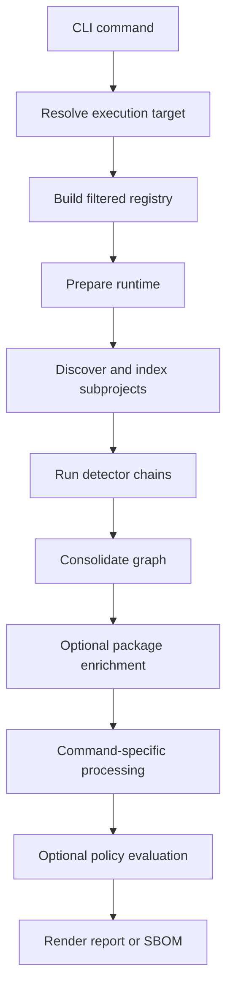
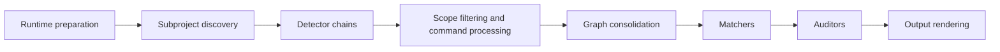
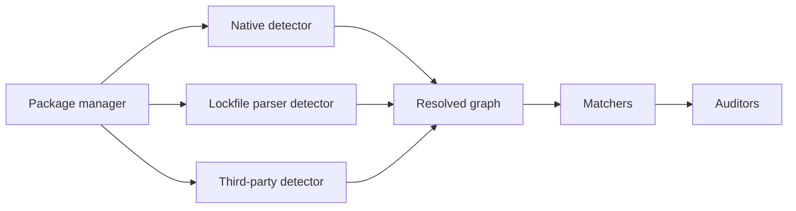

# Bomly Architecture

This document explains how Bomly is structured today and how the main command flows work.

## Product Shape

Bomly is a CLI-first dependency intelligence tool. The command-line interface is the public surface, while the analysis engine underneath is organized so the same runtime can support scanning, explanation, diffing, SBOM generation, and auditing without duplicating logic.

Current public commands:

| Command | Purpose |
| --- | --- |
| `bomly scan` | Resolve dependencies, render reports, and write SBOMs |
| `bomly explain` | Show why a dependency exists in a graph |
| `bomly diff` | Compare dependency state across Git refs or SBOM files |
| `bomly version` | Print version information |

## Runtime Overview

Bomly prepares one runtime per command execution. That runtime holds the filtered registry, execution target metadata, planned subprojects, and detector, matcher, and auditor selections so discovery and execution stay aligned.

## Execution Targets

Each invocation operates on exactly one execution target:

- Filesystem path
- Container image
- Remote Git repository
- SBOM file

The CLI resolves the raw user input, but runtime preparation owns discovery and planning. That keeps `scan`, `explain`, and `diff` consistent with one another.

## Scan Pipeline

The scan engine is responsible for orchestration, not the CLI command handlers. The command layer gathers inputs, while the runtime handles ordering, selection, and reuse.

Stage summary:

1. Runtime preparation builds the filtered registry and execution plan.
2. Subproject discovery finds supported package-manager roots for the target.
3. Detector chains resolve dependency graphs per package manager.
4. Command processing applies scope filtering or focused queries when needed.
5. Consolidation merges subproject graphs into a unified view.
6. Matchers enrich packages with additional metadata such as licenses, EOL status, and vulnerability records.
7. Command processing applies focused graph transforms such as scope filtering or explain-path selection.
8. Auditors evaluate policy against whatever vulnerability data is already present on packages and create findings when `--audit` is enabled.
9. Users combine `--enrich --audit` when they want external matcher data to feed policy evaluation in the same run.
10. Output rendering emits text, JSON, SARIF, or SBOM documents.

## Detector and Auditor Model

Bomly treats detectors, matchers, and auditors as explicit runtime roles.

- Detectors resolve package graphs.
- Matchers enrich resolved packages.
- Auditors evaluate policy and produce normalized findings.

Within a package-manager chain, Bomly uses explicit ordering and superseding rules. Native detectors are preferred where available, and Syft-backed detection fills the coverage gaps for additional ecosystems.

Implementation priority:

| Category | Examples | Priority |
| --- | --- | --- |
| Native | Go, Node, Maven, Gradle, Python, Composer, Bundler, GitHub Actions, SBOM | Highest |
| Lockfile parser | Package-manager-specific parsers where applicable | High |
| Third-party | Syft detector, Grype matcher | Lower |

## Build Modes

Syft and Grype support two build modes:

| Mode | Build tags | Behavior |
| --- | --- | --- |
| Builtin | default build | Link Syft and Grype libraries directly |
| External | `bomly_external_syft`, `bomly_external_grype` | Shell out to `syft` and `grype` binaries on `PATH` |

`make build` produces both release variants. `make build-full` produces the default builtin binary, and `make build-lite` produces the smaller external-tool build.

## CI and Releases

GitHub Actions handles validation, security analysis, smoke coverage, and release packaging:

- Pull requests run fast validation only.
- Pushes to `main` run deeper quality checks and scheduled smoke coverage.
- Semver tags publish draft prereleases to GitHub Releases with cross-platform archives and `SHA256SUMS`.

See [CI and Release Pipeline](CI.md) for workflow details and release mechanics.

## Network Behavior

Bomly is offline-safe by default. Network-backed matchers are only performed when the user explicitly enables `--enrich`. `--audit` evaluates existing package vulnerability data and does not implicitly trigger network enrichment.

Permitted enrichment-time services:

- OSV
- CISA KEV
- ClearlyDefined
- deps.dev
- endoflife.date

Cache failures are non-fatal. The command should warn and continue rather than failing hard.

## Package Map

| Package | Role |
| --- | --- |
| `cmd/bomly` | CLI entry point |
| `internal/cli` | Commands, config loading, progress, and help output |
| `internal/scan` | Runtime preparation, orchestration, and consolidation |
| `internal/registry` | Support metadata and discovery wiring |
| `internal/detectors` | Detector contracts and ecosystem implementations |
| `internal/matchers` | External enrichment matchers and shared matcher cache |
| `internal/auditors` | Policy evaluators and finding creation |
| `internal/licenses` | Shared license helper functions and cache helpers |
| `internal/explain` | Dependency path traversal |
| `internal/output` | Text, JSON, and SARIF rendering |
| `internal/sbom` | SPDX and CycloneDX codecs |
| `internal/model` | Shared domain types |
| `internal/viewmodel` | Structured response payloads and schema generation |
| `internal/plugin` | Plugin protocol and execution support |
| `internal/extensions` | Extension hooks and support code |
| `internal/system` | OS-level helpers used internally |
| `internal/testutil` | Test helpers |

## Design Boundaries

- Detector packages must not import `internal/scan` or `internal/registry`.
- `internal/model` owns shared neutral identifiers and support types.
- `internal/registry` owns discovery and support-matrix data.
- `internal/scan` owns runtime planning, orchestration, and detector-chain reuse.
- The CLI resolves user input but should not perform its own independent discovery pass.
