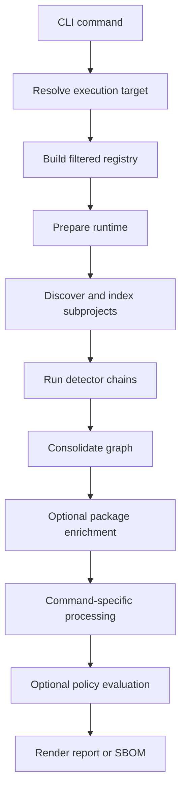
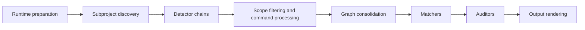
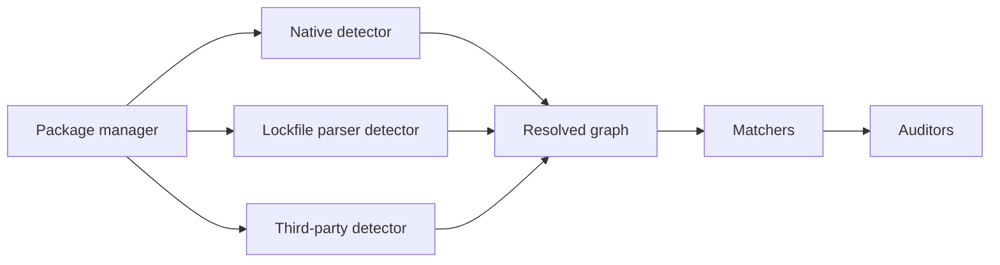

# Bomly Architecture

This document explains how Bomly is structured today and how the main command flows work.

## Product Shape

Bomly is a CLI-first dependency intelligence tool. The command-line interface is the public surface, while the analysis engine underneath is organized so the same runtime can support scanning, explanation, diffing, SBOM generation, and auditing without duplicating logic.

Current public commands:

| Command         | Purpose                                                |
|-----------------|--------------------------------------------------------|
| `bomly scan`    | Resolve dependencies, render reports, and write SBOMs  |
| `bomly explain` | Show why a dependency exists in a graph                |
| `bomly diff`    | Compare dependency state across Git refs or SBOM files |
| `bomly version` | Print version information                              |

## Runtime Overview

Bomly prepares one runtime per command execution. That runtime holds the filtered registry, execution target metadata, planned subprojects, and detector, matcher, and auditor selections so discovery and execution stay aligned.

## Execution Targets

Each invocation operates on exactly one execution target:

- Filesystem path
- Container image
- Remote Git repository
- SBOM file

The CLI resolves the raw user input, but runtime preparation owns discovery and planning. That keeps `scan`, `explain`, and `diff` consistent with one another.

## Scan Pipeline

The scan engine is responsible for orchestration, not the CLI command handlers. The command layer gathers inputs, while the runtime handles ordering, selection, and reuse.

Stage summary:

1. Runtime preparation builds the filtered registry and execution plan.
2. Subproject discovery finds supported package-manager roots for the target.
3. Detector chains resolve dependency graphs per package manager.
4. Command processing applies scope filtering or focused queries when needed.
5. Consolidation merges subproject graphs into a unified view.
6. Matchers enrich packages with additional metadata such as licenses, EOL status, and vulnerability records.
7. Command processing applies focused graph transforms such as scope filtering or explain-path selection.
8. Auditors evaluate policy against whatever vulnerability data is already present on packages and create findings when `--audit` is enabled.
9. Users combine `--enrich --audit` when they want external matcher data to feed policy evaluation in the same run.
10. Output rendering emits text, JSON, SARIF, or SBOM documents.

## Detector and Auditor Model

Bomly treats detectors, matchers, and auditors as explicit runtime roles.

- Detectors resolve package graphs.
- Matchers enrich resolved packages.
- Auditors evaluate policy and produce normalized findings.

Within a package-manager chain, Bomly uses explicit ordering and superseding rules. Native detectors are preferred where available, and Syft-backed detection fills the coverage gaps for additional ecosystems.

Implementation priority:

| Category        | Examples                                                                 | Priority |
|-----------------|--------------------------------------------------------------------------|----------|
| Native          | Go, Node, Maven, Gradle, Python, Composer, Bundler, GitHub Actions, SBOM | Highest  |
| Lockfile parser | Package-manager-specific parsers where applicable                        | High     |
| Third-party     | Syft detector, Grype matcher                                             | Lower    |

## Build Modes

Syft and Grype support two build modes:

| Mode     | Build tags                                    | Behavior                                           |
|----------|-----------------------------------------------|----------------------------------------------------|
| Builtin  | default build                                 | Link Syft and Grype libraries directly             |
| External | `bomly_external_syft`, `bomly_external_grype` | Shell out to `syft` and `grype` binaries on `PATH` |

`make build` produces both release variants. `make build-full` produces the default builtin binary, and `make build-lite` produces the smaller external-tool build.

## CI and Releases

GitHub Actions handles validation, security analysis, smoke coverage, and release packaging:

- Pull requests run fast validation only.
- Pushes to `main` run deeper quality checks and scheduled smoke coverage.
- Semver tags publish draft prereleases to GitHub Releases with cross-platform archives and `SHA256SUMS`.

See [CI and Release Pipeline](CI.md) for workflow details and release mechanics.

## Network Behavior

Bomly is offline-safe by default. Network-backed matchers are only performed when the user explicitly enables `--enrich`. `--audit` evaluates existing package vulnerability data and does not implicitly trigger network enrichment.

Permitted enrichment-time services:

- OSV
- CISA KEV
- ClearlyDefined
- deps.dev
- endoflife.date

Cache failures are non-fatal. The command should warn and continue rather than failing hard.

## Package Map

| Package               | Role                                                                                            |
|-----------------------|-------------------------------------------------------------------------------------------------|
| `cmd/bomly`           | CLI entry point                                                                                 |
| `internal/cli`        | Commands, config loading, progress, and help output                                             |
| `internal/scan`       | Runtime preparation, orchestration, pipeline hooks, and consolidation                           |
| `internal/registry`   | Support metadata, package-manager discovery, and built-in detector, matcher, and auditor wiring |
| `internal/detectors`  | Detector contracts and ecosystem implementations                                                |
| `internal/auditors`   | Policy evaluators and finding creation                                                          |
| `internal/matchers`   | Matcher contracts plus shared enrichment helpers used by built-in matchers                      |
| `internal/explain`    | Dependency path traversal                                                                       |
| `internal/output`     | Text, JSON, SARIF rendering, plus structured response payloads and schema generation            |
| `internal/sbom`       | SPDX and CycloneDX codecs                                                                       |
| `sdk`      | Shared domain types                                                                             |
| `internal/plugin`     | Managed plugin manifests, installation, verification, store state, adapters, and runtime glue  |
| `internal/extensions` | Extension hooks and support code                                                                |
| `internal/system`     | OS-level helpers used internally                                                                |
| `internal/testutil`   | Test helpers                                                                                    |

## Managed Plugins

Bomly uses a hybrid plugin model:

- Built-in detectors, matchers, and auditors stay in-process by default.
- External managed plugins are installed into `~/.bomly/plugins`.
- Runtime preparation loads enabled external plugins into the registry as adapters so the scan engine still owns orchestration. External plugins are disabled on install and become runnable only after `bomly plugin enable <id>`.

Managed plugins currently expose the same three runtime roles as core components:

- Detectors resolve graphs.
- Matchers enrich packages.
- Auditors produce findings and risk signals.

## HashiCorp Runtime

External plugins run through HashiCorp `go-plugin` in gRPC mode. Bomly uses a small public SDK under `sdk` and JSON-encoded v1 request and response schemas under `sdk`.

The runtime layer is responsible for:

- Handshake and plugin API version checks.
- Subprocess launch and cleanup.
- gRPC transport for metadata, detect, match, and audit calls.
- Context-based cancellation and error propagation.

## Plugin SDK

Plugin authors import `sdk` instead of depending on `internal/` packages. The SDK exposes:

- `ServeDetector`
- `ServeMatcher`
- `ServeAuditor`
- Versioned request and response structs in `sdk`
- Identity metadata plus role descriptors for component type, supported modes, matcher priority, matcher required-ness, detector fallback wiring, and install-first support
- Optional runtime hooks for readiness, applicability, and detector install-first execution

The SDK keeps HashiCorp plumbing out of plugin implementations while preserving a typed boundary. Built-ins now use the same SDK contract in-process and are adapted back into the scan engine through shared SDK-to-runtime adapters. That keeps built-ins and external plugins on one metadata and execution model while leaving installation and verification as external-plugin-only concerns.

## Plugin Installation

Managed plugin installation is owned by Bomly rather than by the runtime library. The install flow is:

1. Resolve a local archive, local dev binary, or direct URL source.
2. Validate checksums when required.
3. Extract archives safely into a temp directory.
4. Validate `bomly-plugin.json`.
5. Start the plugin through the SDK/gRPC runtime and compare runtime metadata plus role descriptors with the manifest.
6. Move the plugin into `~/.bomly/plugins/store/<id>/<version>`.
7. Update `installed.json` atomically.

The installer rejects archive path traversal, absolute paths, unsupported entrypoints, and incompatible runtime metadata.

## Plugin Selection

External plugins are not executed ad hoc from CLI handlers. `scan.Prepare` now loads enabled installed plugins into the registry before filtering and subproject planning.

Selection rules stay aligned with the normal scan pipeline:

- Built-ins are registered first.
- External plugins are added as `plugin` components with descriptor-derived support and discovery plans.
- Detector plugins declare package-manager support and evidence patterns in the detector descriptor. Runtime preparation uses those patterns to augment package-manager discovery or create standalone plugin-driven subprojects when no built-in package-manager pattern applies.
- Runtime preparation filters detectors, matchers, auditors, and ecosystems once and reuses that prepared registry for scan execution.

## Built-In vs External Plugins

Built-ins remain the default implementation for core and performance-sensitive logic. External managed plugins are intended for optional or isolatable behavior, especially ecosystem-specific or third-party-backed integrations.

Built-ins and external plugins now share the same SDK-first contract. The difference is operational, not structural:

- built-ins are compiled into the binary and run in-process
- external plugins are installed, verified, and executed behind the managed plugin runtime

## Migration of Existing Components

Bomly no longer assumes that all plugin-capable behavior must stay historical or in-process forever. The registry and scan pipeline now accept either:

- Native built-ins compiled into the main binary.
- External managed plugins adapted into the same detector, matcher, and auditor interfaces.

This keeps the scan engine recognizable while making it possible to migrate selected integrations into managed plugins over time without bypassing runtime preparation, and it prevents drift between built-in and external component metadata.

## Design Boundaries

- Detector packages must not import `internal/scan` or `internal/registry`.
- `sdk` owns shared neutral identifiers and support types.
- `internal/registry` owns discovery, support-matrix data, and built-in registry wiring.
- `internal/scan` owns runtime planning, orchestration, hook execution, and detector-chain reuse.
- `internal/plugin` owns managed plugin installation, verification, store state, and external runtime adapters.
- The CLI resolves user input but should not perform its own independent discovery pass.
