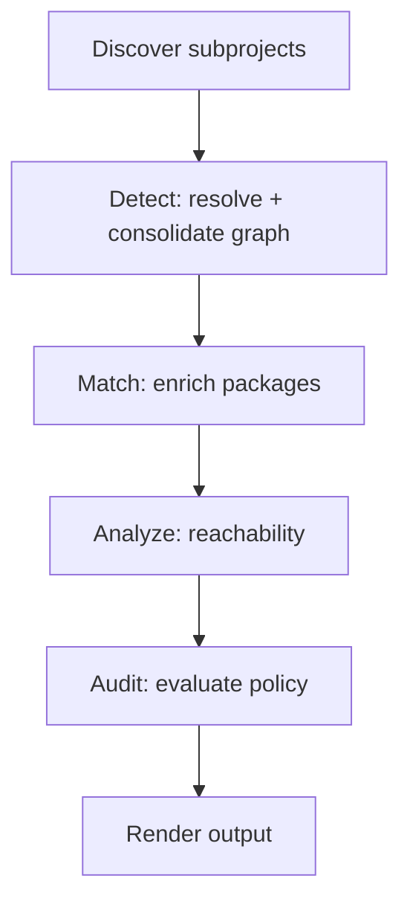
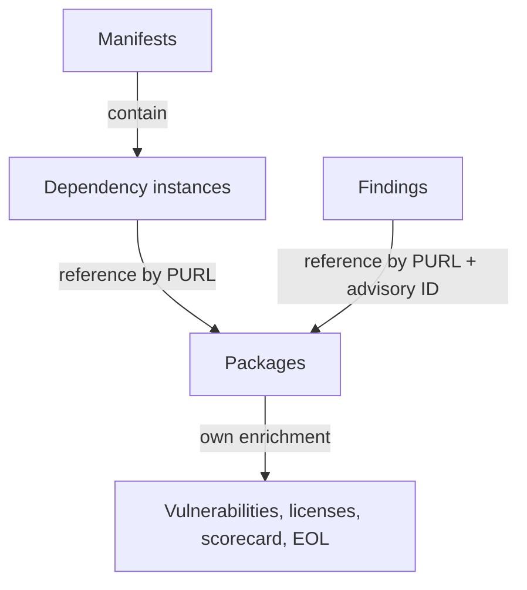
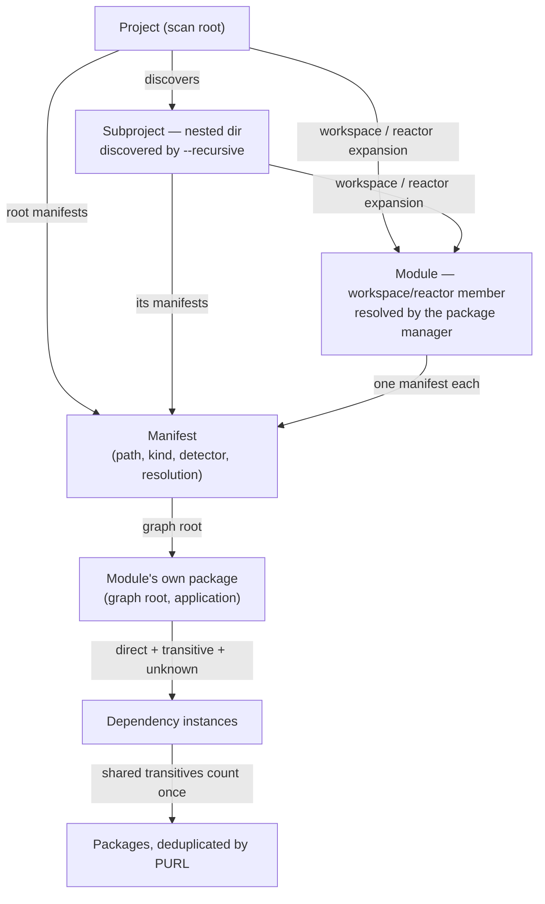

# Architecture

A tour of how Bomly turns a scan target into a report — the stages a scan runs through, the data it produces, and when (if ever) it touches the network. This is the user-facing overview; if you're contributing to Bomly itself, the deep design notes and package boundaries live in the repository's `dev-docs/ARCHITECTURE.md`.

## Commands

Bomly is a CLI. Everything runs through one of four commands:

| Command         | Purpose                                                |
|-----------------|--------------------------------------------------------|
| `bomly scan`    | Resolve dependencies, render reports, and write SBOMs  |
| `bomly explain` | Show why a dependency exists in a graph                |
| `bomly diff`    | Compare dependency state across Git refs or SBOM files |
| `bomly version` | Print version information                              |

Each invocation works on exactly one target: a filesystem path, a container image, a remote Git repository, or an existing SBOM file. See [Scan targets](SCAN_TARGETS.md) for the details of each.

## The scan pipeline

A scan flows through an ordered set of stages. Each stage hands its output to the next, so later stages always see a single, consolidated view of your dependencies.

1. **Discover** — Bomly inspects the target root and finds every supported package-manager root (a `go.mod`, a `package-lock.json`, a `pom.xml`, and so on). With `--recursive` it also walks nested directories, discovering independent subprojects in a monorepo while workspace-aware managers (npm workspaces, Maven reactors, …) keep expanding their own modules from the root. See [Scan targets](SCAN_TARGETS.md#recursive-discovery----recursive).
2. **Detect** — For each root, a [detector](DETECTORS.md) reads the lockfile, manifest, or SBOM and resolves a dependency graph. Per-subproject graphs are then *consolidated* into one graph and one deduplicated package set for the rest of the run. `--scope` narrows the graph to runtime or development dependencies here.
3. **Match** — When you pass `--enrich`, [matchers](MATCHERS.md) add data to published registry packages: known vulnerabilities, licenses, end-of-life status, and project health scores. Project roots, workspace members, and local/file/Git/URL artifacts remain in the graph and reports but are not queried as if they were registry releases.
4. **Analyze** — When you pass `--analyze`, [reachability](REACHABILITY.md) analysis runs on top of the matched data to flag whether a vulnerability is actually reachable from your code.
5. **Audit** — When you pass `--audit`, [auditors](AUDITORS.md) evaluate policy (severity thresholds, license rules, denied packages) against the enriched data and produce findings. Combine `--enrich --audit` to gate on fresh external data in one run.
6. **Render** — Bomly emits the result as text, JSON, SARIF, or an SBOM. See [Output formats](OUTPUT_FORMATS.md) and [SBOM formats](SBOM.md).

`bomly explain` reuses the detect and match stages, then traces the dependency paths that pull in a given package. `bomly diff` runs the pipeline against two states and reports what changed.

## Domain model

Bomly keeps three kinds of data separate, which is why the same fact never appears twice in the output:

- **Dependencies** are detection-time graph nodes. Each is one instance of a dependency in a manifest, carrying its scope, where it was found, and its edges to other dependencies. A dependency points at a package by its PURL but does not itself hold license or vulnerability data.
- **Packages** are deduplicated artifacts keyed by [PURL](GLOSSARY.md). There is one package per unique PURL across the whole scan, and it owns the enrichment: licenses, vulnerabilities, scorecard, and EOL. If 50 dependencies all reference `react@18.2.0`, they share one package — and one set of CVEs.
- **Findings** are reference-style audit results. A finding names a policy outcome and points back at a package (and, for a vulnerability, at a specific advisory) rather than copying that data inline.

In the JSON output these surface as three top-level collections — `manifests` (with their `dependencies`), `packages`, and `findings` — and the same vocabulary carries through SARIF and SBOM output. See [Output formats](OUTPUT_FORMATS.md) and the [schema reference](SCHEMAS.md) for the exact shapes.

Manifests themselves hang off the project structure. A **subproject** is an independently discovered nested directory (what `--recursive` finds); a **module** is a workspace or reactor member the package manager resolves natively (npm/pnpm workspace packages, Cargo workspace members, Maven reactor modules), each with its own manifest entry. A project or module and its manifest are two faces of the same thing, so user-facing views (interactive mode, text, markdown) merge them into a single named node; machine formats keep the flat `manifests` collection, from which the hierarchy is derived using the `subproject` and `path` fields.

## Extensibility

Every built-in is an implementation of the same contract an external plugin implements — there is no privileged internal path. Three extension points are pluggable today, and a fourth is planned:

| Extension point | Status    | Responsibility                                                   |
|-----------------|-----------|------------------------------------------------------------------|
| Detector        | Available | Turn evidence (lockfile, manifest, SBOM) into a dependency graph |
| Matcher         | Available | Enrich packages with vulnerability, license, or lifecycle data   |
| Auditor         | Available | Evaluate policy and emit findings                                |
| Analyzer        | Planned   | Annotate reachability for a language                             |

External plugins run as sandboxed, versioned binaries and are disabled until you explicitly enable them. See [Plugins](PLUGINS.md) for the trust model, installation, and authoring guides.

## Network behavior

**Bomly is offline-safe by default.** A plain `bomly scan` reads files on disk and makes no network calls of its own.

- **Matchers** only run when you pass `--enrich`. `--audit` evaluates data that is already present and never triggers enrichment on its own.
- **Detectors** vary: lockfile parsers (npm, pnpm, Yarn, Bun text lockfiles, Composer, Bundler, NuGet, GitHub Actions, SBOM ingest, …) are pure file readers and make no network calls. Build-tool–backed detectors shell out to the package manager when their deterministic file parser cannot resolve the project. Bun prefers `bun.lock`, then uses `bun pm ls --all` for the installed tree, and finally falls back to Syft; displayed child edges are preserved and unprovable hoisted parent relationships remain explicitly `unknown`. Install-first is never implicit.
- `--install-first` is the explicit opt-in that lets supporting detectors run their install command (`npm install`, `pip install`, …) before resolving; this downloads packages by design.

When enrichment is enabled, the **only** services Bomly's built-in matchers contact are OSV, CISA KEV, deps.dev, ClearlyDefined, endoflife.date, and OpenSSF Scorecard. No telemetry, no credentials sent. External plugin matchers may contact their own documented services once you install and enable them. See [Detectors → Network behavior](DETECTORS.md#network-behavior) and [Matchers](MATCHERS.md).

## Build variants

Bomly ships in two variants. The full binary (`bomly`) links the Syft and Grype libraries directly and needs no external tools. The lite binary (`bomly-lite`) shells out to `syft` and `grype` on your `PATH` for a smaller download. Both behave the same from the command line. See [Installation](INSTALLATION.md) for which to pick.
